本文总结了 Matplotlib 以及 Seaborn 用的最多最全图表，掌握这些图形的绘制，对于数据分析的可视化有莫大的作用，强烈推荐大家阅读后续内容。

如果觉得内容不错，欢迎分享到您的朋友圈。


## 介绍

这些图表根据可视化目标的7个不同情景进行分组。 例如，如果要想象两个变量之间的关系，请查看“关联”部分下的图表。 或者，如果您想要显示值如何随时间变化，请查看“变化”部分，依此类推。

有效图表的重要特征：

* 在不歪曲事实的情况下传达正确和必要的信息。

* 设计简单，您不必太费力就能理解它。

* 从审美角度支持信息而不是掩盖信息。

* 信息没有超负荷。

## 准备工作

在代码运行前先引入下面的设置内容。 当然，单独的图表，可以重新设置显示要素。

```plaintext
# !pip install brewer2mpl
import numpy as np
import pandas as pd
import matplotlib as mpl
import matplotlib.pyplot as plt
import seaborn as sns
import warnings; warnings.filterwarnings(action='once')

large = 22; med = 16; small = 12
params = {'axes.titlesize': large,
          'legend.fontsize': med,
          'figure.figsize': (16, 10),
          'axes.labelsize': med,
          'axes.titlesize': med,
          'xtick.labelsize': med,
          'ytick.labelsize': med,
          'figure.titlesize': large}
plt.rcParams.update(params)
plt.style.use('seaborn-whitegrid')
sns.set_style("white")
%matplotlib inline

# Version
print(mpl.__version__)  #> 3.0.0
print(sns.__version__)  #> 0.9.0
```

## 一、关联 （Correlation）

关联图表用于可视化2个或更多变量之间的关系。 也就是说，一个变量如何相对于另一个变化。

### 1. 散点图（Scatter plot）

散点图是用于研究两个变量之间关系的经典的和基本的图表。 如果数据中有多个组，则可能需要以不同颜色可视化每个组。 在 matplotlib 中，您可以使用 `plt.scatterplot（）` 方便地执行此操作。

```plaintext
# Import dataset
midwest = pd.read_csv("https://raw.githubusercontent.com/selva86/datasets/master/midwest_filter.csv")

# Prepare Data
# Create as many colors as there are unique midwest['category']
categories = np.unique(midwest['category'])
colors = [plt.cm.tab10(i/float(len(categories)-1)) for i in range(len(categories))]

# Draw Plot for Each Category
plt.figure(figsize=(16, 10), dpi= 80, facecolor='w', edgecolor='k')

for i, category in enumerate(categories):
    plt.scatter('area', 'poptotal',
                data=midwest.loc[midwest.category==category, :],
                s=20, cmap=colors[i], label=str(category))
    # "c=" 修改为 "cmap="，智影双全 备注

# Decorations
plt.gca().set(xlim=(0.0, 0.1), ylim=(0, 90000),
              xlabel='Area', ylabel='Population')

plt.xticks(fontsize=12); plt.yticks(fontsize=12)
plt.title("Scatterplot of Midwest Area vs Population", fontsize=22)
plt.legend(fontsize=12)    
plt.show()    
```


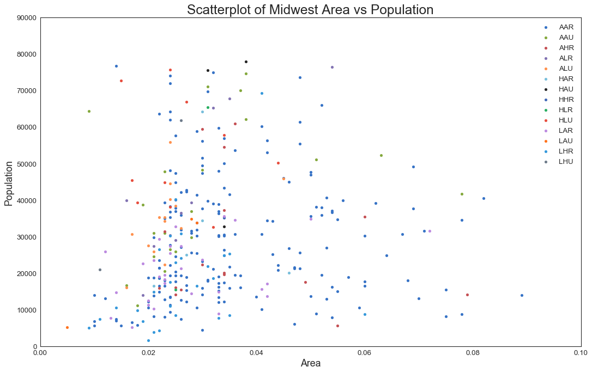


图1

### 2. 带边界的气泡图（Bubble plot with Encircling）

有时，您希望在边界内显示一组点以强调其重要性。 在这个例子中，你从数据框中获取记录，并用下面代码中描述的 `encircle（）` 来使边界显示出来。

```plaintext
from matplotlib import patches
from scipy.spatial import ConvexHull
import warnings; warnings.simplefilter('ignore')
sns.set_style("white")

# Step 1: Prepare Data
midwest = pd.read_csv("https://raw.githubusercontent.com/selva86/datasets/master/midwest_filter.csv")

# As many colors as there are unique midwest['category']
categories = np.unique(midwest['category'])
colors = [plt.cm.tab10(i/float(len(categories)-1)) for i in range(len(categories))]

# Step 2: Draw Scatterplot with unique color for each category
fig = plt.figure(figsize=(16, 10), dpi= 80, facecolor='w', edgecolor='k')    

for i, category in enumerate(categories):
    plt.scatter('area', 'poptotal', data=midwest.loc[midwest.category==category, :],
                s='dot_size', cmap=colors[i], label=str(category), edgecolors='black', linewidths=.5)
    # "c=" 修改为 "cmap="，智影双全 备注

# Step 3: Encircling
# https://stackoverflow.com/questions/44575681/how-do-i-encircle-different-data-sets-in-scatter-plot
def encircle(x,y, ax=None, **kw):
    if not ax: ax=plt.gca()
    p = np.c_[x,y]
    hull = ConvexHull(p)
    poly = plt.Polygon(p[hull.vertices,:], **kw)
    ax.add_patch(poly)

# Select data to be encircled
midwest_encircle_data = midwest.loc[midwest.state=='IN', :]                         

# Draw polygon surrounding vertices    
encircle(midwest_encircle_data.area, midwest_encircle_data.poptotal, ec="k", fc="gold", alpha=0.1)
encircle(midwest_encircle_data.area, midwest_encircle_data.poptotal, ec="firebrick", fc="none", linewidth=1.5)

# Step 4: Decorations
plt.gca().set(xlim=(0.0, 0.1), ylim=(0, 90000),
              xlabel='Area', ylabel='Population')

plt.xticks(fontsize=12); plt.yticks(fontsize=12)
plt.title("Bubble Plot with Encircling", fontsize=22)
plt.legend(fontsize=12)    
plt.show()    
```


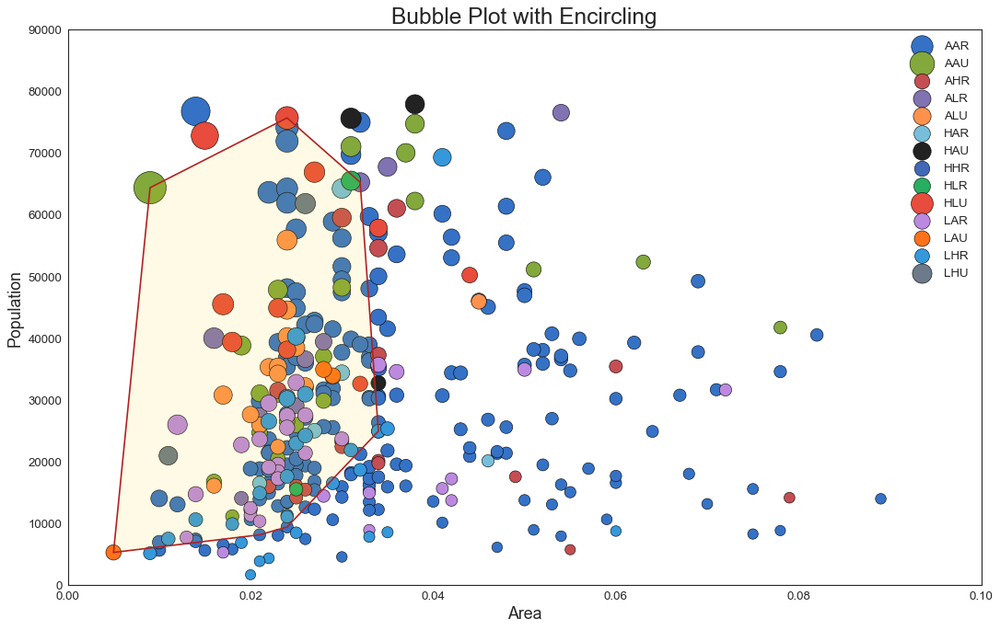


图2

### 3. 带线性回归最佳拟合线的散点图 （Scatter plot with linear regression line of best fit）

如果你想了解两个变量如何相互改变，那么最佳拟合线就是常用的方法。 下图显示了数据中各组之间最佳拟合线的差异。 要禁用分组并仅为整个数据集绘制一条最佳拟合线，请从下面的 `sns.lmplot（）` 调用中删除 `hue ='cyl'` 参数。

```plaintext
# Import Data
df = pd.read_csv("https://raw.githubusercontent.com/selva86/datasets/master/mpg_ggplot2.csv")
df_select = df.loc[df.cyl.isin([4,8]), :]

# Plot
sns.set_style("white")
gridobj = sns.lmplot(x="displ", y="hwy", hue="cyl", data=df_select,
                     height=7, aspect=1.6, robust=True, palette='tab10',
                     scatter_kws=dict(s=60, linewidths=.7, edgecolors='black'))

# Decorations
gridobj.set(xlim=(0.5, 7.5), ylim=(0, 50))
plt.title("Scatterplot with line of best fit grouped by number of cylinders", fontsize=20)
plt.show()
```


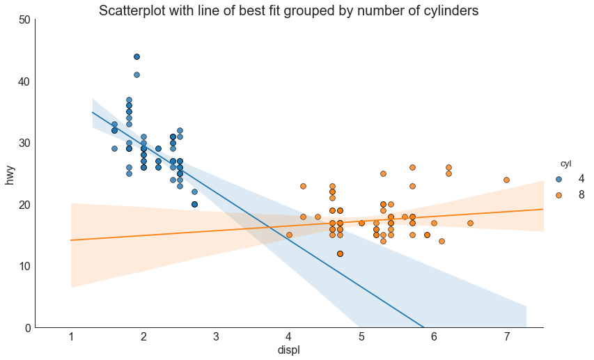


图3

**针对每列绘制线性回归线**

或者，可以在其每列中显示每个组的最佳拟合线。 可以通过在 `sns.lmplot()` 中设置 `col=groupingcolumn` 参数来实现，如下：

```plaintext
# Import Data
df = pd.read_csv("https://raw.githubusercontent.com/selva86/datasets/master/mpg_ggplot2.csv")
df_select = df.loc[df.cyl.isin([4,8]), :]

# Each line in its own column
sns.set_style("white")
gridobj = sns.lmplot(x="displ", y="hwy",
                     data=df_select,
                     height=7,
                     robust=True,
                     palette='Set1',
                     col="cyl",
                     scatter_kws=dict(s=60, linewidths=.7, edgecolors='black'))

# Decorations
gridobj.set(xlim=(0.5, 7.5), ylim=(0, 50))
plt.show()
```


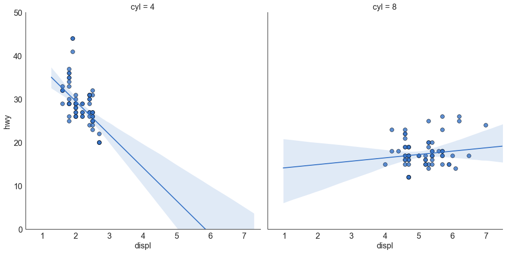


图3-2

### 4. 抖动图 （Jittering with stripplot）

通常，多个数据点具有完全相同的 X 和 Y 值。 结果，多个点绘制会重叠并隐藏。 为避免这种情况，请将数据点稍微抖动，以便您可以直观地看到它们。 使用 seaborn 的 `stripplot（）` 很方便实现这个功能。

```plaintext
# Import Data
df = pd.read_csv("https://raw.githubusercontent.com/selva86/datasets/master/mpg_ggplot2.csv")

# Draw Stripplot
fig, ax = plt.subplots(figsize=(16,10), dpi= 80)    
sns.stripplot(df.cty, df.hwy, jitter=0.25, size=8, ax=ax, linewidth=.5)

# Decorations
plt.title('Use jittered plots to avoid overlapping of points', fontsize=22)
plt.show()
```


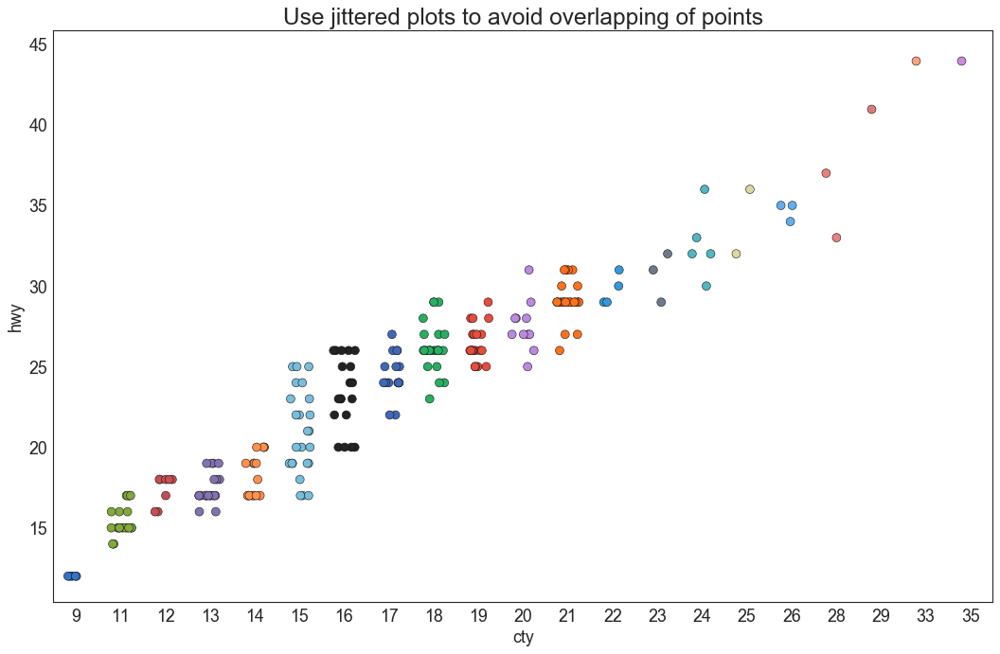


图4

### 5. 计数图 （Counts Plot）

避免点重叠问题的另一个选择是增加点的大小，这取决于该点中有多少点。 因此，点的大小越大，其周围的点的集中度越高。

```plaintext
# Import Data
df = pd.read_csv("https://raw.githubusercontent.com/selva86/datasets/master/mpg_ggplot2.csv")
df_counts = df.groupby(['hwy', 'cty']).size().reset_index(name='counts')

# Draw Stripplot
fig, ax = plt.subplots(figsize=(16,10), dpi= 80)    
sns.stripplot(df_counts.cty, df_counts.hwy, size=df_counts.counts*2, ax=ax)

# Decorations
plt.title('Counts Plot - Size of circle is bigger as more points overlap', fontsize=22)
plt.show()
```


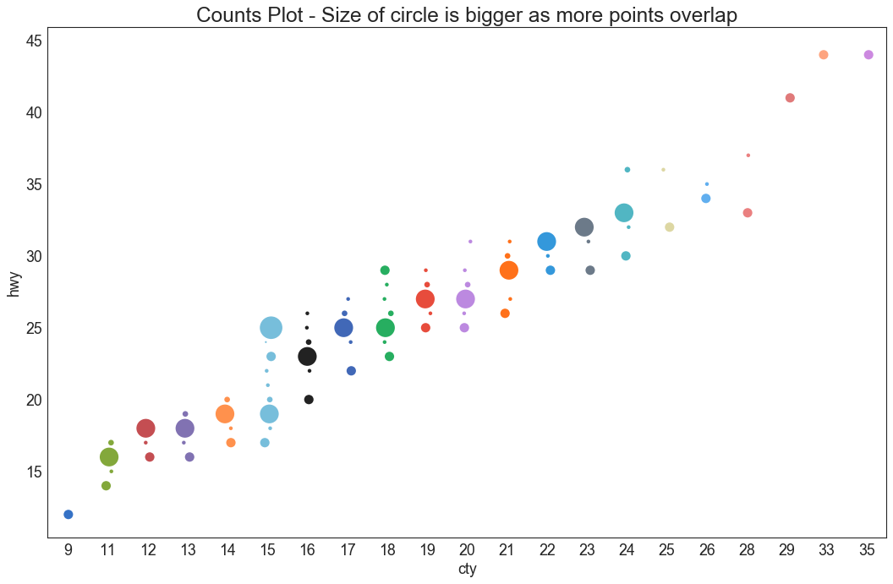


图5

### 6. 边缘直方图 （Marginal Histogram）

边缘直方图具有沿 X 和 Y 轴变量的直方图。 这用于可视化 X 和 Y 之间的关系以及单独的 X 和 Y 的单变量分布。 这种图经常用于探索性数据分析（EDA）。

```plaintext
# Import Data
df = pd.read_csv("https://raw.githubusercontent.com/selva86/datasets/master/mpg_ggplot2.csv")

# Create Fig and gridspec
fig = plt.figure(figsize=(16, 10), dpi= 80)
grid = plt.GridSpec(4, 4, hspace=0.5, wspace=0.2)

# Define the axes
ax_main = fig.add_subplot(grid[:-1, :-1])
ax_right = fig.add_subplot(grid[:-1, -1], xticklabels=[], yticklabels=[])
ax_bottom = fig.add_subplot(grid[-1, 0:-1], xticklabels=[], yticklabels=[])

# Scatterplot on main ax
ax_main.scatter('displ', 'hwy', s=df.cty*4, c=df.manufacturer.astype('category').cat.codes, alpha=.9, data=df, cmap="tab10", edgecolors='gray', linewidths=.5)

# histogram on the right
ax_bottom.hist(df.displ, 40, histtype='stepfilled', orientation='vertical', color='deeppink')
ax_bottom.invert_yaxis()

# histogram in the bottom
ax_right.hist(df.hwy, 40, histtype='stepfilled', orientation='horizontal', color='deeppink')

# Decorations
ax_main.set(title='Scatterplot with Histograms \n displ vs hwy', xlabel='displ', ylabel='hwy')
ax_main.title.set_fontsize(20)
for item in ([ax_main.xaxis.label, ax_main.yaxis.label] + ax_main.get_xticklabels() + ax_main.get_yticklabels()):
    item.set_fontsize(14)

xlabels = ax_main.get_xticks().tolist()
ax_main.set_xticklabels(xlabels)
plt.show()
```


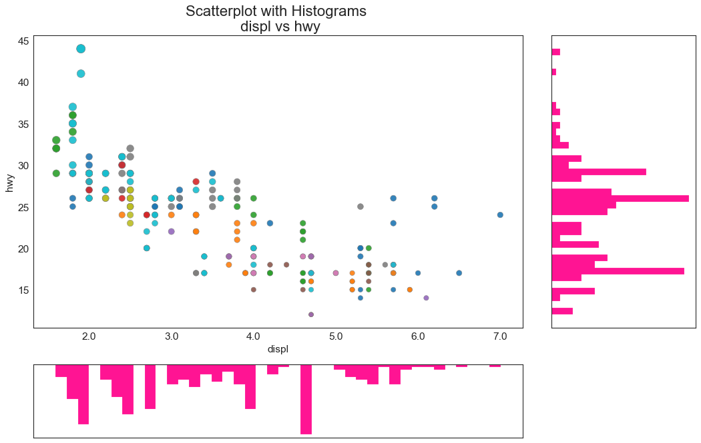


图6

### 7. 边缘箱形图 （Marginal Boxplot）

边缘箱图与边缘直方图具有相似的用途。 然而，箱线图有助于精确定位 X 和 Y 的中位数、第25和第75百分位数。

```plaintext
# Import Data
df = pd.read_csv("https://raw.githubusercontent.com/selva86/datasets/master/mpg_ggplot2.csv")

# Create Fig and gridspec
fig = plt.figure(figsize=(16, 10), dpi= 80)
grid = plt.GridSpec(4, 4, hspace=0.5, wspace=0.2)

# Define the axes
ax_main = fig.add_subplot(grid[:-1, :-1])
ax_right = fig.add_subplot(grid[:-1, -1], xticklabels=[], yticklabels=[])
ax_bottom = fig.add_subplot(grid[-1, 0:-1], xticklabels=[], yticklabels=[])

# Scatterplot on main ax
ax_main.scatter('displ', 'hwy', s=df.cty*5, c=df.manufacturer.astype('category').cat.codes, alpha=.9, data=df, cmap="Set1", edgecolors='black', linewidths=.5)

# Add a graph in each part
sns.boxplot(df.hwy, ax=ax_right, orient="v")
sns.boxplot(df.displ, ax=ax_bottom, orient="h")

# Decorations ------------------
# Remove x axis name for the boxplot
ax_bottom.set(xlabel='')
ax_right.set(ylabel='')

# Main Title, Xlabel and YLabel
ax_main.set(title='Scatterplot with Histograms \n displ vs hwy', xlabel='displ', ylabel='hwy')

# Set font size of different components
ax_main.title.set_fontsize(20)
for item in ([ax_main.xaxis.label, ax_main.yaxis.label] + ax_main.get_xticklabels() + ax_main.get_yticklabels()):
    item.set_fontsize(14)

plt.show()
```


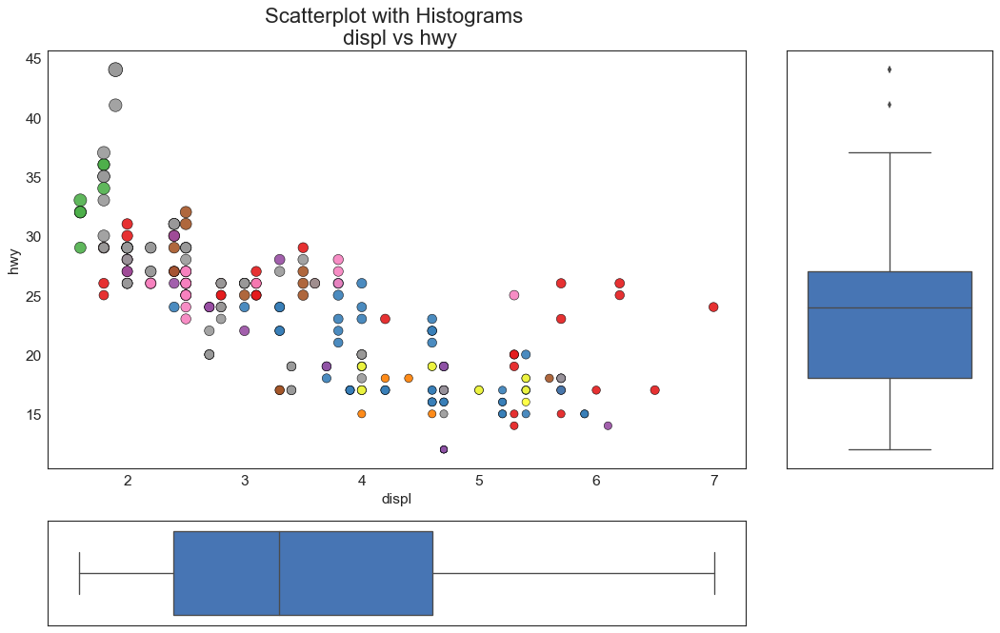


图7

### 8. 相关图 （Correllogram）

相关图用于直观地查看给定数据框（或二维数组）中所有可能的数值变量对之间的相关度量。

```plaintext
# Import Dataset
df = pd.read_csv("https://github.com/selva86/datasets/raw/master/mtcars.csv")

# Plot
plt.figure(figsize=(12,10), dpi= 80)
sns.heatmap(df.corr(), xticklabels=df.corr().columns, yticklabels=df.corr().columns, cmap='RdYlGn', center=0, annot=True)

# Decorations
plt.title('Correlogram of mtcars', fontsize=22)
plt.xticks(fontsize=12)
plt.yticks(fontsize=12)
plt.show()
```


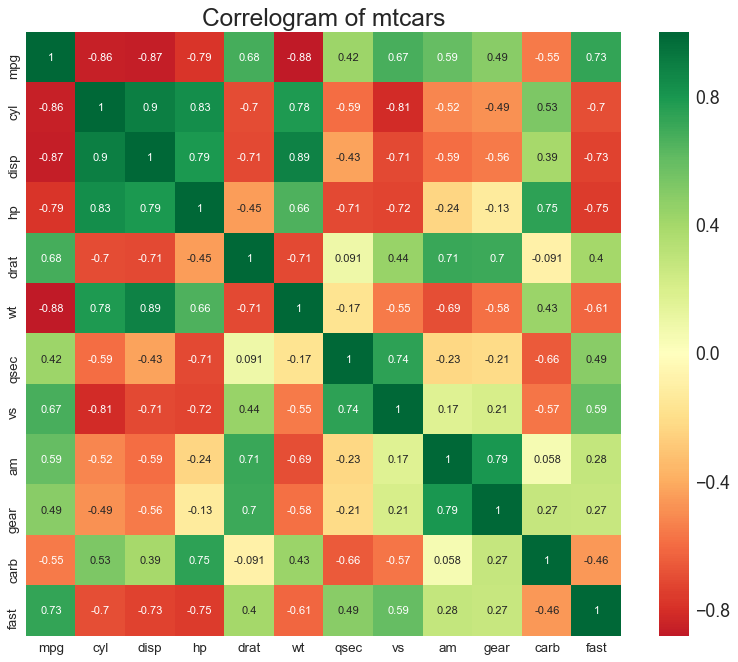


图8

### 9. 矩阵图 （Pairwise Plot）

矩阵图是探索性分析中的最爱，用于理解所有可能的数值变量对之间的关系。 它是双变量分析的必备工具。

```plaintext
# Load Dataset
df = sns.load_dataset('iris')

# Plot
plt.figure(figsize=(10,8), dpi= 80)
sns.pairplot(df, kind="scatter", hue="species", plot_kws=dict(s=80, edgecolor="white", linewidth=2.5))
plt.show()
```


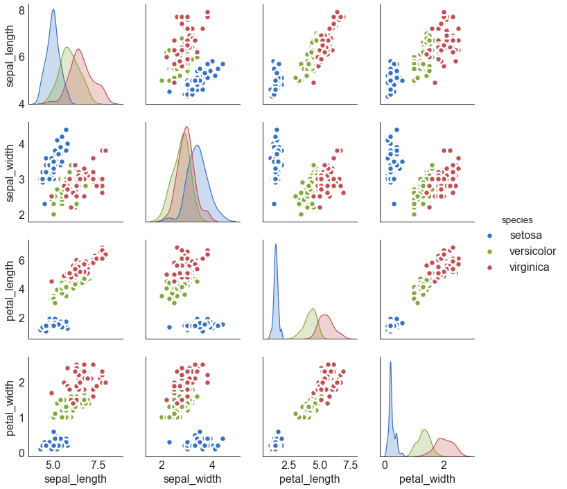


```plaintext
# Load Dataset
df = sns.load_dataset('iris')

# Plot
plt.figure(figsize=(10,8), dpi= 80)
sns.pairplot(df, kind="reg", hue="species")
plt.show()
```


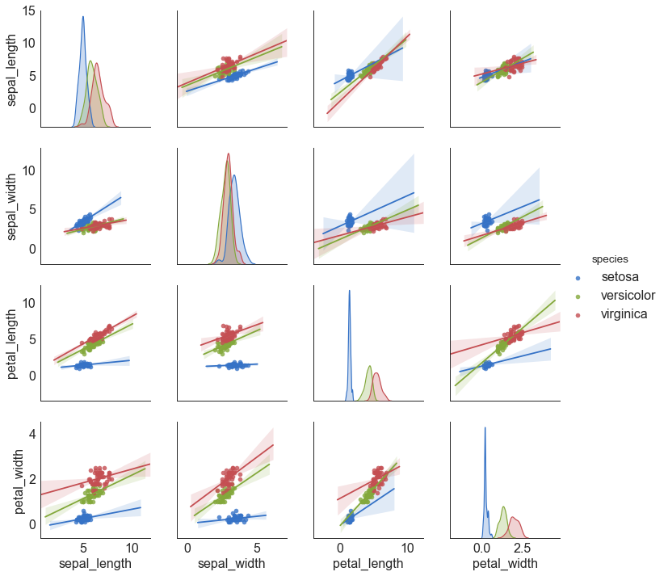


### 10. 热力图 (General Heatmap)&#x20;

不同于相关系数图，这是展示“类别 vs 类别”指标的利器。

```plain&#x20;text
# --- Heatmap ---# 场景：展示一周内不同时段的网站流量
data = np.random.rand(7, 24)
days = ['Mon', 'Tue', 'Wed', 'Thu', 'Fri', 'Sat', 'Sun']
hours = [f'{i}:00' for i in range(24)]

df_heat = pd.DataFrame(data, index=days, columns=hours)

plt.figure(figsize=(18, 6))
sns.heatmap(df_heat, annot=False, cmap="YlGnBu", cbar_kws={'label': 'Traffic Intensity'})
plt.title("Website Traffic Heatmap by Hour of Day", fontsize=20)
plt.xlabel("Hour of Day")
plt.ylabel("Day of Week")
plt.show()
```

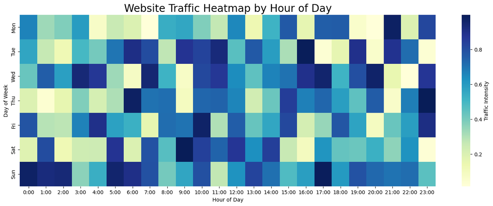


### 11. PCA Biplot (主成分分析双标图)

在降维的同时，展示原始变量对主成分的贡献（载荷）以及样本的分布。

```plain&#x20;text
from sklearn.decomposition import PCA
from sklearn.datasets import load_iris
import matplotlib.pyplot as plt
import numpy as np

iris = load_iris()
pca = PCA(n_components=2)
components = pca.fit_transform(iris.data)
loadings = pca.components_.T * np.sqrt(pca.explained_variance_)

plt.figure(figsize=(10, 8))
# 绘制样本点
plt.scatter(components[:, 0], components[:, 1], c=iris.target, cmap='viridis', alpha=0.5)

# 绘制变量特征向量
for i, feature in enumerate(iris.feature_names):
    plt.arrow(0, 0, loadings[i, 0], loadings[i, 1], color='r', alpha=0.8, head_width=0.05)
    plt.text(loadings[i, 0]*1.2, loadings[i, 1]*1.2, feature, color='r', fontsize=12)

plt.xlabel("PC1")
plt.ylabel("PC2")
plt.title("PCA Biplot: Samples and Feature Loadings", fontsize=18)
plt.show()
```

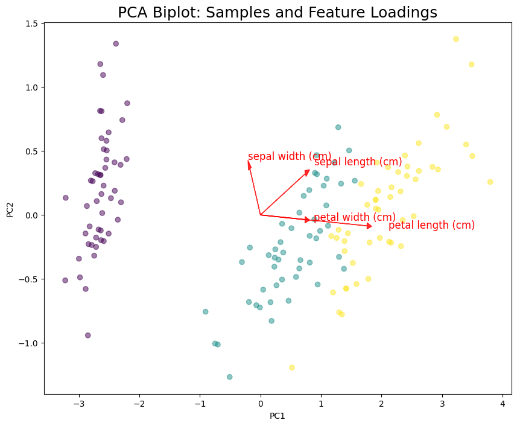


## 二、偏差 （Deviation）

### 12. 发散型条形图 （Diverging Bars）

如果您想根据单个指标查看项目的变化情况，并可视化此差异的顺序和数量，那么散型条形图 （Diverging Bars） 是一个很好的工具。 它有助于快速区分数据中组的性能，并且非常直观，并且可以立即传达这一点。

```plaintext
# Prepare Data
df = pd.read_csv("https://github.com/selva86/datasets/raw/master/mtcars.csv")
x = df.loc[:, ['mpg']]
df['mpg_z'] = (x - x.mean())/x.std()
df['colors'] = ['red' if x < 0 else 'green' for x in df['mpg_z']]
df.sort_values('mpg_z', inplace=True)
df.reset_index(inplace=True)

# Draw plot
plt.figure(figsize=(14,10), dpi= 80)
plt.hlines(y=df.index, xmin=0, xmax=df.mpg_z, color=df.colors, alpha=0.4, linewidth=5)

# Decorations
plt.gca().set(ylabel='$Model$', xlabel='$Mileage$')
plt.yticks(df.index, df.cars, fontsize=12)
plt.title('Diverging Bars of Car Mileage', fontdict={'size':20})
plt.grid(linestyle='--', alpha=0.5)
plt.show()
```


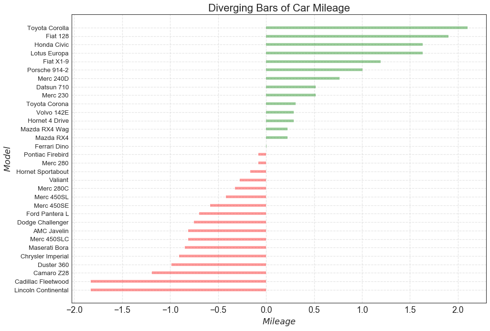


图10

### 13. 发散型文本 （Diverging Texts）

发散型文本 （Diverging Texts）与发散型条形图 （Diverging Bars）相似，如果你想以一种漂亮和可呈现的方式显示图表中每个项目的价值，就可以使用这种方法。

```plaintext
# Prepare Data
df = pd.read_csv("https://github.com/selva86/datasets/raw/master/mtcars.csv")
x = df.loc[:, ['mpg']]
df['mpg_z'] = (x - x.mean())/x.std()
df['colors'] = ['red' if x < 0 else 'green' for x in df['mpg_z']]
df.sort_values('mpg_z', inplace=True)
df.reset_index(inplace=True)

# Draw plot
plt.figure(figsize=(14,14), dpi= 80)
plt.hlines(y=df.index, xmin=0, xmax=df.mpg_z)
for x, y, tex in zip(df.mpg_z, df.index, df.mpg_z):
    t = plt.text(x, y, round(tex, 2), horizontalalignment='right' if x < 0 else 'left',
                 verticalalignment='center', fontdict={'color':'red' if x < 0 else 'green', 'size':14})

# Decorations    
plt.yticks(df.index, df.cars, fontsize=12)
plt.title('Diverging Text Bars of Car Mileage', fontdict={'size':20})
plt.grid(linestyle='--', alpha=0.5)
plt.xlim(-2.5, 2.5)
plt.show()
```


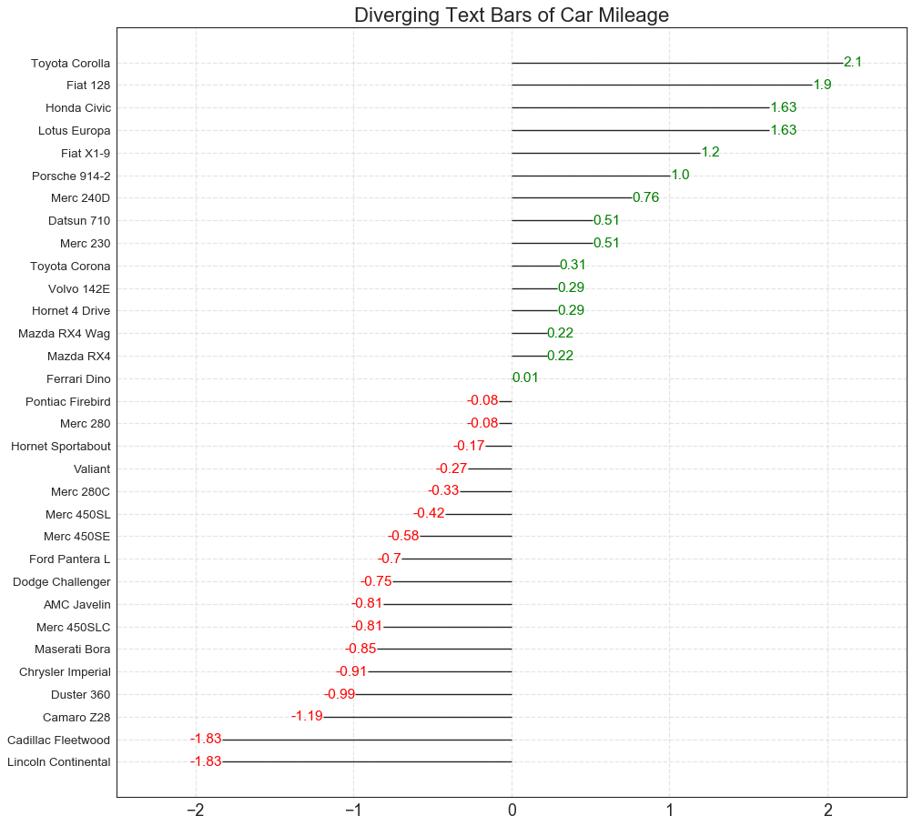


图11

### 14. 发散型包点图 （Diverging Dot Plot）

发散型包点图 （Diverging Dot Plot）也类似于发散型条形图 （Diverging Bars）。 然而，与发散型条形图 （Diverging Bars）相比，条的缺失减少了组之间的对比度和差异。

```plaintext
# Prepare Data
df = pd.read_csv("https://github.com/selva86/datasets/raw/master/mtcars.csv")
x = df.loc[:, ['mpg']]
df['mpg_z'] = (x - x.mean())/x.std()
df['colors'] = ['red' if x < 0 else 'darkgreen' for x in df['mpg_z']]
df.sort_values('mpg_z', inplace=True)
df.reset_index(inplace=True)

# Draw plot
plt.figure(figsize=(14,16), dpi= 80)
plt.scatter(df.mpg_z, df.index, s=450, alpha=.6, color=df.colors)
for x, y, tex in zip(df.mpg_z, df.index, df.mpg_z):
    t = plt.text(x, y, round(tex, 1), horizontalalignment='center',
                 verticalalignment='center', fontdict={'color':'white'})

# Decorations
# Lighten borders
plt.gca().spines["top"].set_alpha(.3)
plt.gca().spines["bottom"].set_alpha(.3)
plt.gca().spines["right"].set_alpha(.3)
plt.gca().spines["left"].set_alpha(.3)

plt.yticks(df.index, df.cars)
plt.title('Diverging Dotplot of Car Mileage', fontdict={'size':20})
plt.xlabel('$Mileage$')
plt.grid(linestyle='--', alpha=0.5)
plt.xlim(-2.5, 2.5)
plt.show()
```


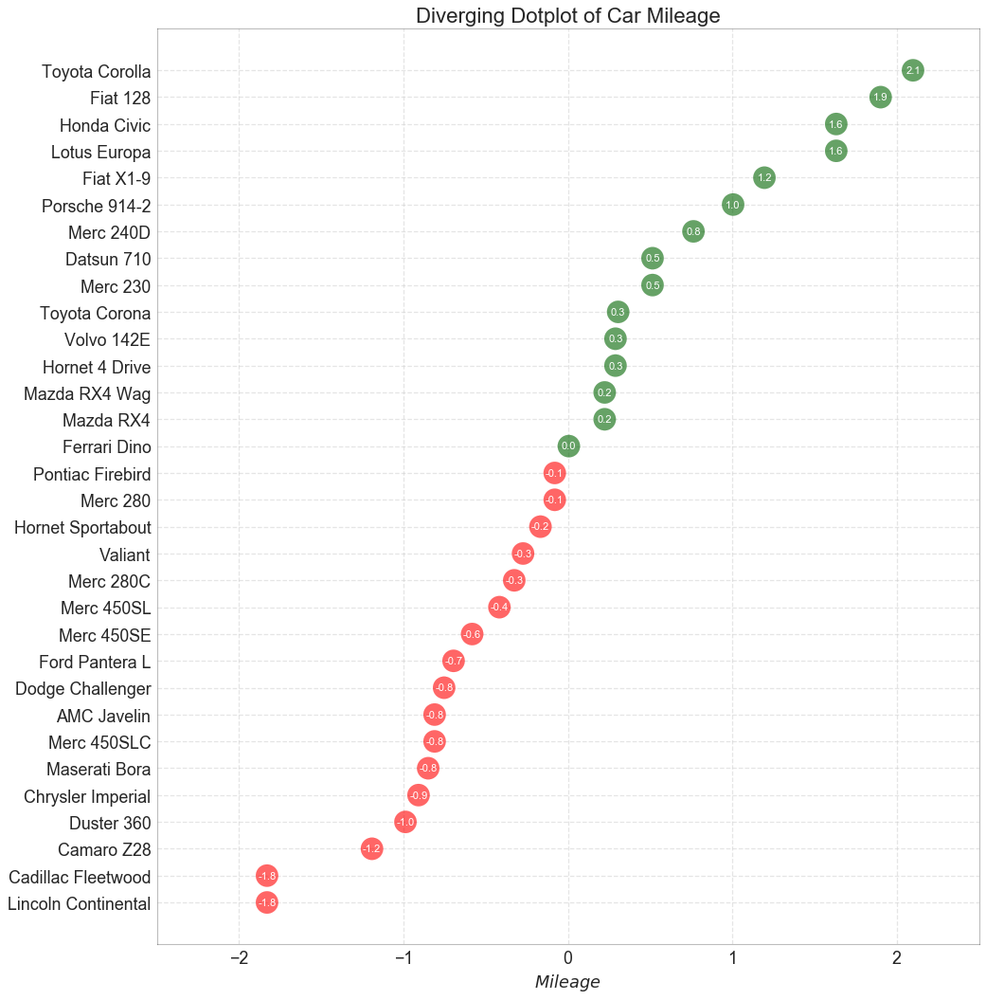


图12

### 15. 带标记的发散型棒棒糖图 （Diverging Lollipop Chart with Markers）

带标记的棒棒糖图通过强调您想要引起注意的任何重要数据点并在图表中适当地给出推理，提供了一种对差异进行可视化的灵活方式。

```plaintext
# Prepare Data
df = pd.read_csv("https://github.com/selva86/datasets/raw/master/mtcars.csv")
x = df.loc[:, ['mpg']]
df['mpg_z'] = (x - x.mean())/x.std()
df['colors'] = 'black'

# color fiat differently
df.loc[df.cars == 'Fiat X1-9', 'colors'] = 'darkorange'
df.sort_values('mpg_z', inplace=True)
df.reset_index(inplace=True)


# Draw plot
import matplotlib.patches as patches

plt.figure(figsize=(14,16), dpi= 80)
plt.hlines(y=df.index, xmin=0, xmax=df.mpg_z, color=df.colors, alpha=0.4, linewidth=1)
plt.scatter(df.mpg_z, df.index, color=df.colors, s=[600 if x == 'Fiat X1-9' else 300 for x in df.cars], alpha=0.6)
plt.yticks(df.index, df.cars)
plt.xticks(fontsize=12)

# Annotate
plt.annotate('Mercedes Models', xy=(0.0, 11.0), xytext=(1.0, 11), xycoords='data',
            fontsize=15, ha='center', va='center',
            bbox=dict(boxstyle='square', fc='firebrick'),
            arrowprops=dict(arrowstyle='-[, widthB=2.0, lengthB=1.5', lw=2.0, color='steelblue'), color='white')

# Add Patches
p1 = patches.Rectangle((-2.0, -1), width=.3, height=3, alpha=.2, facecolor='red')
p2 = patches.Rectangle((1.5, 27), width=.8, height=5, alpha=.2, facecolor='green')
plt.gca().add_patch(p1)
plt.gca().add_patch(p2)

# Decorate
plt.title('Diverging Bars of Car Mileage', fontdict={'size':20})
plt.grid(linestyle='--', alpha=0.5)
plt.show()
```


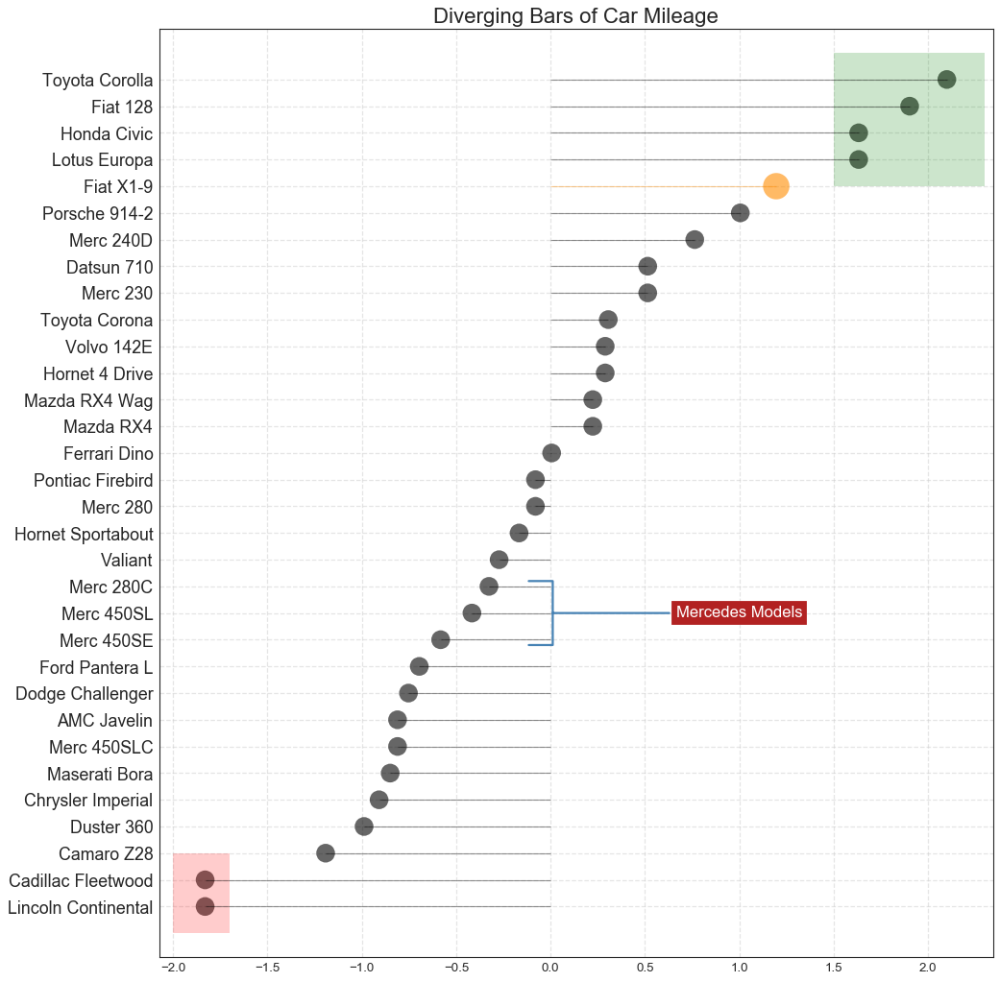


图13

### 16. 面积图 （Area Chart）

通过对轴和线之间的区域进行着色，面积图不仅强调峰和谷，而且还强调高点和低点的持续时间。 高点持续时间越长，线下面积越大。

```plaintext
import numpy as np
import pandas as pd

# Prepare Data
df = pd.read_csv("https://github.com/selva86/datasets/raw/master/economics.csv", parse_dates=['date']).head(100)
x = np.arange(df.shape[0])
y_returns = (df.psavert.diff().fillna(0)/df.psavert.shift(1)).fillna(0) * 100

# Plot
plt.figure(figsize=(16,10), dpi= 80)
plt.fill_between(x[1:], y_returns[1:], 0, where=y_returns[1:] >= 0, facecolor='green', interpolate=True, alpha=0.7)
plt.fill_between(x[1:], y_returns[1:], 0, where=y_returns[1:] <= 0, facecolor='red', interpolate=True, alpha=0.7)

# Annotate
plt.annotate('Peak \n1975', xy=(94.0, 21.0), xytext=(88.0, 28),
             bbox=dict(boxstyle='square', fc='firebrick'),
             arrowprops=dict(facecolor='steelblue', shrink=0.05), fontsize=15, color='white')


# Decorations
xtickvals = [str(m)[:3].upper()+"-"+str(y) for y,m in zip(df.date.dt.year, df.date.dt.month_name())]
plt.gca().set_xticks(x[::6])
plt.gca().set_xticklabels(xtickvals[::6], rotation=90, fontdict={'horizontalalignment': 'center', 'verticalalignment': 'center_baseline'})
plt.ylim(-35,35)
plt.xlim(1,100)
plt.title("Month Economics Return %", fontsize=22)
plt.ylabel('Monthly returns %')
plt.grid(alpha=0.5)
plt.show()
```


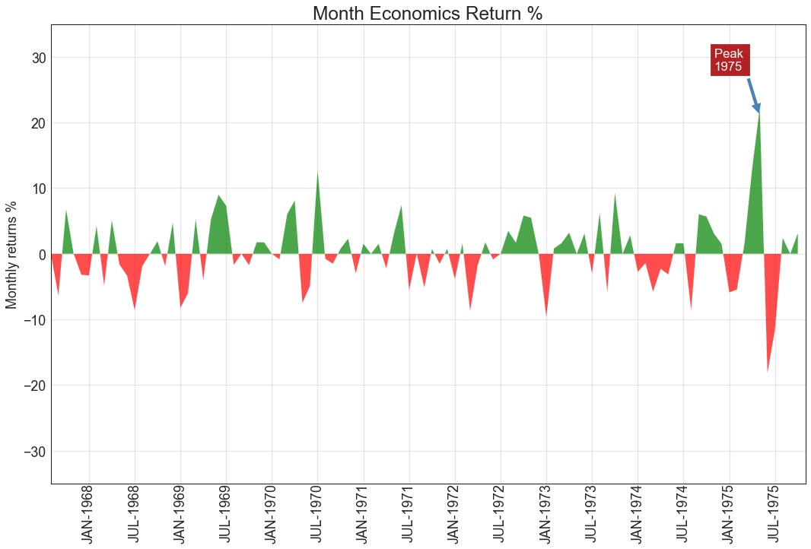


图14

## 三、排序 （Ranking）

### 17. 有序条形图 （Ordered Bar Chart）

有序条形图有效地传达了项目的排名顺序。 但是，在图表上方添加度量标准的值，用户可以从图表本身获取精确信息。

```plaintext
# Prepare Data
df_raw = pd.read_csv("https://github.com/selva86/datasets/raw/master/mpg_ggplot2.csv")
df = df_raw[['cty', 'manufacturer']].groupby('manufacturer').apply(lambda x: x.mean())
df.sort_values('cty', inplace=True)
df.reset_index(inplace=True)

# Draw plot
import matplotlib.patches as patches

fig, ax = plt.subplots(figsize=(16,10), facecolor='white', dpi= 80)
ax.vlines(x=df.index, ymin=0, ymax=df.cty, color='firebrick', alpha=0.7, linewidth=20)

# Annotate Text
for i, cty in enumerate(df.cty):
    ax.text(i, cty+0.5, round(cty, 1), horizontalalignment='center')


# Title, Label, Ticks and Ylim
ax.set_title('Bar Chart for Highway Mileage', fontdict={'size':22})
ax.set(ylabel='Miles Per Gallon', ylim=(0, 30))
plt.xticks(df.index, df.manufacturer.str.upper(), rotation=60, horizontalalignment='right', fontsize=12)

# Add patches to color the X axis labels
p1 = patches.Rectangle((.57, -0.005), width=.33, height=.13, alpha=.1, facecolor='green', transform=fig.transFigure)
p2 = patches.Rectangle((.124, -0.005), width=.446, height=.13, alpha=.1, facecolor='red', transform=fig.transFigure)
fig.add_artist(p1)
fig.add_artist(p2)
plt.show()
```


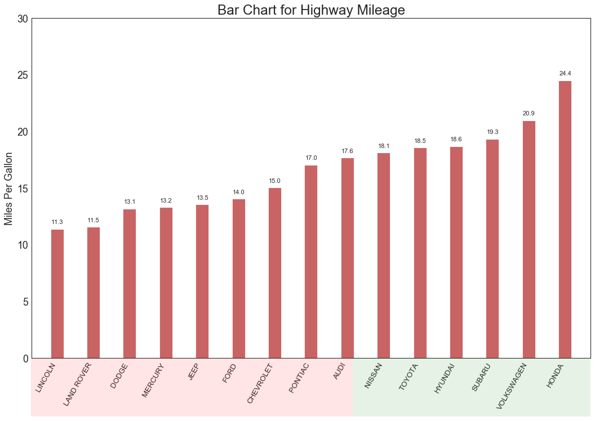


图15

### 18. 棒棒糖图 （Lollipop Chart）

棒棒糖图表以一种视觉上令人愉悦的方式提供与有序条形图类似的目的。

```plaintext
# Prepare Data
df_raw = pd.read_csv("https://github.com/selva86/datasets/raw/master/mpg_ggplot2.csv")
df = df_raw[['cty', 'manufacturer']].groupby('manufacturer').apply(lambda x: x.mean())
df.sort_values('cty', inplace=True)
df.reset_index(inplace=True)

# Draw plot
fig, ax = plt.subplots(figsize=(16,10), dpi= 80)
ax.vlines(x=df.index, ymin=0, ymax=df.cty, color='firebrick', alpha=0.7, linewidth=2)
ax.scatter(x=df.index, y=df.cty, s=75, color='firebrick', alpha=0.7)

# Title, Label, Ticks and Ylim
ax.set_title('Lollipop Chart for Highway Mileage', fontdict={'size':22})
ax.set_ylabel('Miles Per Gallon')
ax.set_xticks(df.index)
ax.set_xticklabels(df.manufacturer.str.upper(), rotation=60, fontdict={'horizontalalignment': 'right', 'size':12})
ax.set_ylim(0, 30)

# Annotate
for row in df.itertuples():
    ax.text(row.Index, row.cty+.5, s=round(row.cty, 2), horizontalalignment= 'center', verticalalignment='bottom', fontsize=14)

plt.show()
```


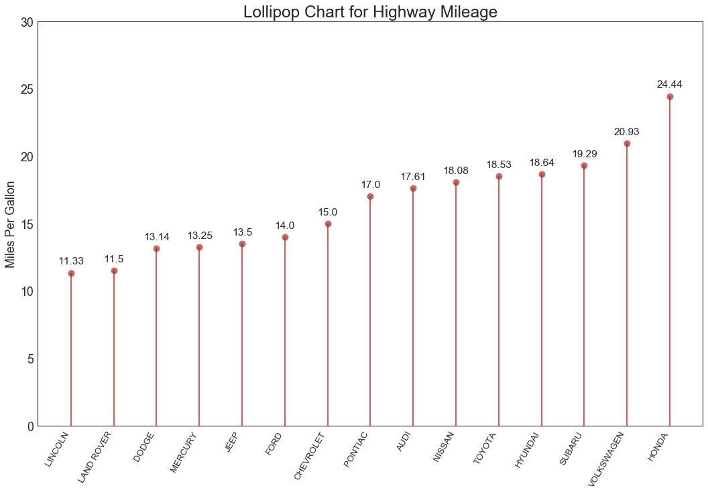


图16

### 19. 包点图 （Dot Plot）

包点图表传达了项目的排名顺序，并且由于它沿水平轴对齐，因此您可以更容易地看到点彼此之间的距离。

```plaintext
# Prepare Data
df_raw = pd.read_csv("https://github.com/selva86/datasets/raw/master/mpg_ggplot2.csv")
df = df_raw[['cty', 'manufacturer']].groupby('manufacturer').apply(lambda x: x.mean())
df.sort_values('cty', inplace=True)
df.reset_index(inplace=True)

# Draw plot
fig, ax = plt.subplots(figsize=(16,10), dpi= 80)
ax.hlines(y=df.index, xmin=11, xmax=26, color='gray', alpha=0.7, linewidth=1, linestyles='dashdot')
ax.scatter(y=df.index, x=df.cty, s=75, color='firebrick', alpha=0.7)

# Title, Label, Ticks and Ylim
ax.set_title('Dot Plot for Highway Mileage', fontdict={'size':22})
ax.set_xlabel('Miles Per Gallon')
ax.set_yticks(df.index)
ax.set_yticklabels(df.manufacturer.str.title(), fontdict={'horizontalalignment': 'right'})
ax.set_xlim(10, 27)
plt.show()
```


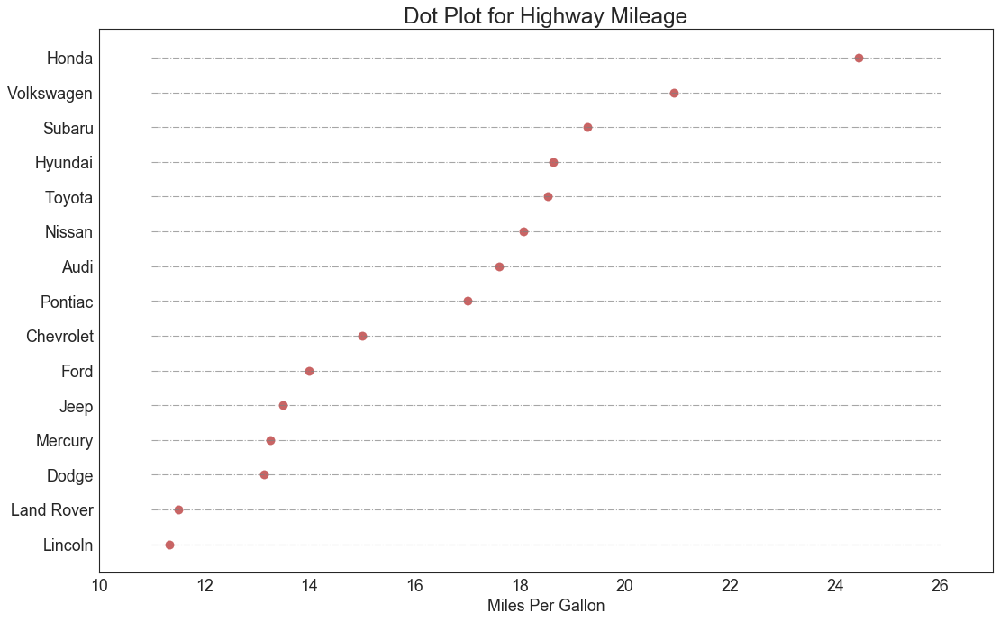


图17

### 20. 坡度图 （Slope Chart）

坡度图最适合比较给定人/项目的“前”和“后”位置。

```plaintext
import matplotlib.lines as mlines
# Import Data
df = pd.read_csv("https://raw.githubusercontent.com/selva86/datasets/master/gdppercap.csv")

left_label = [str(c) + ', '+ str(round(y)) for c, y in zip(df.continent, df['1952'])]
right_label = [str(c) + ', '+ str(round(y)) for c, y in zip(df.continent, df['1957'])]
klass = ['red' if (y1-y2) < 0 else 'green' for y1, y2 in zip(df['1952'], df['1957'])]

# draw line
# https://stackoverflow.com/questions/36470343/how-to-draw-a-line-with-matplotlib/36479941
def newline(p1, p2, color='black'):
    ax = plt.gca()
    l = mlines.Line2D([p1[0],p2[0]], [p1[1],p2[1]], color='red' if p1[1]-p2[1] > 0 else 'green', marker='o', markersize=6)
    ax.add_line(l)
    return l

fig, ax = plt.subplots(1,1,figsize=(14,14), dpi= 80)

# Vertical Lines
ax.vlines(x=1, ymin=500, ymax=13000, color='black', alpha=0.7, linewidth=1, linestyles='dotted')
ax.vlines(x=3, ymin=500, ymax=13000, color='black', alpha=0.7, linewidth=1, linestyles='dotted')

# Points
ax.scatter(y=df['1952'], x=np.repeat(1, df.shape[0]), s=10, color='black', alpha=0.7)
ax.scatter(y=df['1957'], x=np.repeat(3, df.shape[0]), s=10, color='black', alpha=0.7)

# Line Segmentsand Annotation
for p1, p2, c in zip(df['1952'], df['1957'], df['continent']):
    newline([1,p1], [3,p2])
    ax.text(1-0.05, p1, c + ', ' + str(round(p1)), horizontalalignment='right', verticalalignment='center', fontdict={'size':14})
    ax.text(3+0.05, p2, c + ', ' + str(round(p2)), horizontalalignment='left', verticalalignment='center', fontdict={'size':14})

# 'Before' and 'After' Annotations
ax.text(1-0.05, 13000, 'BEFORE', horizontalalignment='right', verticalalignment='center', fontdict={'size':18, 'weight':700})
ax.text(3+0.05, 13000, 'AFTER', horizontalalignment='left', verticalalignment='center', fontdict={'size':18, 'weight':700})

# Decoration
ax.set_title("Slopechart: Comparing GDP Per Capita between 1952 vs 1957", fontdict={'size':22})
ax.set(xlim=(0,4), ylim=(0,14000), ylabel='Mean GDP Per Capita')
ax.set_xticks([1,3])
ax.set_xticklabels(["1952", "1957"])
plt.yticks(np.arange(500, 13000, 2000), fontsize=12)

# Lighten borders
plt.gca().spines["top"].set_alpha(.0)
plt.gca().spines["bottom"].set_alpha(.0)
plt.gca().spines["right"].set_alpha(.0)
plt.gca().spines["left"].set_alpha(.0)
plt.show()
```


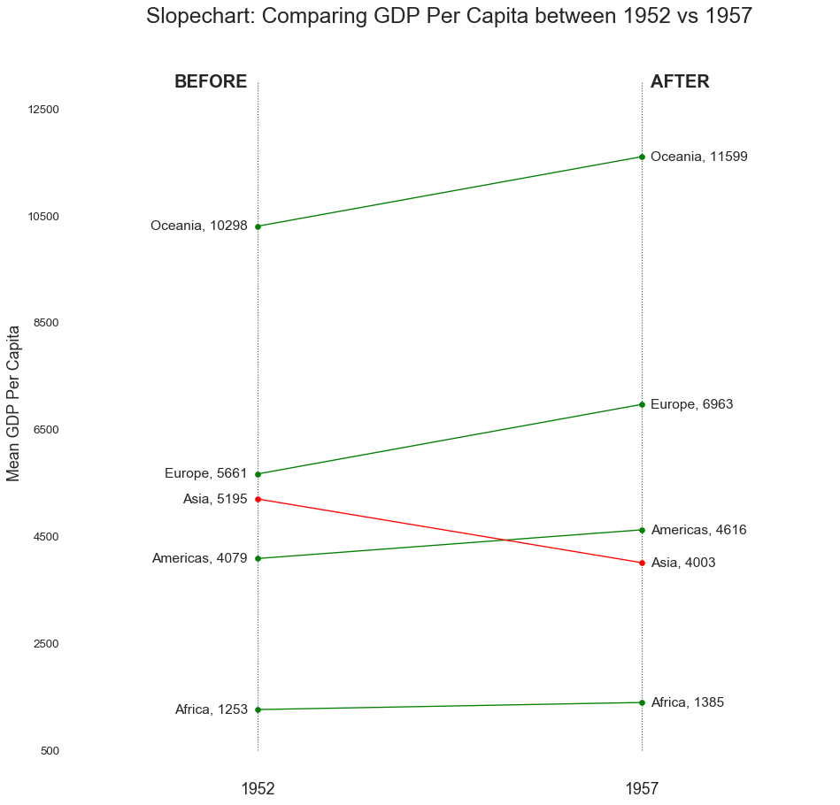


图18

### 21. 哑铃图 （Dumbbell Plot）

哑铃图表传达了各种项目的“前”和“后”位置以及项目的等级排序。 如果您想要将特定项目/计划对不同对象的影响可视化，那么它非常有用。

```plaintext
import matplotlib.lines as mlines

# Import Data
df = pd.read_csv("https://raw.githubusercontent.com/selva86/datasets/master/health.csv")
df.sort_values('pct_2014', inplace=True)
df.reset_index(inplace=True)

# Func to draw line segment
def newline(p1, p2, color='black'):
    ax = plt.gca()
    l = mlines.Line2D([p1[0],p2[0]], [p1[1],p2[1]], color='skyblue')
    ax.add_line(l)
    return l

# Figure and Axes
fig, ax = plt.subplots(1,1,figsize=(14,14), facecolor='#f7f7f7', dpi= 80)

# Vertical Lines
ax.vlines(x=.05, ymin=0, ymax=26, color='black', alpha=1, linewidth=1, linestyles='dotted')
ax.vlines(x=.10, ymin=0, ymax=26, color='black', alpha=1, linewidth=1, linestyles='dotted')
ax.vlines(x=.15, ymin=0, ymax=26, color='black', alpha=1, linewidth=1, linestyles='dotted')
ax.vlines(x=.20, ymin=0, ymax=26, color='black', alpha=1, linewidth=1, linestyles='dotted')

# Points
ax.scatter(y=df['index'], x=df['pct_2013'], s=50, color='#0e668b', alpha=0.7)
ax.scatter(y=df['index'], x=df['pct_2014'], s=50, color='#a3c4dc', alpha=0.7)

# Line Segments
for i, p1, p2 in zip(df['index'], df['pct_2013'], df['pct_2014']):
    newline([p1, i], [p2, i])

# Decoration
ax.set_facecolor('#f7f7f7')
ax.set_title("Dumbell Chart: Pct Change - 2013 vs 2014", fontdict={'size':22})
ax.set(xlim=(0,.25), ylim=(-1, 27), ylabel='Mean GDP Per Capita')
ax.set_xticks([.05, .1, .15, .20])
ax.set_xticklabels(['5%', '15%', '20%', '25%'])
ax.set_xticklabels(['5%', '15%', '20%', '25%'])    
plt.show()
```


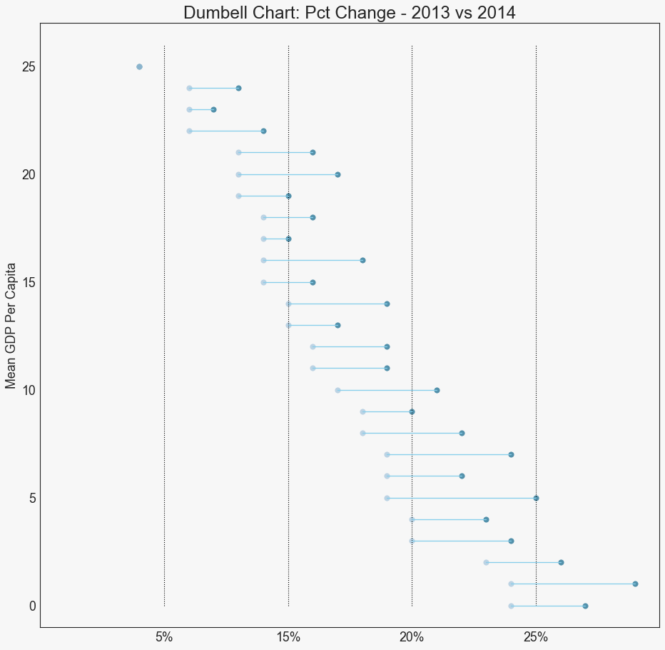


图19


### 22. 凸点图 (Bump Chart)

专门用于展示**排名随时间的变化**。它可以清晰地看到某个项目在多个时间节点中“名次”的起伏，而不是数值。

```python
import pandas as pd

# Data: Team rankings over 4 weeks
data = {
    'Team A': [1, 2, 2, 1],
    'Team B': [2, 1, 3, 2],
    'Team C': [3, 3, 1, 3]
}
df = pd.DataFrame(data, index=['Week 1', 'Week 2', 'Week 3', 'Week 4'])

plt.figure(figsize=(10, 6))
for column in df.columns:
    plt.plot(df.index, df[column], marker='o', lw=3, label=column)

plt.gca().invert_yaxis() # 排名第一在最上方
plt.title('Team Rankings Over Time (Bump Chart)', fontsize=18)
plt.yticks([1, 2, 3])
plt.legend()
plt.grid(axis='x', linestyle='--', alpha=0.6)
plt.show()
```


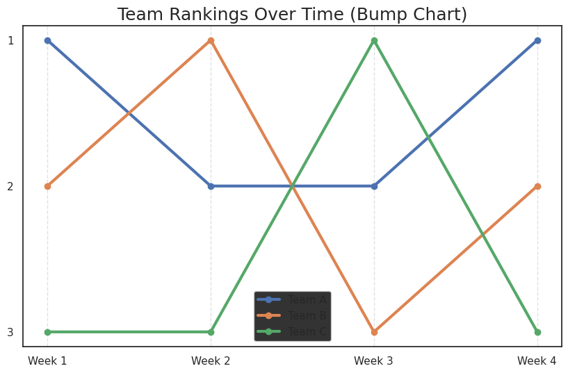

### 23. 帕累托图 (Pareto Chart)

质量管理 80/20 原则的经典图表。结合了条形图（频数）和折线图（累计百分比）。

```plain&#x20;text
data = {'Issue A': 50, 'Issue B': 30, 'Issue C': 15, 'Issue D': 5}
df = pd.DataFrame(list(data.items()), columns=['Problem', 'Count'])
df = df.sort_values(by='Count', ascending=False)
df['cum_percentage'] = df['Count'].cumsum() / df['Count'].sum() * 100

fig, ax1 = plt.subplots(figsize=(10, 6))
ax1.bar(df.Problem, df.Count, color="C0")
ax2 = ax1.twinx()
ax2.plot(df.Problem, df.cum_percentage, color="C1", marker="D", ms=7)
ax2.set_ylim(0, 110)

plt.title('Pareto Chart: 80/20 Rule Analysis', fontsize=18)
plt.show()
```

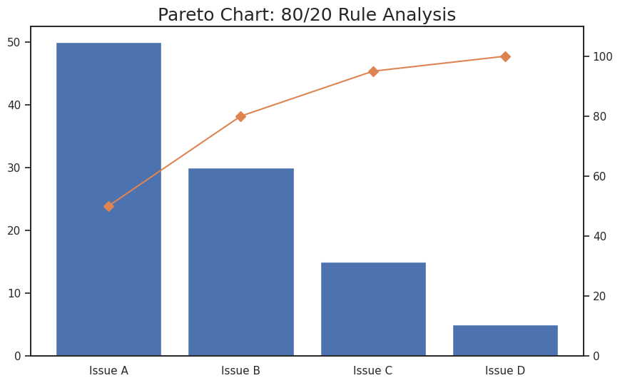


### 24. 条形图 （Bar Chart）

条形图是基于计数或任何给定指标可视化项目的经典方式。 在下面的图表中，我为每个项目使用了不同的颜色，但您通常可能希望为所有项目选择一种颜色，除非您按组对其进行着色。 颜色名称存储在下面代码中的all\_colors中。 您可以通过在 `plt.plot（）` 中设置颜色参数来更改条的颜色。

```plaintext
import random

# Import Data
df_raw = pd.read_csv("https://github.com/selva86/datasets/raw/master/mpg_ggplot2.csv")

# Prepare Data
df = df_raw.groupby('manufacturer').size().reset_index(name='counts')
n = df['manufacturer'].unique().__len__()+1
all_colors = list(plt.cm.colors.cnames.keys())
random.seed(100)
c = random.choices(all_colors, k=n)

# Plot Bars
plt.figure(figsize=(16,10), dpi= 80)
plt.bar(df['manufacturer'], df['counts'], color=c, width=.5)
for i, val in enumerate(df['counts'].values):
    plt.text(i, val, float(val), horizontalalignment='center', verticalalignment='bottom', fontdict={'fontweight':500, 'size':12})

# Decoration
plt.gca().set_xticklabels(df['manufacturer'], rotation=60, horizontalalignment= 'right')
plt.title("Number of Vehicles by Manaufacturers", fontsize=22)
plt.ylabel('# Vehicles')
plt.ylim(0, 45)
plt.show()
```


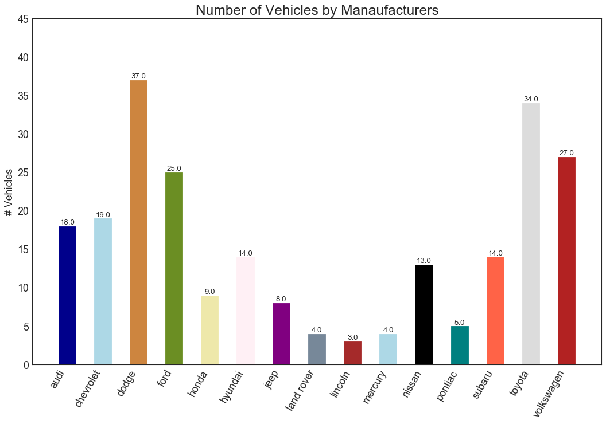


### 25. 径向柱状图 (Radial Bar Chart)

将条形图弯曲成环状，极具视觉冲击力，常用于展示周期性数据或仪表盘。

```plain&#x20;text
# 数据
labels = ['A', 'B', 'C', 'D', 'E']
values = [80, 60, 95, 40, 70]
num_vars = len(labels)

angles = np.linspace(0, 2 * np.pi, num_vars, endpoint=False)
width = 2 * np.pi / num_vars

fig, ax = plt.subplots(figsize=(8, 8), subplot_kw={'projection': 'polar'})
bars = ax.bar(angles, values, width=width, bottom=20, color=plt.cm.viridis(np.linspace(0, 1, num_vars)), edgecolor='white')

ax.set_theta_offset(np.pi / 2)
ax.set_theta_direction(-1)
ax.set_xticks(angles)
ax.set_xticklabels(labels)
ax.set_yticklabels([]) # 隐藏圈圈刻度
plt.title("Radial Bar Chart", fontsize=18)
plt.show()
```

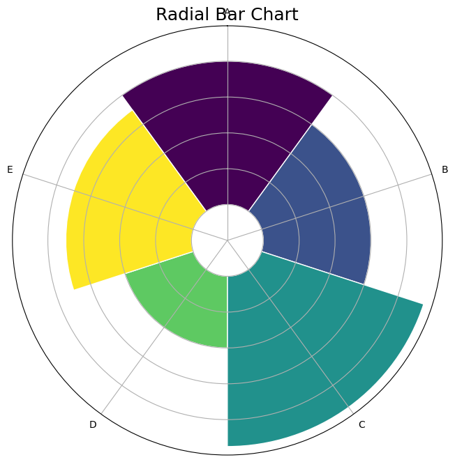


## 四、分布 （Distribution）

### 26. 连续变量的直方图 （Histogram for Continuous Variable）

直方图显示给定变量的频率分布。 下面的图表示基于类型变量对频率条进行分组，从而更好地了解连续变量和类型变量。

```plaintext
# Import Data
df = pd.read_csv("https://github.com/selva86/datasets/raw/master/mpg_ggplot2.csv")

# Prepare data
x_var = 'displ'
groupby_var = 'class'
df_agg = df.loc[:, [x_var, groupby_var]].groupby(groupby_var)
vals = [df[x_var].values.tolist() for i, df in df_agg]

# Draw
plt.figure(figsize=(16,9), dpi= 80)
colors = [plt.cm.Spectral(i/float(len(vals)-1)) for i in range(len(vals))]
n, bins, patches = plt.hist(vals, 30, stacked=True, density=False, color=colors[:len(vals)])

# Decoration
plt.legend({group:col for group, col in zip(np.unique(df[groupby_var]).tolist(), colors[:len(vals)])})
plt.title(f"Stacked Histogram of ${x_var}$ colored by ${groupby_var}$", fontsize=22)
plt.xlabel(x_var)
plt.ylabel("Frequency")
plt.ylim(0, 25)
plt.xticks(ticks=bins[::3], labels=[round(b,1) for b in bins[::3]])
plt.show()
```


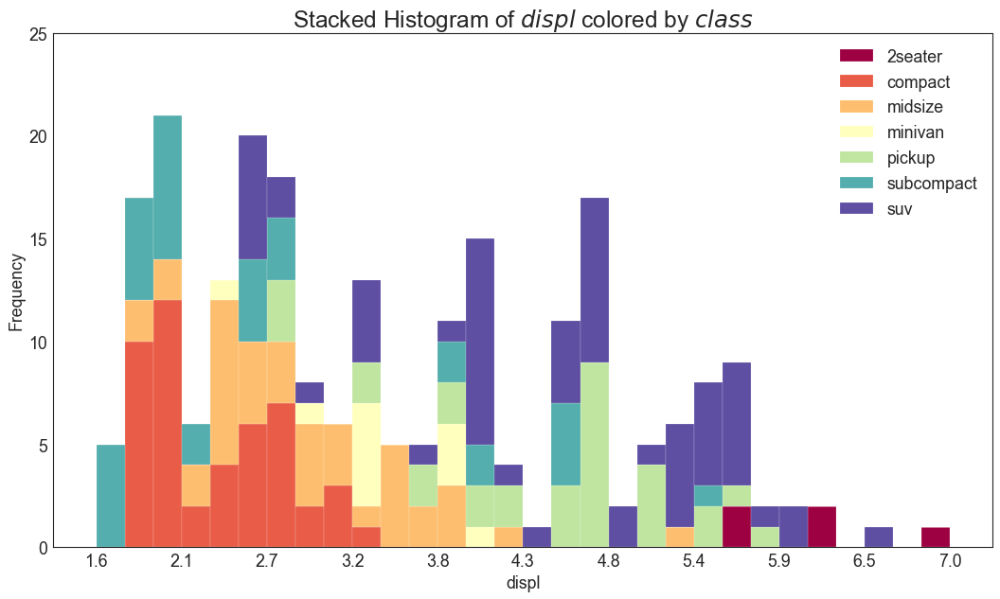


图20

### 27. 类型变量的直方图 （Histogram for Categorical Variable）

类型变量的直方图显示该变量的频率分布。 通过对条形图进行着色，可以将分布与表示颜色的另一个类型变量相关联。

```plaintext
# Import Data
df = pd.read_csv("https://github.com/selva86/datasets/raw/master/mpg_ggplot2.csv")

# Prepare data
x_var = 'manufacturer'
groupby_var = 'class'
df_agg = df.loc[:, [x_var, groupby_var]].groupby(groupby_var)
vals = [df[x_var].values.tolist() for i, df in df_agg]

# Draw
plt.figure(figsize=(16,9), dpi= 80)
colors = [plt.cm.Spectral(i/float(len(vals)-1)) for i in range(len(vals))]
n, bins, patches = plt.hist(vals, df[x_var].unique().__len__(), stacked=True, density=False, color=colors[:len(vals)])

# Decoration
plt.legend({group:col for group, col in zip(np.unique(df[groupby_var]).tolist(), colors[:len(vals)])})
plt.title(f"Stacked Histogram of ${x_var}$ colored by ${groupby_var}$", fontsize=22)
plt.xlabel(x_var)
plt.ylabel("Frequency")
plt.ylim(0, 40)
plt.xticks(ticks=bins, labels=np.unique(df[x_var]).tolist(), rotation=90, horizontalalignment='left')
plt.show()
```


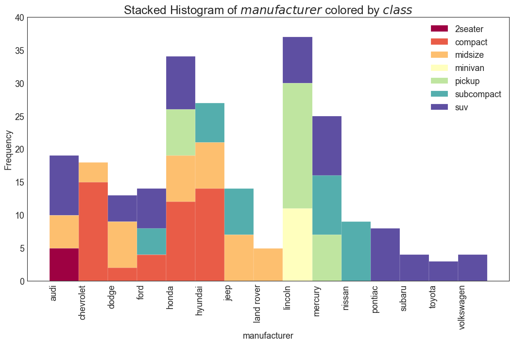


图21

### 28. 密度图 （Density Plot）

密度图是一种常用工具，用于可视化连续变量的分布。 通过“响应”变量对它们进行分组，您可以检查 X 和 Y 之间的关系。以下情况用于表示目的，以描述城市里程的分布如何随着汽缸数的变化而变化。

```plaintext
# Import Data
df = pd.read_csv("https://github.com/selva86/datasets/raw/master/mpg_ggplot2.csv")

# Draw Plot
plt.figure(figsize=(16,10), dpi= 80)
sns.kdeplot(df.loc[df['cyl'] == 4, "cty"], shade=True, color="g", label="Cyl=4", alpha=.7)
sns.kdeplot(df.loc[df['cyl'] == 5, "cty"], shade=True, color="deeppink", label="Cyl=5", alpha=.7)
sns.kdeplot(df.loc[df['cyl'] == 6, "cty"], shade=True, color="dodgerblue", label="Cyl=6", alpha=.7)
sns.kdeplot(df.loc[df['cyl'] == 8, "cty"], shade=True, color="orange", label="Cyl=8", alpha=.7)

# Decoration
plt.title('Density Plot of City Mileage by n_Cylinders', fontsize=22)
plt.legend()
plt.show()
```


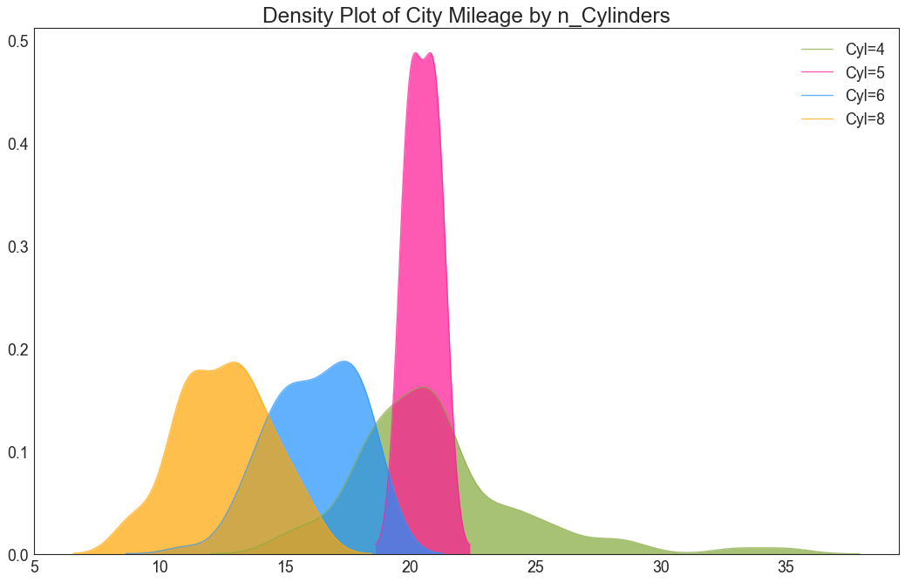


图22

### 29. 直方密度线图 （Density Curves with Histogram）

带有直方图的密度曲线汇集了两个图所传达的集体信息，因此您可以将它们放在一个图中而不是两个图中。

```plaintext
# Import Data
df = pd.read_csv("https://github.com/selva86/datasets/raw/master/mpg_ggplot2.csv")

# Draw Plot
plt.figure(figsize=(13,10), dpi= 80)
sns.distplot(df.loc[df['class'] == 'compact', "cty"], color="dodgerblue", label="Compact", hist_kws={'alpha':.7}, kde_kws={'linewidth':3})
sns.distplot(df.loc[df['class'] == 'suv', "cty"], color="orange", label="SUV", hist_kws={'alpha':.7}, kde_kws={'linewidth':3})
sns.distplot(df.loc[df['class'] == 'minivan', "cty"], color="g", label="minivan", hist_kws={'alpha':.7}, kde_kws={'linewidth':3})
plt.ylim(0, 0.35)

# Decoration
plt.title('Density Plot of City Mileage by Vehicle Type', fontsize=22)
plt.legend()
plt.show()
```


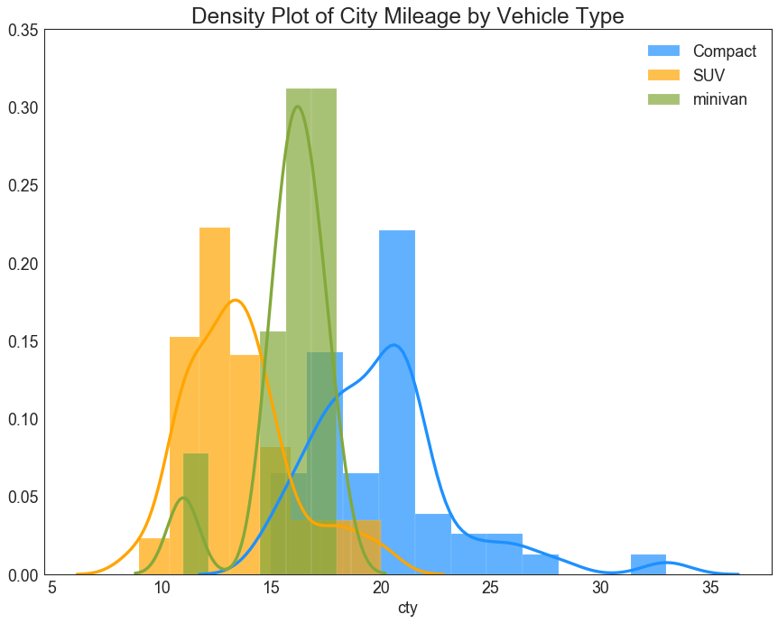


图23

### 30. 脊线图 (Ridge Plot / Joyplot)

脊线图 (Ridge Plot / Joyplot)允许不同组的密度曲线重叠，这是一种可视化大量分组数据的彼此关系分布的好方法。 它看起来很悦目，并清楚地传达了正确的信息。 它可以使用基于 matplotlib 的 joypy 包轻松构建。 （『智影双全』注：需要安装 joypy 库）

```plaintext
# !pip install joypy
# 智影双全 备注
import joypy

# Import Data
mpg = pd.read_csv("https://github.com/selva86/datasets/raw/master/mpg_ggplot2.csv")

# Draw Plot
plt.figure(figsize=(16,10), dpi= 80)
fig, axes = joypy.joyplot(mpg, column=['hwy', 'cty'], by="class", ylim='own', figsize=(14,10))

# Decoration
plt.title('Joy Plot of City and Highway Mileage by Class', fontsize=22)
plt.show()
```


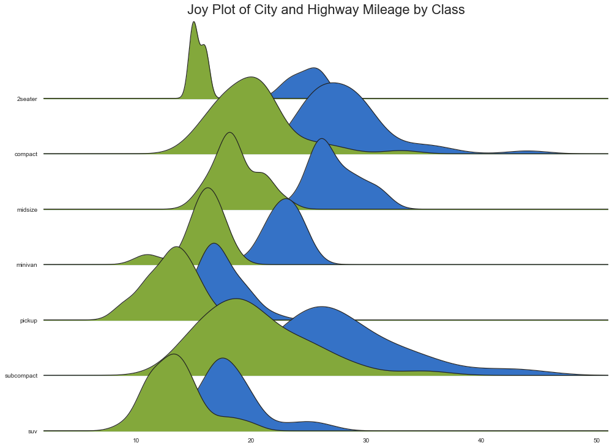


展示多个类别随时间或数值范围的分布变化。比重叠的密度图更清晰，视觉效果极佳。

```python
import seaborn as sns

# Generate Data
sns.set_theme(style="white", rc={"axes.facecolor": (0, 0, 0, 0)})
df = sns.load_dataset("iris")

# Plot
g = sns.FacetGrid(df, row="species", hue="species", aspect=5, height=1.5)
g.map(sns.kdeplot, "sepal_length", fill=True, alpha=1, lw=1.5)
g.map(plt.axhline, y=0, lw=2, clip_on=False)

# Decoration
g.fig.subplots_adjust(hspace=-0.25)
g.set_titles("")
g.set(yticks=[], ylabel="")
g.despine(bottom=True, left=True)
plt.suptitle('Ridge Plot: Iris Sepal Length Distribution', fontsize=18)
plt.show()
```

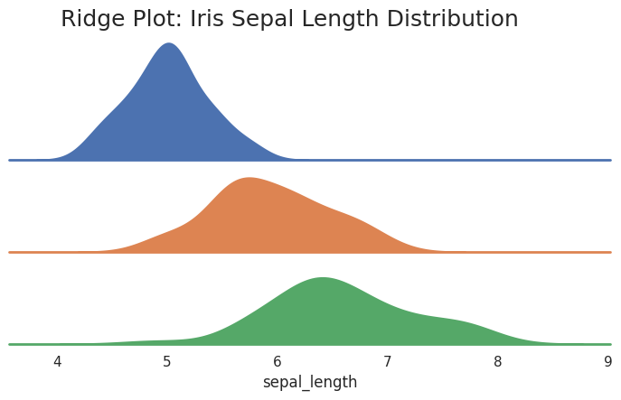


### 31. 分布式包点图 （Distributed Dot Plot）

分布式包点图显示按组分割的点的单变量分布。 点数越暗，该区域的数据点集中度越高。 通过对中位数进行不同着色，组的真实定位立即变得明显。

```plaintext
import matplotlib.patches as mpatches

# Prepare Data
df_raw = pd.read_csv("https://github.com/selva86/datasets/raw/master/mpg_ggplot2.csv")
cyl_colors = {4:'tab:red', 5:'tab:green', 6:'tab:blue', 8:'tab:orange'}
df_raw['cyl_color'] = df_raw.cyl.map(cyl_colors)

# Mean and Median city mileage by make
df = df_raw[['cty', 'manufacturer']].groupby('manufacturer').apply(lambda x: x.mean())
df.sort_values('cty', ascending=False, inplace=True)
df.reset_index(inplace=True)
df_median = df_raw[['cty', 'manufacturer']].groupby('manufacturer').apply(lambda x: x.median())

# Draw horizontal lines
fig, ax = plt.subplots(figsize=(16,10), dpi= 80)
ax.hlines(y=df.index, xmin=0, xmax=40, color='gray', alpha=0.5, linewidth=.5, linestyles='dashdot')

# Draw the Dots
for i, make in enumerate(df.manufacturer):
    df_make = df_raw.loc[df_raw.manufacturer==make, :]
    ax.scatter(y=np.repeat(i, df_make.shape[0]), x='cty', data=df_make, s=75, edgecolors='gray', c='w', alpha=0.5)
    ax.scatter(y=i, x='cty', data=df_median.loc[df_median.index==make, :], s=75, c='firebrick')

# Annotate    
ax.text(33, 13, "$red \; dots \; are \; the \: median$", fontdict={'size':12}, color='firebrick')

# Decorations
red_patch = plt.plot([],[], marker="o", ms=10, ls="", mec=None, color='firebrick', label="Median")
plt.legend(handles=red_patch)
ax.set_title('Distribution of City Mileage by Make', fontdict={'size':22})
ax.set_xlabel('Miles Per Gallon (City)', alpha=0.7)
ax.set_yticks(df.index)
ax.set_yticklabels(df.manufacturer.str.title(), fontdict={'horizontalalignment': 'right'}, alpha=0.7)
ax.set_xlim(1, 40)
plt.xticks(alpha=0.7)
plt.gca().spines["top"].set_visible(False)    
plt.gca().spines["bottom"].set_visible(False)    
plt.gca().spines["right"].set_visible(False)    
plt.gca().spines["left"].set_visible(False)   
plt.grid(axis='both', alpha=.4, linewidth=.1)
plt.show()
```


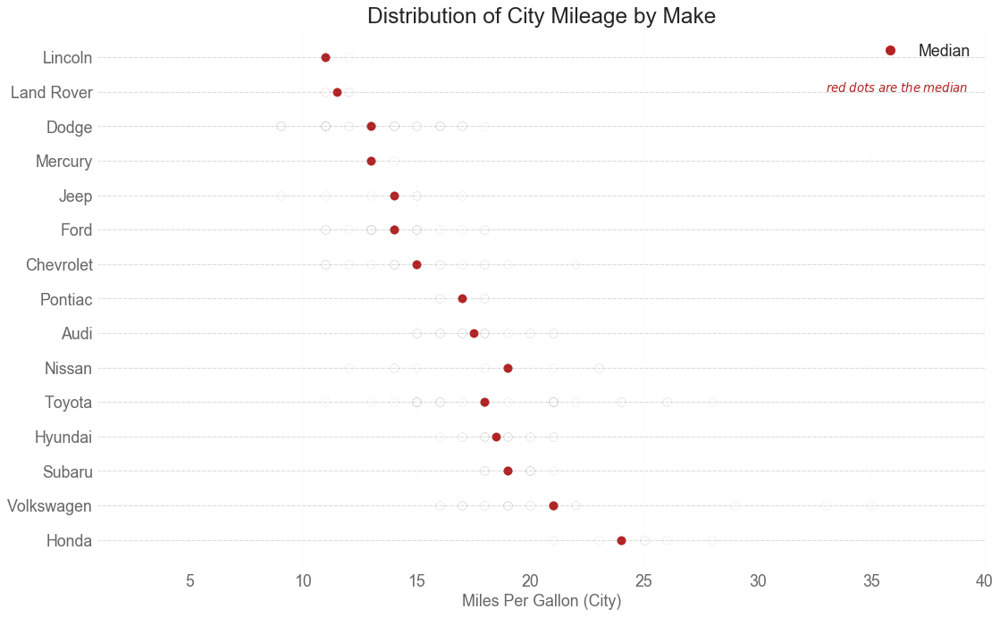


图25

### 32. 箱形图 （Box Plot）

箱形图是一种可视化分布的好方法，记住中位数、第25个第45个四分位数和异常值。 但是，您需要注意解释可能会扭曲该组中包含的点数的框的大小。 因此，手动提供每个框中的观察数量可以帮助克服这个缺点。

例如，左边的前两个框具有相同大小的框，即使它们的值分别是5和47。 因此，写入该组中的观察数量是必要的。

```plaintext
# Import Data
df = pd.read_csv("https://github.com/selva86/datasets/raw/master/mpg_ggplot2.csv")

# Draw Plot
plt.figure(figsize=(13,10), dpi= 80)
sns.boxplot(x='class', y='hwy', data=df, notch=False)

# Add N Obs inside boxplot (optional)
def add_n_obs(df,group_col,y):
    medians_dict = {grp[0]:grp[1][y].median() for grp in df.groupby(group_col)}
    xticklabels = [x.get_text() for x in plt.gca().get_xticklabels()]
    n_obs = df.groupby(group_col)[y].size().values
    for (x, xticklabel), n_ob in zip(enumerate(xticklabels), n_obs):
        plt.text(x, medians_dict[xticklabel]*1.01, "#obs : "+str(n_ob), horizontalalignment='center', fontdict={'size':14}, color='white')

add_n_obs(df,group_col='class',y='hwy')    

# Decoration
plt.title('Box Plot of Highway Mileage by Vehicle Class', fontsize=22)
plt.ylim(10, 40)
plt.show()
```


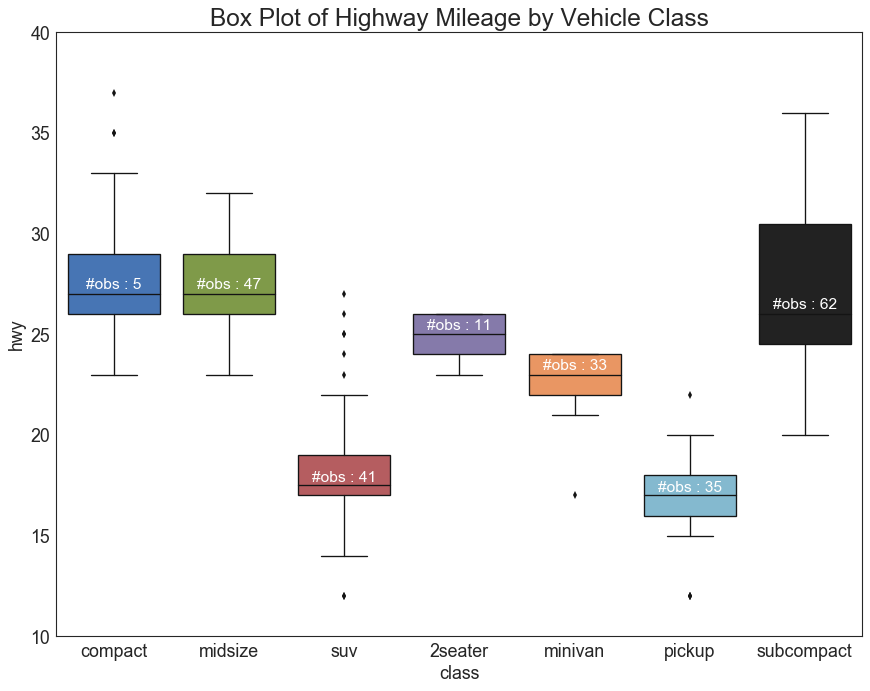


图26

### 33. 包点+箱形图 （Dot + Box Plot）

包点+箱形图 （Dot + Box Plot）传达类似于分组的箱形图信息。 此外，这些点可以了解每组中有多少数据点。

```plaintext
# Import Data
df = pd.read_csv("https://github.com/selva86/datasets/raw/master/mpg_ggplot2.csv")

# Draw Plot
plt.figure(figsize=(13,10), dpi= 80)
sns.boxplot(x='class', y='hwy', data=df, hue='cyl')
sns.stripplot(x='class', y='hwy', data=df, color='black', size=3, jitter=1)

for i in range(len(df['class'].unique())-1):
    plt.vlines(i+.5, 10, 45, linestyles='solid', colors='gray', alpha=0.2)

# Decoration
plt.title('Box Plot of Highway Mileage by Vehicle Class', fontsize=22)
plt.legend(title='Cylinders')
plt.show()
```


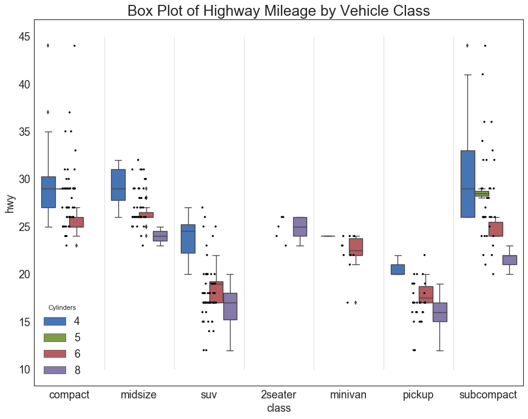


图27

### 34. 小提琴图 （Violin Plot）

小提琴图是箱形图在视觉上令人愉悦的替代品。 小提琴的形状或面积取决于它所持有的观察次数。 但是，小提琴图可能更难以阅读，并且在专业设置中不常用。

```plaintext
# Import Data
df = pd.read_csv("https://github.com/selva86/datasets/raw/master/mpg_ggplot2.csv")

# Draw Plot
plt.figure(figsize=(13,10), dpi= 80)
sns.violinplot(x='class', y='hwy', data=df, scale='width', inner='quartile')

# Decoration
plt.title('Violin Plot of Highway Mileage by Vehicle Class', fontsize=22)
plt.show()
```


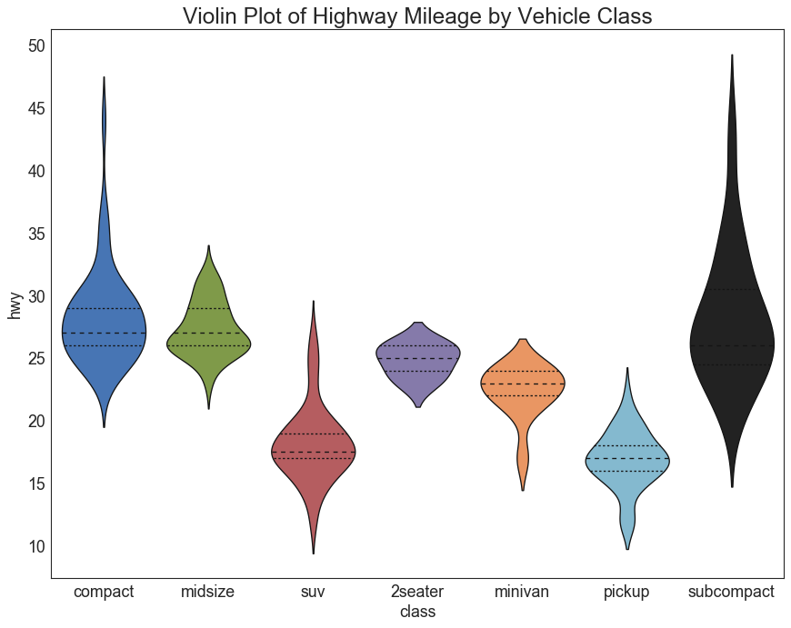


图28

### 35. 人口金字塔 （Population Pyramid）

人口金字塔可用于显示由数量排序的组的分布。 或者它也可以用于显示人口的逐级过滤，因为它在下面用于显示有多少人通过营销渠道的每个阶段。

```plaintext
# Read data
df = pd.read_csv("https://raw.githubusercontent.com/selva86/datasets/master/email_campaign_funnel.csv")

# Draw Plot
plt.figure(figsize=(13,10), dpi= 80)
group_col = 'Gender'
order_of_bars = df.Stage.unique()[::-1]
colors = [plt.cm.Spectral(i/float(len(df[group_col].unique())-1)) for i in range(len(df[group_col].unique()))]

for c, group in zip(colors, df[group_col].unique()):
    sns.barplot(x='Users', y='Stage', data=df.loc[df[group_col]==group, :], order=order_of_bars, color=c, label=group)

# Decorations    
plt.xlabel("$Users$")
plt.ylabel("Stage of Purchase")
plt.yticks(fontsize=12)
plt.title("Population Pyramid of the Marketing Funnel", fontsize=22)
plt.legend()
plt.show()
```


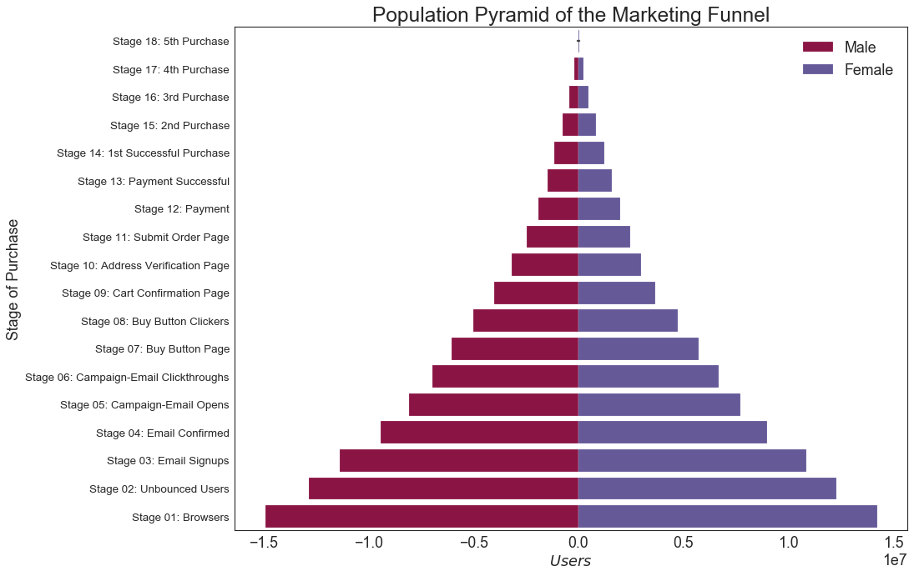


### 36. 分类图 （Categorical Plots）

由 seaborn库 提供的分类图可用于可视化彼此相关的2个或更多分类变量的计数分布。

```plaintext
# Load Dataset
titanic = sns.load_dataset("titanic")

# Plot
g = sns.catplot("alive", col="deck", col_wrap=4,
                data=titanic[titanic.deck.notnull()],
                kind="count", height=3.5, aspect=.8,
                palette='tab20')

fig.suptitle('sf')
plt.show()
```


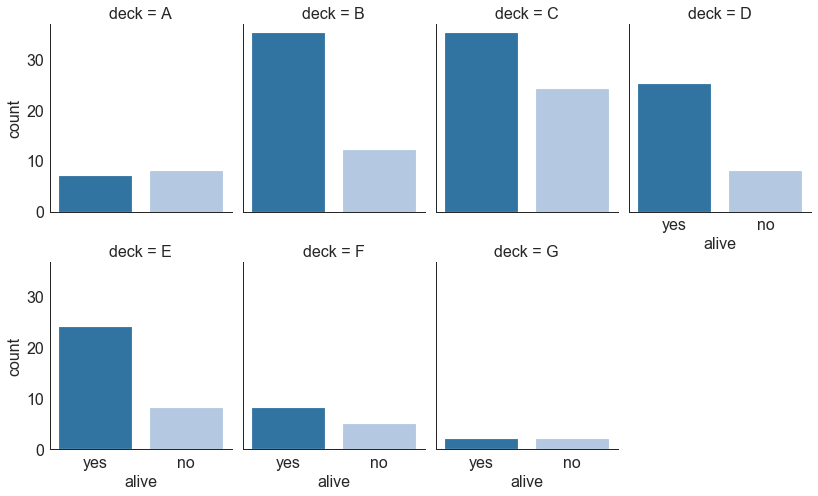


图30

```plaintext
# Load Dataset
titanic = sns.load_dataset("titanic")

# Plot
sns.catplot(x="age", y="embark_town",
            hue="sex", col="class",
            data=titanic[titanic.embark_town.notnull()],
            orient="h", height=5, aspect=1, palette="tab10",
            kind="violin", dodge=True, cut=0, bw=.2)
```


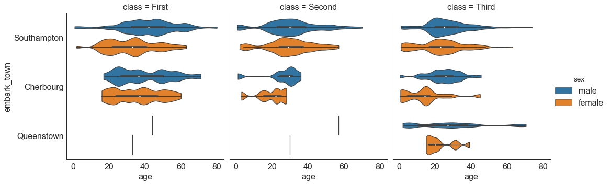


图30-2


```python
import seaborn as sns
import matplotlib.pyplot as plt

# Import Data
titanic = sns.load_dataset("titanic")

# Plot
plt.figure(figsize=(10, 8))
sns.boxenplot(x='class', y='fare', data=titanic, hue='survived', palette='magma')

# Decoration
plt.title('Boxenplot (Letter-Value Plot) for Large Data: Fare vs Class', fontsize=22)
plt.show()
```

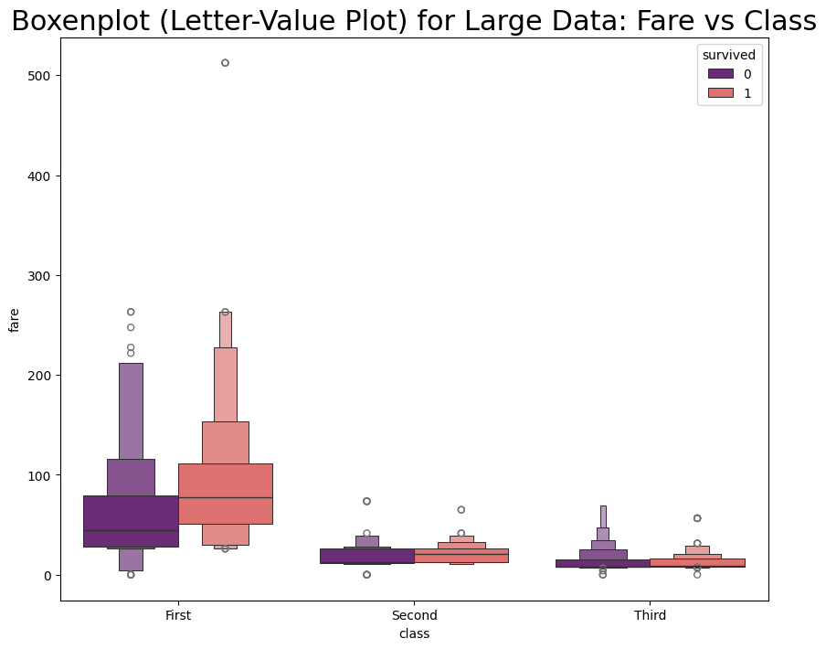

### 37. 六边形箱图 (Hexbin Plot)

当散点图的点过于密集（数据量极大）导致无法分辨密度时，Hexbin 是最佳替代方案。

```python
# Generate Data
n = 100000
x = np.random.standard_normal(n)
y = 2.0 + 3.0 * x + 4.0 * np.random.standard_normal(n)

# Plot
plt.figure(figsize=(12, 9))
hb = plt.hexbin(x, y, gridsize=50, cmap='YlGnBu', mincnt=1)
cb = plt.colorbar(hb, label='Counts')

# Decoration
plt.title('Hexbin Plot for Large Datasets', fontsize=22)
plt.xlabel('X Value')
plt.ylabel('Y Value')
plt.show()
```

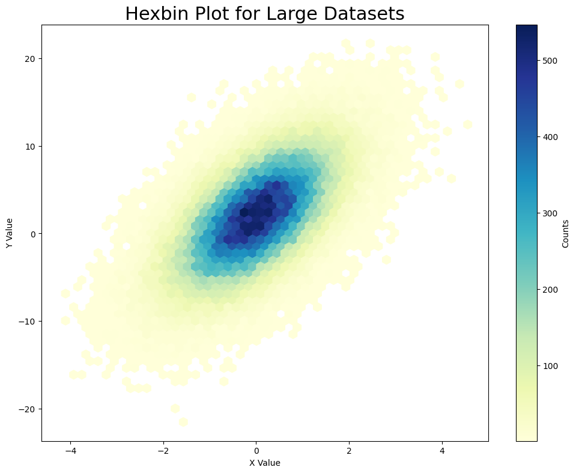

### 38. 二维核密度估计图 (2D KDE Plot)

与 Hexbin 类似，但它通过平滑的轮廓线（类似等高线）展示密度，适合展示两个变量之间的连续分布规律。

```python
import seaborn as sns
iris = sns.load_dataset('iris')

plt.figure(figsize=(10, 8))
sns.kdeplot(data=iris, x="sepal_width", y="sepal_length", fill=True, cmap="Purples", thresh=0.05)
plt.title('2D Density Plot: Sepal Dimensions', fontsize=18)
plt.show()
```

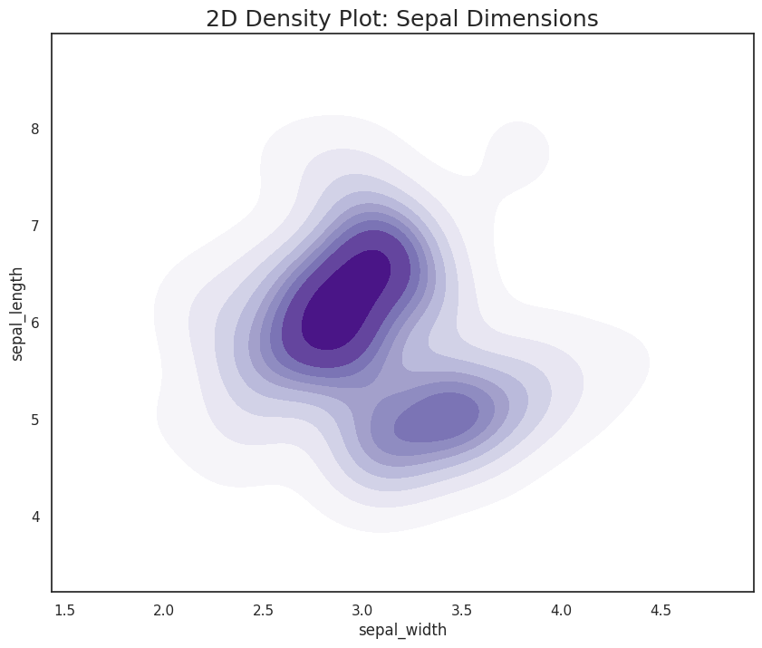


### 39. 联合分布图 (Joint Plot)

在一张图里同时看到：1. 两个变量的散点关联；2. 每个变量各自的直方图分布。

```plain&#x20;text
import seaborn as sns
tips = sns.load_dataset("tips")

g = sns.jointplot(data=tips, x="total_bill", y="tip", kind="reg", color="m", height=7)
plt.suptitle('Joint Plot: Scatter + Regression + Marginal Distribution', y=1.02, fontsize=16)
plt.show()
```

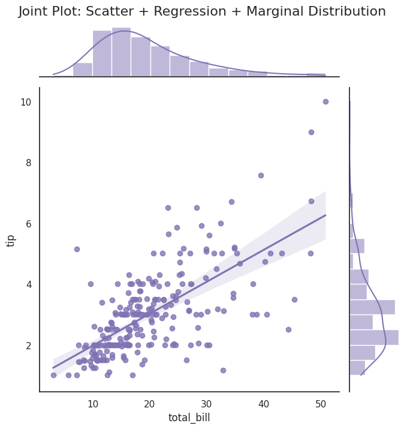


### 40. 地毯图 (Rug Plot)

常与 KDE（核密度估计）结合，增强对数据密度的感知。

```plain&#x20;text
# --- Density + Rug Plot ---
df_iris = sns.load_dataset('iris')

plt.figure(figsize=(10, 6))
sns.distplot(df_iris['sepal_length'], hist=True, kde=True, 
             rug=True, # 底部添加小细线
             rug_kws={"color": "r", "alpha": 0.5, "height": 0.05},
             kde_kws={"color": "b", "lw": 3},
             hist_kws={"histtype": "step", "linewidth": 3, "alpha": 0.3, "color": "g"})

plt.title("Distribution of Sepal Length with Rug Plot", fontsize=20)
plt.show()
```

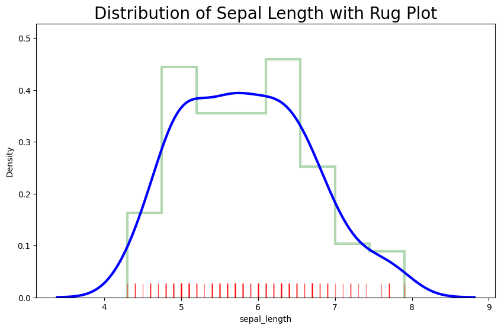


### 41. 雨云图 (Raincloud Plot)

雨云图结合了**核密度估计 (KDE)**、**箱形图**和**抖动散点图**，是目前统计学界最推崇的展示分布的方式，因为它不隐藏任何原始数据。

```plain&#x20;text
# 需要安装 ptitprince 库，或者用 seaborn 模拟import seaborn as sns

# Load Data
tips = sns.load_dataset("tips")

# Plot
plt.figure(figsize=(13, 10))
ax = sns.violinplot(x="day", y="total_bill", data=tips, inner=None, color=".8")
ax = sns.stripplot(x="day", y="total_bill", data=tips, jitter=True, alpha=0.5)
ax = sns.boxplot(x="day", y="total_bill", data=tips, width=0.15, showcaps=False, 
                 boxprops={'facecolor':'none', "zorder":10}, showfliers=False, whiskerprops={'linewidth':2, "zorder":10})

plt.title('Raincloud Plot: Distribution of Tips by Day', fontsize=22)
plt.show()
```

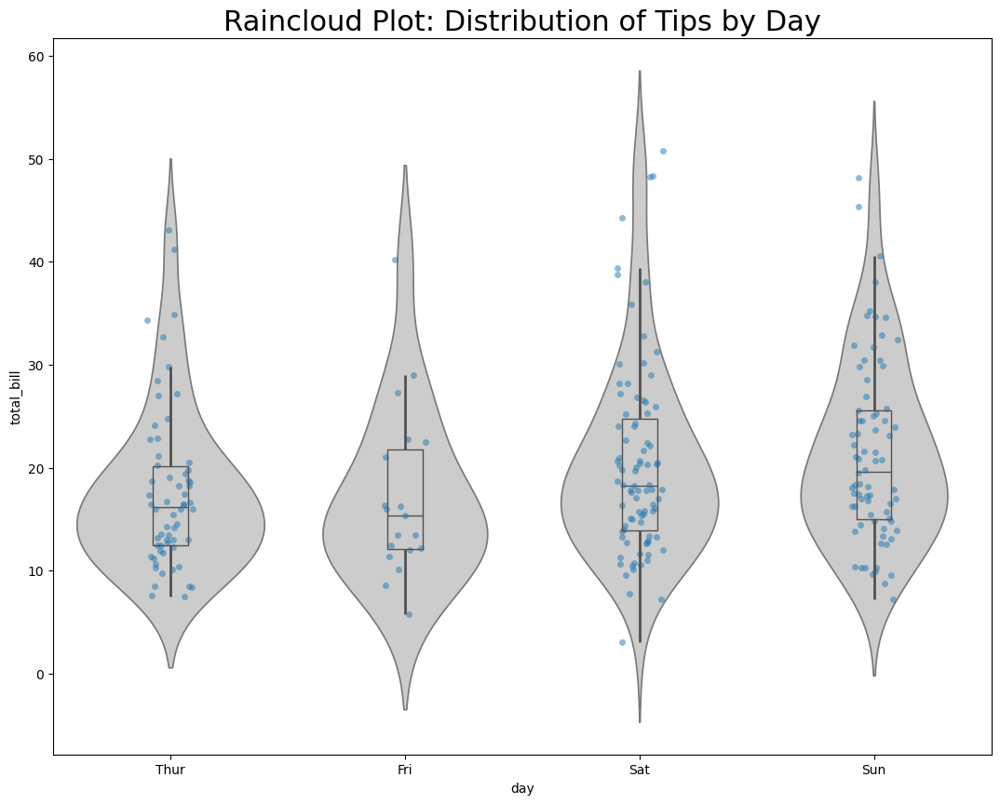


### 42. 经验累积分布函数图 (ECDF Plot)

比直方图更稳健，不受分箱（bin）数量影响，能精确看出多少比例的数据小于某个值。

```plain&#x20;text
import seaborn as sns
df_iris = sns.load_dataset('iris')

plt.figure(figsize=(10, 6))
sns.ecdfplot(data=df_iris, x="sepal_length", hue="species")
plt.title('Empirical Cumulative Distribution Function (ECDF)', fontsize=18)
plt.grid(axis='both', alpha=0.3)
plt.show()
```

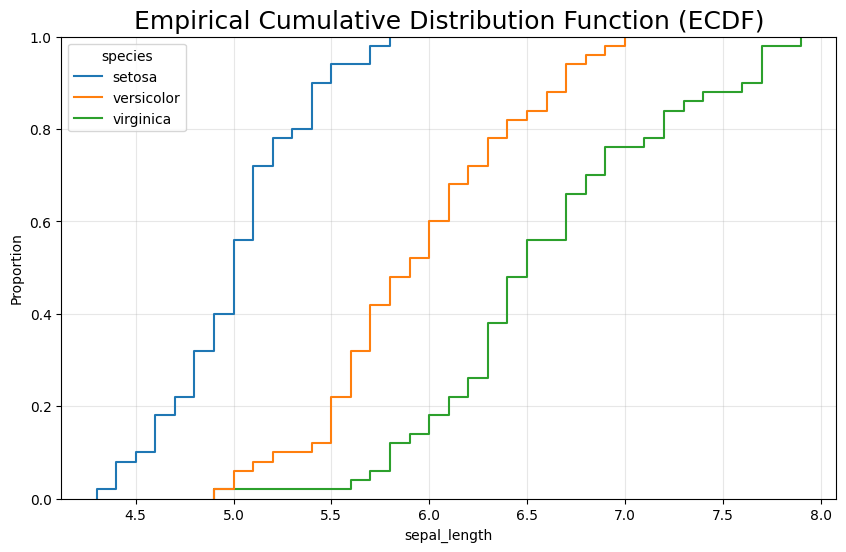


### 43. 豆状图 (Bean Plot)

小提琴图的变体，它在展示密度的同时，用横线展示每一个原始观测值，比小提琴图更“透明”。

```plain&#x20;text
# 通常使用 seaborn 的 violinplot 配合 inner='stick' 实现类似效果
plt.figure(figsize=(10, 6))
sns.violinplot(x='day', y='total_bill', data=tips, inner='stick', palette="Pastel1")
plt.title('Bean Plot Style (Violin + Individual Observations)', fontsize=18)
plt.show()
```

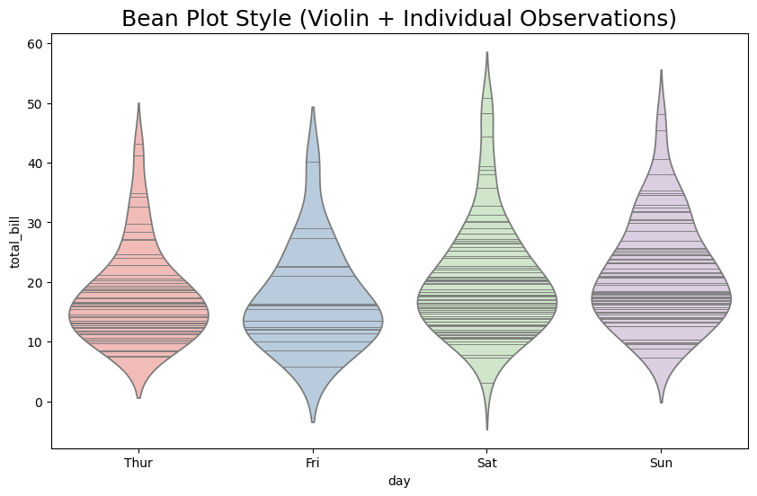


### 44. 库克距离图 (Cook's Distance Plot)

衡量回归模型中每个样本点对参数估计的影响力。用于识别“强影响力点”（Outliers/Leverage points），即那些如果删掉会对模型产生剧烈影响的点。

```plain&#x20;text
import statsmodels.api as sm
from statsmodels.stats.outliers_influence import OLSInfluence
import matplotlib.pyplot as plt
import numpy as np

# Generate new X and y data suitable for regression with matching sizes
np.random.seed(42)
n_samples = 100
X_reg = np.random.rand(n_samples, 2) * 10 # 2 independent variables
y_reg = 2 * X_reg[:, 0] + 3 * X_reg[:, 1] + np.random.normal(0, 1, n_samples) # Linear relationship + noise

# Add a constant to the independent variables for the OLS model
X_reg_const = sm.add_constant(X_reg)

# Fit a simple OLS model
ols_model = sm.OLS(y_reg, X_reg_const)
ols_results = ols_model.fit()

# Now, pass the ols_results to OLSInfluence
influence = OLSInfluence(ols_results)
(c, p) = influence.cooks_distance

plt.figure(figsize=(12, 6))
plt.stem(np.arange(len(c)), c, markerfmt=",")
plt.axhline(4/len(c), color='red', linestyle='--') # 常用阈值线
plt.title("Cook's Distance: Detecting Influential Points")
plt.xlabel("Observation Index")
plt.ylabel("Cook's Distance")
plt.show()
```

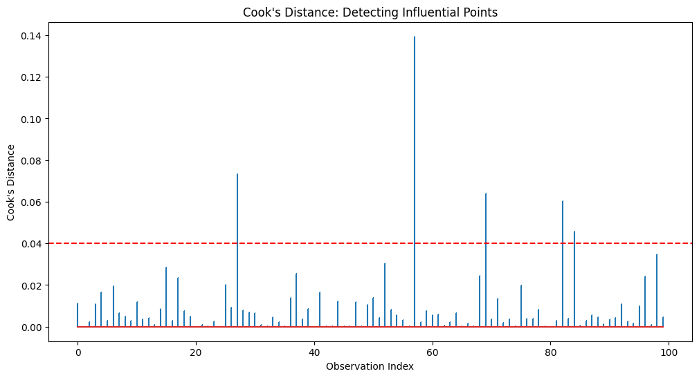


## 五、组成 （Composition）

### 45. 华夫饼图 （Waffle Chart）

可以使用 pywaffle包 创建华夫饼图，并用于显示更大群体中的组的组成。

（『智影双全』注：需要安装 pywaffle 库）

```plaintext
#! pip install pywaffle
# Reference: https://stackoverflow.com/questions/41400136/how-to-do-waffle-charts-in-python-square-piechart
from pywaffle import Waffle

# Import
df_raw = pd.read_csv("https://github.com/selva86/datasets/raw/master/mpg_ggplot2.csv")

# Prepare Data
df = df_raw.groupby('class').size().reset_index(name='counts')
n_categories = df.shape[0]
colors = [plt.cm.inferno_r(i/float(n_categories)) for i in range(n_categories)]

# Draw Plot and Decorate
fig = plt.figure(
    FigureClass=Waffle,
    plots={
        '111': {
            'values': df['counts'],
            'labels': ["{0} ({1})".format(n[0], n[1]) for n in df[['class', 'counts']].itertuples()],
            'legend': {'loc': 'upper left', 'bbox_to_anchor': (1.05, 1), 'fontsize': 12},
            'title': {'label': '# Vehicles by Class', 'loc': 'center', 'fontsize':18}
        },
    },
    rows=7,
    colors=colors,
    figsize=(16, 9)
)
```


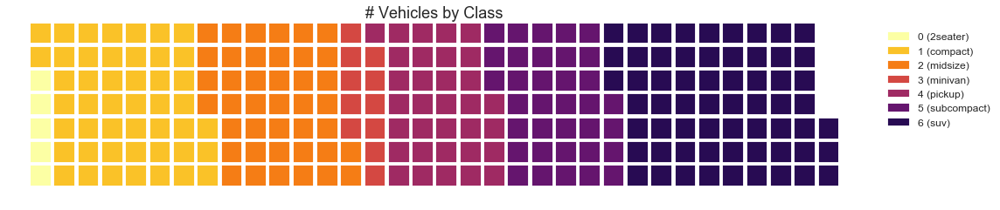


图31

```plaintext
#! pip install pywaffle
from pywaffle import Waffle

# Import
# df_raw = pd.read_csv("https://github.com/selva86/datasets/raw/master/mpg_ggplot2.csv")

# Prepare Data
# By Class Data
df_class = df_raw.groupby('class').size().reset_index(name='counts_class')
n_categories = df_class.shape[0]
colors_class = [plt.cm.Set3(i/float(n_categories)) for i in range(n_categories)]

# By Cylinders Data
df_cyl = df_raw.groupby('cyl').size().reset_index(name='counts_cyl')
n_categories = df_cyl.shape[0]
colors_cyl = [plt.cm.Spectral(i/float(n_categories)) for i in range(n_categories)]

# By Make Data
df_make = df_raw.groupby('manufacturer').size().reset_index(name='counts_make')
n_categories = df_make.shape[0]
colors_make = [plt.cm.tab20b(i/float(n_categories)) for i in range(n_categories)]


# Draw Plot and Decorate
fig = plt.figure(
    FigureClass=Waffle,
    plots={
        '311': {
            'values': df_class['counts_class'],
            'labels': ["{1}".format(n[0], n[1]) for n in df_class[['class', 'counts_class']].itertuples()],
            'legend': {'loc': 'upper left', 'bbox_to_anchor': (1.05, 1), 'fontsize': 12, 'title':'Class'},
            'title': {'label': '# Vehicles by Class', 'loc': 'center', 'fontsize':18},
            'colors': colors_class
        },
        '312': {
            'values': df_cyl['counts_cyl'],
            'labels': ["{1}".format(n[0], n[1]) for n in df_cyl[['cyl', 'counts_cyl']].itertuples()],
            'legend': {'loc': 'upper left', 'bbox_to_anchor': (1.05, 1), 'fontsize': 12, 'title':'Cyl'},
            'title': {'label': '# Vehicles by Cyl', 'loc': 'center', 'fontsize':18},
            'colors': colors_cyl
        },
        '313': {
            'values': df_make['counts_make'],
            'labels': ["{1}".format(n[0], n[1]) for n in df_make[['manufacturer', 'counts_make']].itertuples()],
            'legend': {'loc': 'upper left', 'bbox_to_anchor': (1.05, 1), 'fontsize': 12, 'title':'Manufacturer'},
            'title': {'label': '# Vehicles by Make', 'loc': 'center', 'fontsize':18},
            'colors': colors_make
        }
    },
    rows=9,
    figsize=(16, 14)
)
```


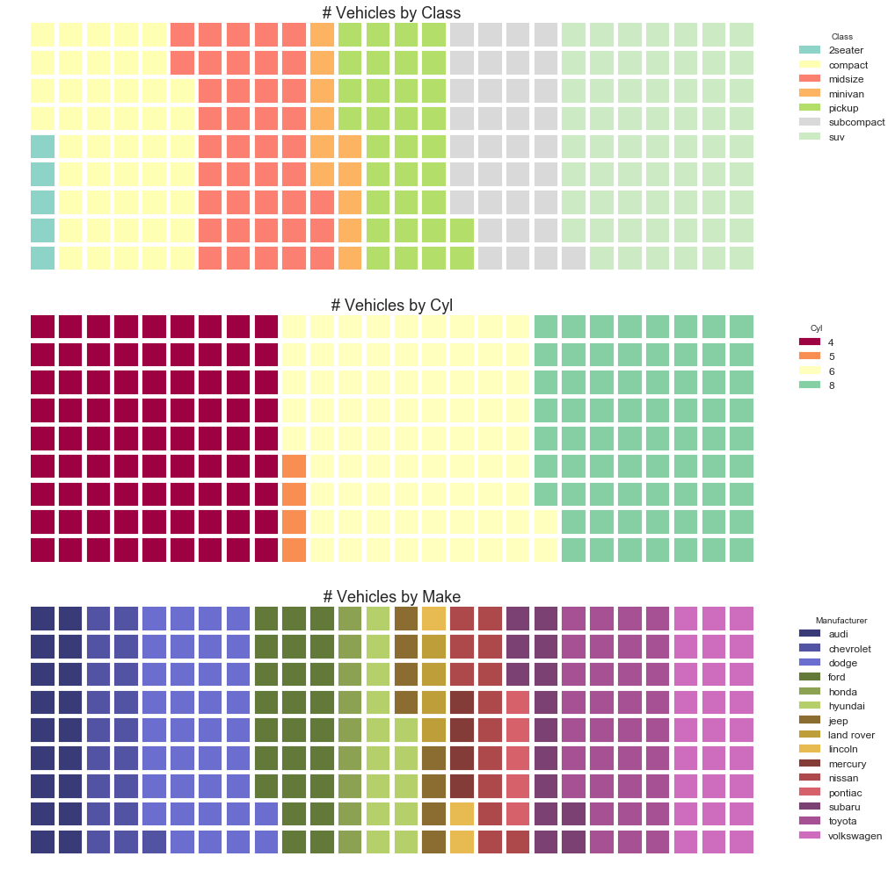


图31-2


```sql
!pip install pywaffle
from pywaffle import Waffle

data = {'Social Media': 50, 'Search Engine': 30, 'Direct': 20}

fig = plt.figure(
    FigureClass=Waffle,
    rows=5,
    values=data,
    colors=["#232066", "#983D3D", "#DCB732"],
    legend={'loc': 'upper left', 'bbox_to_anchor': (1, 1)},
    icons='user', # 需要 FontAwesome 支持，否则可去掉
    font_size=12
)
plt.title('Waffle Chart: Traffic Sources', fontsize=18)
plt.show()
```


### 46. 饼图 （Pie Chart）

饼图是显示组成的经典方式。 然而，现在通常不建议使用它，因为馅饼部分的面积有时会变得误导。 因此，如果您要使用饼图，强烈建议明确记下饼图每个部分的百分比或数字。

```plaintext
# Import
df_raw = pd.read_csv("https://github.com/selva86/datasets/raw/master/mpg_ggplot2.csv")

# Prepare Data
df = df_raw.groupby('class').size()

# Make the plot with pandas
df.plot(kind='pie', subplots=True, figsize=(8, 8))
plt.title("Pie Chart of Vehicle Class - Bad")
plt.ylabel("")
plt.show()
```


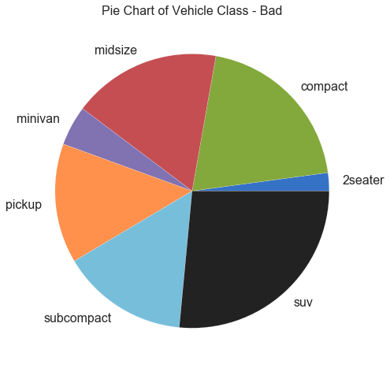


图32

```plaintext
# Import
df_raw = pd.read_csv("https://github.com/selva86/datasets/raw/master/mpg_ggplot2.csv")

# Prepare Data
df = df_raw.groupby('class').size().reset_index(name='counts')

# Draw Plot
fig, ax = plt.subplots(figsize=(12, 7), subplot_kw=dict(aspect="equal"), dpi= 80)

data = df['counts']
categories = df['class']
explode = [0,0,0,0,0,0.1,0]

def func(pct, allvals):
    absolute = int(pct/100.*np.sum(allvals))
    return "{:.1f}% ({:d} )".format(pct, absolute)

wedges, texts, autotexts = ax.pie(data,
                                  autopct=lambda pct: func(pct, data),
                                  textprops=dict(color="w"),
                                  colors=plt.cm.Dark2.colors,
                                 startangle=140,
                                 explode=explode)

# Decoration
ax.legend(wedges, categories, title="Vehicle Class", loc="center left", bbox_to_anchor=(1, 0, 0.5, 1))
plt.setp(autotexts, size=10, weight=700)
ax.set_title("Class of Vehicles: Pie Chart")
plt.show()
```


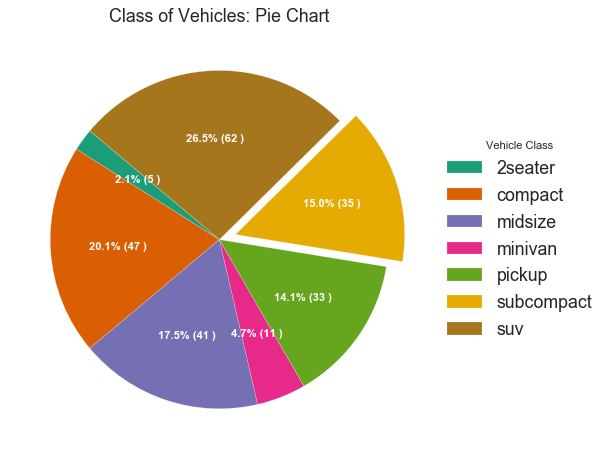


图32-2

### 47. 树形图 （Treemap）

树形图类似于饼图，它可以更好地完成工作而不会误导每个组的贡献。

（『智影双全』注：需要安装 squarify 库）

```plaintext
# pip install squarify
import squarify

# Import Data
df_raw = pd.read_csv("https://github.com/selva86/datasets/raw/master/mpg_ggplot2.csv")

# Prepare Data
df = df_raw.groupby('class').size().reset_index(name='counts')
labels = df.apply(lambda x: str(x[0]) + "\n (" + str(x[1]) + ")", axis=1)
sizes = df['counts'].values.tolist()
colors = [plt.cm.Spectral(i/float(len(labels))) for i in range(len(labels))]

# Draw Plot
plt.figure(figsize=(12,8), dpi= 80)
squarify.plot(sizes=sizes, label=labels, color=colors, alpha=.8)

# Decorate
plt.title('Treemap of Vechile Class')
plt.axis('off')
plt.show()
```


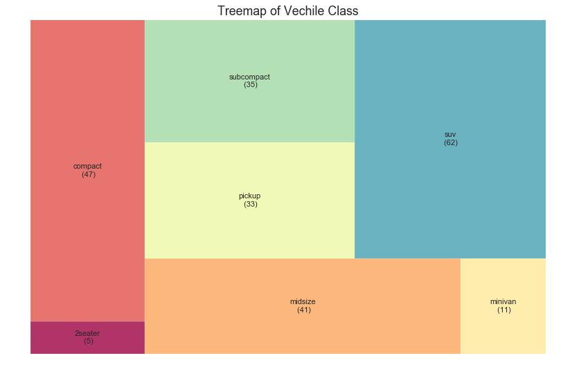


### 48. 瀑布图 (Waterfall Chart)

&#x20;财务分析中的神图。用于展示初始值如何通过一系列增量和减量演变为最终值。

```bash
import pandas as pd

# Data
data = {'Category': ['Start', 'Sales', 'Services', 'Tax', 'Refurb', 'End'],
        'Amount': [100, 30, 20, -15, -10, 125]}
df = pd.DataFrame(data)
df['rel_amount'] = df['Amount']
df.loc[df['Category'] == 'End', 'rel_amount'] = 0
df['cumulative'] = df['Amount'].cumsum().shift(1).fillna(0)

# Plot
fig, ax = plt.subplots(figsize=(10, 6))
colors = ['blue' if x > 0 else 'red' for x in df.Amount]
colors[0] = colors[-1] = 'gray' # Start and End

ax.bar(df.Category, df.Amount, bottom=df.cumulative, color=colors)

# Decoration
plt.title('Business Cash Flow (Waterfall)', fontsize=18)
plt.ylabel('Value')
plt.grid(axis='y', linestyle='--', alpha=0.7)
plt.show()
```

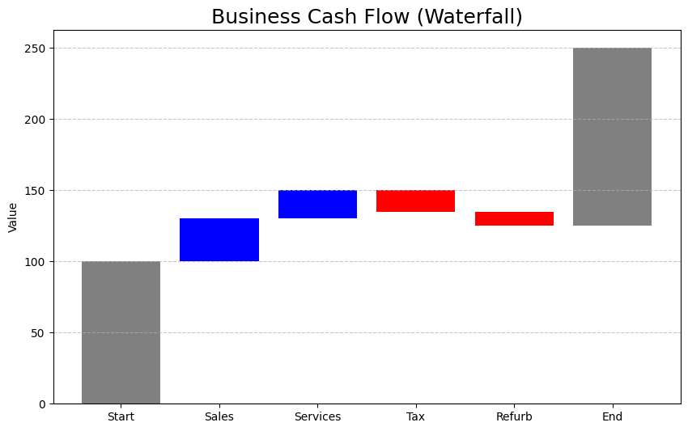


### 49. 桑基图 (Sankey Diagram)

描述流量、能源流向或转化率（如用户流失分析）。
*注：Matplotlib 自带的 `sankey` 模块较复杂，通常建议展示原理。*

```python
from matplotlib.sankey import Sankey

plt.figure(figsize=(12, 8))
sankey = Sankey(flows=[0.25, 0.15, 0.60, -0.10, -0.05, -0.15, -0.70],
                labels=['First', 'Second', 'Third', 'Loss', 'Profit', 'Tax', 'Exit'],
                orientations=[-1, 1, 0, 1, 1, -1, 0])
sankey.finish()
plt.title('Sankey Diagram of Flow Conversion', fontsize=22)
plt.show()
```

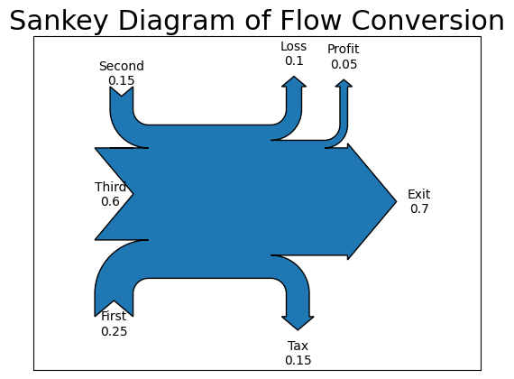


### 50. 漏斗图 (Funnel Chart)

用于展示用户转化率，Matplotlib 没有直接的 funnel 函数，通常用横向条形图模拟。

```plain&#x20;text
# --- Funnel Chart ---# 场景：展示营销转化漏斗
stages = ["访问人数", "注册人数", "点击付费", "成功下单"]
values = [10000, 7500, 3000, 1000]

# 计算每一层相对最大值的偏移，使其居中
path_widths = [i/max(values) for i in values]
offset = [(1-i)/2 for i in path_widths]

fig, ax = plt.subplots(figsize=(10, 6))
colors = sns.color_palette("Blues_r", len(stages))

for i, stage in enumerate(stages):
    # 绘制每一层
    ax.barh(stage, path_widths[i], left=offset[i], color=colors[i], height=0.8, edgecolor='black')
    # 添加数值标签
    ax.text(0.5, i, f"{values[i]} ({values[i]/values[0]*100:.1f}%)", 
            ha='center', va='center', fontsize=14, color='black', fontweight='bold')

ax.set_xlim(0, 1)
ax.axis('off')
ax.invert_yaxis()
plt.title("User Conversion Funnel", fontsize=20)
plt.show()
```

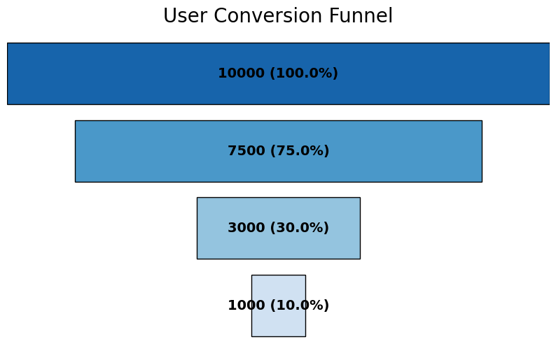


### 51. 旭日图 (Sunburst Chart)

层级化的饼图，适合展示多级分类（如：国家 -> 省份 -> 城市）的占比。

```plain&#x20;text
fig, ax = plt.subplots(figsize=(8, 8))

size = 0.3
vals = np.array([[60., 32.], [37., 40.], [29., 10.]])

cmap = plt.get_cmap("tab20c")
outer_colors = cmap(np.arange(3)*4)
inner_colors = cmap([1, 2, 5, 6, 9, 10])

ax.pie(vals.sum(axis=1), radius=1, colors=outer_colors,
       wedgeprops=dict(width=size, edgecolor='w'), labels=['Group A', 'Group B', 'Group C'])

ax.pie(vals.flatten(), radius=1-size, colors=inner_colors,
       wedgeprops=dict(width=size, edgecolor='w'))

ax.set(aspect="equal", title='Nested Pie Chart for Hierarchical Data')
plt.show()
```

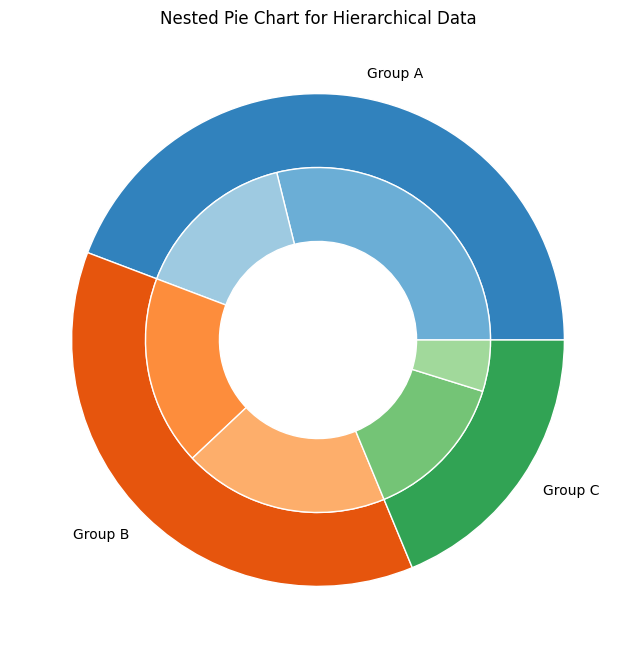


### 52. 维恩图 (Venn Diagram)

展示集合之间的交集关系（常用于生信或用户重叠分析）。

```plain&#x20;text
# !pip install matplotlib-vennfrom matplotlib_venn import venn2

plt.figure(figsize=(8, 8))
venn2(subsets = (10, 20, 5), set_labels = ('Group A', 'Group B'))
plt.title("Venn Diagram for Set Overlap", fontsize=18)
plt.show()
```

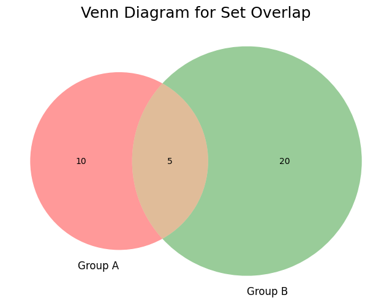


### 53. 马赛克图 (Marimekko / Mekko Chart)

在一个图中同时展示两个分类变量的占比情况。条形的宽度代表一个维度，高度代表另一个维度。常用于市场份额分析。

```plain&#x20;text
import matplotlib.pyplot as plt
import numpy as np

# 模拟数据：三个公司的三个产品线的市场份额
labels = ['Company A', 'Company B', 'Company C']
widths = np.array([50, 30, 20])  # 公司规模占比
data = np.array([[0.6, 0.2, 0.2], [0.4, 0.4, 0.2], [0.3, 0.3, 0.4]]) # 各公司内部产品线占比

fig, ax = plt.subplots(figsize=(10, 6))
left = 0
for i in range(len(widths)):
    bottom = 0
    for j in range(data.shape[1]):
        ax.bar(left + widths[i]/2, data[i, j], width=widths[i], bottom=bottom,
               edgecolor='white', label=f'Prod {j}' if i==0 else "")
        bottom += data[i, j]
    left += widths[i]

plt.xticks([25, 65, 90], labels)
plt.title('Marimekko Chart: Market Share by Company and Product')
plt.show()
```

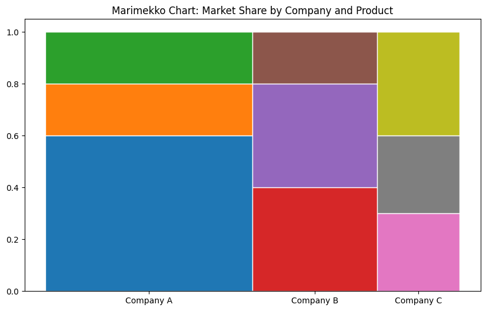


### 54. UpSet 图 (UpSet Plot)

当集合数量超过3个时，维恩图（Venn）会变得无法阅读。UpSet图是展示多个集合交集的最佳替代方案，广泛用于用户标签分析、基因组学。

```plain&#x20;text
!pip install upsetplot
from upsetplot import generate_counts, plot
import matplotlib.pyplot as plt

# 模拟数据：用户在不同平台的订阅情况
example = generate_counts()
plot(example, orientation='horizontal')
plt.suptitle('UpSet Plot for Set Intersections')
plt.show()
```

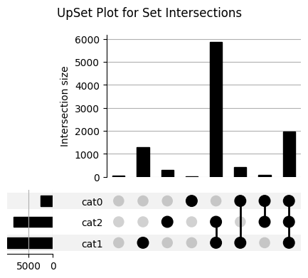


## 六、变化 （Change）

### 55. 时间序列图 （Time Series Plot）

时间序列图用于显示给定度量随时间变化的方式。 在这里，您可以看到 1949年 至 1969年间航空客运量的变化情况。

```plaintext
# Import Data
df = pd.read_csv('https://github.com/selva86/datasets/raw/master/AirPassengers.csv')

# Draw Plot
plt.figure(figsize=(16,10), dpi= 80)
plt.plot('date', 'traffic', data=df, color='tab:red')

# Decoration
plt.ylim(50, 750)
xtick_location = df.index.tolist()[::12]
xtick_labels = [x[-4:] for x in df.date.tolist()[::12]]
plt.xticks(ticks=xtick_location, labels=xtick_labels, rotation=0, fontsize=12, horizontalalignment='center', alpha=.7)
plt.yticks(fontsize=12, alpha=.7)
plt.title("Air Passengers Traffic (1949 - 1969)", fontsize=22)
plt.grid(axis='both', alpha=.3)

# Remove borders
plt.gca().spines["top"].set_alpha(0.0)    
plt.gca().spines["bottom"].set_alpha(0.3)
plt.gca().spines["right"].set_alpha(0.0)    
plt.gca().spines["left"].set_alpha(0.3)   
plt.show()
```


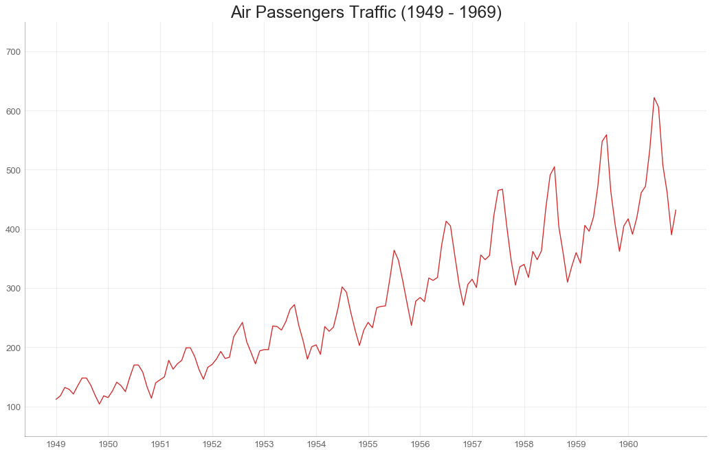


图35

### 56. 带波峰波谷标记的时序图 （Time Series with Peaks and Troughs Annotated）

下面的时间序列绘制了所有峰值和低谷，并注释了所选特殊事件的发生。

```plaintext
# Import Data
df = pd.read_csv('https://github.com/selva86/datasets/raw/master/AirPassengers.csv')

# Get the Peaks and Troughs
data = df['traffic'].values
doublediff = np.diff(np.sign(np.diff(data)))
peak_locations = np.where(doublediff == -2)[0] + 1

doublediff2 = np.diff(np.sign(np.diff(-1*data)))
trough_locations = np.where(doublediff2 == -2)[0] + 1

# Draw Plot
plt.figure(figsize=(16,10), dpi= 80)
plt.plot('date', 'traffic', data=df, color='tab:blue', label='Air Traffic')
plt.scatter(df.date[peak_locations], df.traffic[peak_locations], marker=mpl.markers.CARETUPBASE, color='tab:green', s=100, label='Peaks')
plt.scatter(df.date[trough_locations], df.traffic[trough_locations], marker=mpl.markers.CARETDOWNBASE, color='tab:red', s=100, label='Troughs')

# Annotate
for t, p in zip(trough_locations[1::5], peak_locations[::3]):
    plt.text(df.date[p], df.traffic[p]+15, df.date[p], horizontalalignment='center', color='darkgreen')
    plt.text(df.date[t], df.traffic[t]-35, df.date[t], horizontalalignment='center', color='darkred')

# Decoration
plt.ylim(50,750)
xtick_location = df.index.tolist()[::6]
xtick_labels = df.date.tolist()[::6]
plt.xticks(ticks=xtick_location, labels=xtick_labels, rotation=90, fontsize=12, alpha=.7)
plt.title("Peak and Troughs of Air Passengers Traffic (1949 - 1969)", fontsize=22)
plt.yticks(fontsize=12, alpha=.7)

# Lighten borders
plt.gca().spines["top"].set_alpha(.0)
plt.gca().spines["bottom"].set_alpha(.3)
plt.gca().spines["right"].set_alpha(.0)
plt.gca().spines["left"].set_alpha(.3)

plt.legend(loc='upper left')
plt.grid(axis='y', alpha=.3)
plt.show()
```


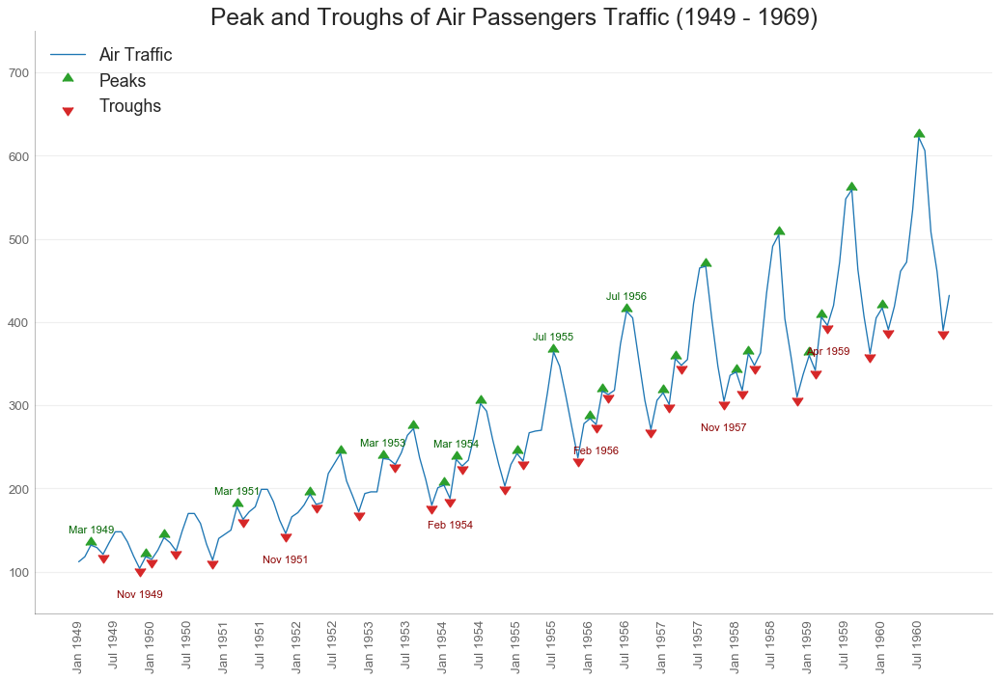


图36

### 57. 自相关和部分自相关图 （Autocorrelation (ACF) and Partial Autocorrelation (PACF) Plot）

自相关图（ACF图）显示时间序列与其自身滞后的相关性。 每条垂直线（在自相关图上）表示系列与滞后0之间的滞后之间的相关性。图中的蓝色阴影区域是显着性水平。 那些位于蓝线之上的滞后是显着的滞后。

那么如何解读呢？

对于空乘旅客，我们看到多达14个滞后跨越蓝线，因此非常重要。 这意味着，14年前的航空旅客交通量对今天的交通状况有影响。

PACF在另一方面显示了任何给定滞后（时间序列）与当前序列的自相关，但是删除了滞后的贡献。

```plaintext
from statsmodels.graphics.tsaplots import plot_acf, plot_pacf

# Import Data
df = pd.read_csv('https://github.com/selva86/datasets/raw/master/AirPassengers.csv')

# Draw Plot
fig, (ax1, ax2) = plt.subplots(1, 2,figsize=(16,6), dpi= 80)
plot_acf(df.traffic.tolist(), ax=ax1, lags=50)
plot_pacf(df.traffic.tolist(), ax=ax2, lags=20)

# Decorate
# lighten the borders
ax1.spines["top"].set_alpha(.3); ax2.spines["top"].set_alpha(.3)
ax1.spines["bottom"].set_alpha(.3); ax2.spines["bottom"].set_alpha(.3)
ax1.spines["right"].set_alpha(.3); ax2.spines["right"].set_alpha(.3)
ax1.spines["left"].set_alpha(.3); ax2.spines["left"].set_alpha(.3)

# font size of tick labels
ax1.tick_params(axis='both', labelsize=12)
ax2.tick_params(axis='both', labelsize=12)
plt.show()
```


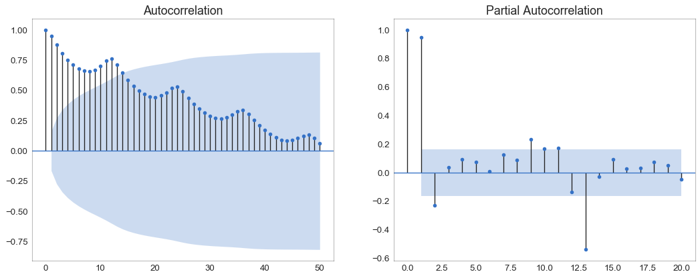


图37

### 58. 交叉相关图 （Cross Correlation plot）

交叉相关图显示了两个时间序列相互之间的滞后。

```plaintext
import statsmodels.tsa.stattools as stattools

# Import Data
df = pd.read_csv('https://github.com/selva86/datasets/raw/master/mortality.csv')
x = df['mdeaths']
y = df['fdeaths']

# Compute Cross Correlations
ccs = stattools.ccf(x, y)[:100]
nlags = len(ccs)

# Compute the Significance level
# ref: https://stats.stackexchange.com/questions/3115/cross-correlation-significance-in-r/3128#3128
conf_level = 2 / np.sqrt(nlags)

# Draw Plot
plt.figure(figsize=(12,7), dpi= 80)

plt.hlines(0, xmin=0, xmax=100, color='gray')  # 0 axis
plt.hlines(conf_level, xmin=0, xmax=100, color='gray')
plt.hlines(-conf_level, xmin=0, xmax=100, color='gray')

plt.bar(x=np.arange(len(ccs)), height=ccs, width=.3)

# Decoration
plt.title('$Cross\; Correlation\; Plot:\; mdeaths\; vs\; fdeaths$', fontsize=22)
plt.xlim(0,len(ccs))
plt.show()
```


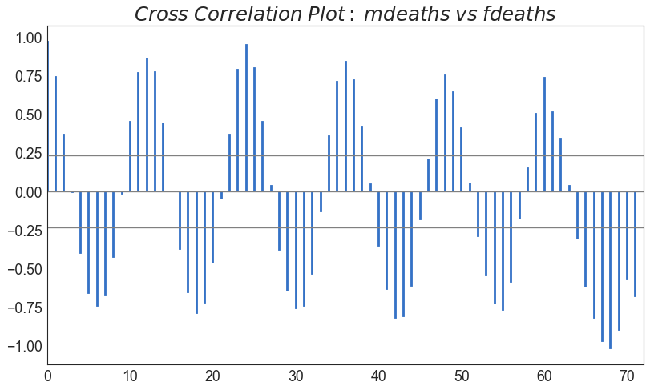


图38

### 59. 时间序列分解图 （Time Series Decomposition Plot）

时间序列分解图显示时间序列分解为趋势，季节和残差分量。

```plaintext
from statsmodels.tsa.seasonal import seasonal_decompose
from dateutil.parser import parse

# Import Data
df = pd.read_csv('https://github.com/selva86/datasets/raw/master/AirPassengers.csv')
dates = pd.DatetimeIndex([parse(d).strftime('%Y-%m-01') for d in df['date']])
df.set_index(dates, inplace=True)

# Decompose
result = seasonal_decompose(df['traffic'], model='multiplicative')

# Plot
plt.rcParams.update({'figure.figsize': (10,10)})
result.plot().suptitle('Time Series Decomposition of Air Passengers')
plt.show()
```


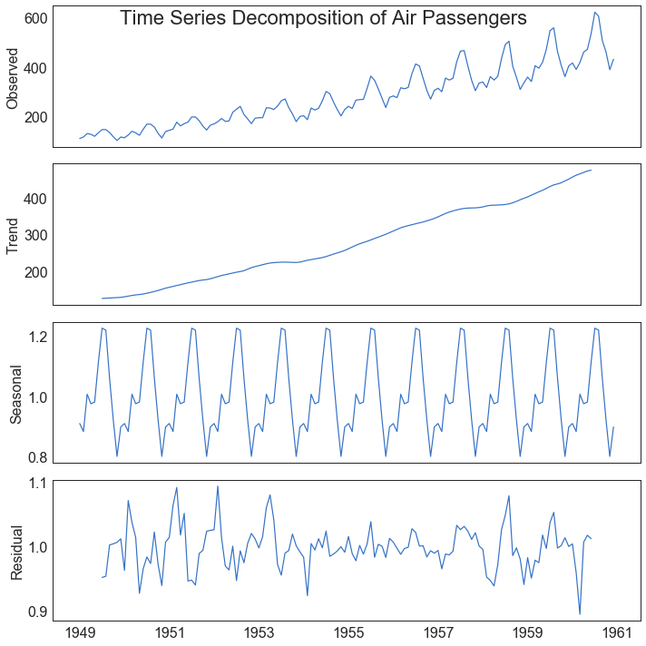


图39

### 60. 多个时间序列 （Multiple Time Series）

您可以绘制多个时间序列，在同一图表上测量相同的值，如下所示。

```plaintext
import pandas as pd
# Import Data
df = pd.read_csv('https://github.com/selva86/datasets/raw/master/mortality.csv')

# Plot
plt.figure(figsize=(16, 10), dpi= 80)
columns = df.columns[1:]
colors = plt.cm.tab10.colors  # 使用标准调色板

for i, column in enumerate(columns):
    plt.plot(df.date, df[column], lw=1.5, color=colors[i], label=column)
    # 在曲线末端添加文字标签
    plt.text(df.shape[0]-1, df[column].values[-1], column, fontsize=14, color=colors[i])

# Decorations
plt.title('Number of Deaths from Lung Diseases in the UK (1974-1979)', fontsize=22)
plt.xticks(range(0, df.shape[0], 12), df.date.values[::12], fontsize=12)
plt.grid(axis='y', alpha=.3)
plt.gca().spines["top"].set_alpha(0)
plt.gca().spines["right"].set_alpha(0)
plt.show()
```

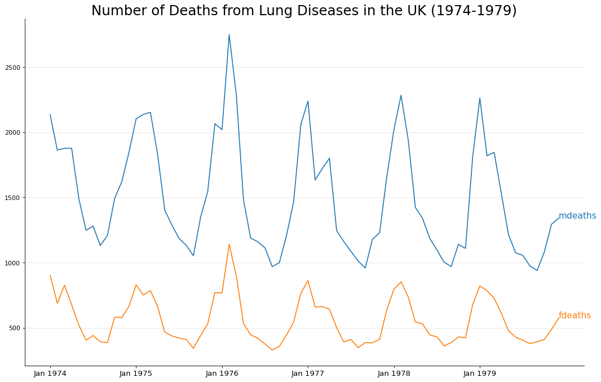


图40

### 61. 使用辅助 Y 轴来绘制不同范围的图形 （Plotting with different scales using secondary Y axis）

如果要显示在同一时间点测量两个不同数量的两个时间序列，则可以在右侧的辅助Y轴上再绘制第二个系列。

```plaintext
# Import Data
df = pd.read_csv("https://github.com/selva86/datasets/raw/master/economics.csv")

x = df['date']
y1 = df['psavert']
y2 = df['unemploy']

# Plot Line1 (Left Y Axis)
fig, ax1 = plt.subplots(1,1,figsize=(16,9), dpi= 80)
ax1.plot(x, y1, color='tab:red')

# Plot Line2 (Right Y Axis)
ax2 = ax1.twinx()  # instantiate a second axes that shares the same x-axis
ax2.plot(x, y2, color='tab:blue')

# Decorations
# ax1 (left Y axis)
ax1.set_xlabel('Year', fontsize=20)
ax1.tick_params(axis='x', rotation=0, labelsize=12)
ax1.set_ylabel('Personal Savings Rate', color='tab:red', fontsize=20)
ax1.tick_params(axis='y', rotation=0, labelcolor='tab:red' )
ax1.grid(alpha=.4)

# ax2 (right Y axis)
ax2.set_ylabel("# Unemployed (1000's)", color='tab:blue', fontsize=20)
ax2.tick_params(axis='y', labelcolor='tab:blue')
ax2.set_xticks(np.arange(0, len(x), 60))
ax2.set_xticklabels(x[::60], rotation=90, fontdict={'fontsize':10})
ax2.set_title("Personal Savings Rate vs Unemployed: Plotting in Secondary Y Axis", fontsize=22)
fig.tight_layout()
plt.show()
```


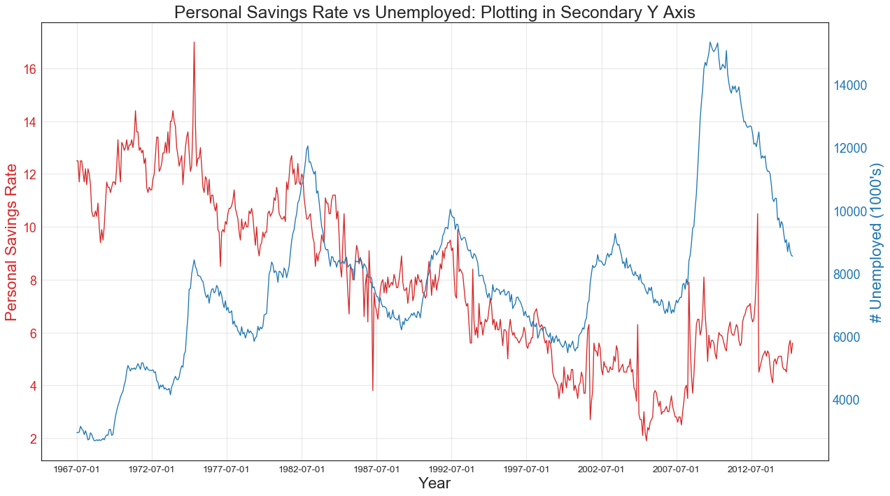


图41

### 62. 带有误差带的时间序列 （Time Series with Error Bands）

如果您有一个时间序列数据集，每个时间点（日期/时间戳）有多个观测值，则可以构建带有误差带的时间序列。 您可以在下面看到一些基于每天不同时间订单的示例。 另一个关于45天持续到达的订单数量的例子。

在该方法中，订单数量的平均值由白线表示。 并且计算95％置信区间并围绕均值绘制。

```plaintext
from scipy.stats import sem

# Import Data
df = pd.read_csv("https://raw.githubusercontent.com/selva86/datasets/master/user_orders_hourofday.csv")
df_mean = df.groupby('order_hour_of_day').quantity.mean()
df_se = df.groupby('order_hour_of_day').quantity.apply(sem).mul(1.96)

# Plot
plt.figure(figsize=(16,10), dpi= 80)
plt.ylabel("# Orders", fontsize=16)  
x = df_mean.index
plt.plot(x, df_mean, color="white", lw=2)
plt.fill_between(x, df_mean - df_se, df_mean + df_se, color="#3F5D7D")  

# Decorations
# Lighten borders
plt.gca().spines["top"].set_alpha(0)
plt.gca().spines["bottom"].set_alpha(1)
plt.gca().spines["right"].set_alpha(0)
plt.gca().spines["left"].set_alpha(1)
plt.xticks(x[::2], [str(d) for d in x[::2]] , fontsize=12)
plt.title("User Orders by Hour of Day (95% confidence)", fontsize=22)
plt.xlabel("Hour of Day")

s, e = plt.gca().get_xlim()
plt.xlim(s, e)

# Draw Horizontal Tick lines  
for y in range(8, 20, 2):    
    plt.hlines(y, xmin=s, xmax=e, colors='black', alpha=0.5, linestyles="--", lw=0.5)

plt.show()
```


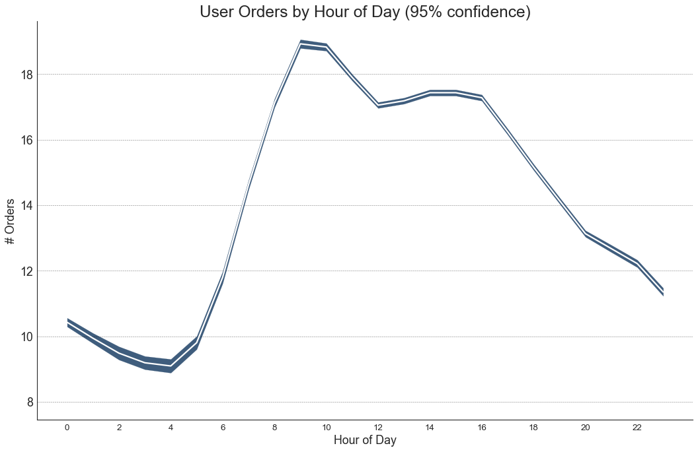


图42

```plaintext
# "Data Source: https://www.kaggle.com/olistbr/brazilian-ecommerce#olist_orders_dataset.csv"
from dateutil.parser import parse
from scipy.stats import sem

# Import Data
df_raw = pd.read_csv('https://raw.githubusercontent.com/selva86/datasets/master/orders_45d.csv',
                     parse_dates=['purchase_time', 'purchase_date'])

# Prepare Data: Daily Mean and SE Bands
df_mean = df_raw.groupby('purchase_date').quantity.mean()
df_se = df_raw.groupby('purchase_date').quantity.apply(sem).mul(1.96)

# Plot
plt.figure(figsize=(16,10), dpi= 80)
plt.ylabel("# Daily Orders", fontsize=16)  
x = [d.date().strftime('%Y-%m-%d') for d in df_mean.index]
plt.plot(x, df_mean, color="white", lw=2)
plt.fill_between(x, df_mean - df_se, df_mean + df_se, color="#3F5D7D")  

# Decorations
# Lighten borders
plt.gca().spines["top"].set_alpha(0)
plt.gca().spines["bottom"].set_alpha(1)
plt.gca().spines["right"].set_alpha(0)
plt.gca().spines["left"].set_alpha(1)
plt.xticks(x[::6], [str(d) for d in x[::6]] , fontsize=12)
plt.title("Daily Order Quantity of Brazilian Retail with Error Bands (95% confidence)", fontsize=20)

# Axis limits
s, e = plt.gca().get_xlim()
plt.xlim(s, e-2)
plt.ylim(4, 10)

# Draw Horizontal Tick lines  
for y in range(5, 10, 1):    
    plt.hlines(y, xmin=s, xmax=e, colors='black', alpha=0.5, linestyles="--", lw=0.5)

plt.show()
```


图42-2

### 63. 堆积面积图 （Stacked Area Chart）

堆积面积图可以直观地显示多个时间序列的贡献程度，因此很容易相互比较。

```plaintext
# Import Data
df = pd.read_csv('https://raw.githubusercontent.com/selva86/datasets/master/nightvisitors.csv')

# Decide Colors
mycolors = ['tab:red', 'tab:blue', 'tab:green', 'tab:orange', 'tab:brown', 'tab:grey', 'tab:pink', 'tab:olive']      

# Draw Plot and Annotate
fig, ax = plt.subplots(1,1,figsize=(16, 9), dpi= 80)
columns = df.columns[1:]
labs = columns.values.tolist()

# Prepare data
x  = df['yearmon'].values.tolist()
y0 = df[columns[0]].values.tolist()
y1 = df[columns[1]].values.tolist()
y2 = df[columns[2]].values.tolist()
y3 = df[columns[3]].values.tolist()
y4 = df[columns[4]].values.tolist()
y5 = df[columns[5]].values.tolist()
y6 = df[columns[6]].values.tolist()
y7 = df[columns[7]].values.tolist()
y = np.vstack([y0, y2, y4, y6, y7, y5, y1, y3])

# Plot for each column
labs = columns.values.tolist()
ax = plt.gca()
ax.stackplot(x, y, labels=labs, colors=mycolors, alpha=0.8)

# Decorations
ax.set_title('Night Visitors in Australian Regions', fontsize=18)
ax.set(ylim=[0, 100000])
ax.legend(fontsize=10, ncol=4)
plt.xticks(x[::5], fontsize=10, horizontalalignment='center')
plt.yticks(np.arange(10000, 100000, 20000), fontsize=10)
plt.xlim(x[0], x[-1])

# Lighten borders
plt.gca().spines["top"].set_alpha(0)
plt.gca().spines["bottom"].set_alpha(.3)
plt.gca().spines["right"].set_alpha(0)
plt.gca().spines["left"].set_alpha(.3)

plt.show()
```


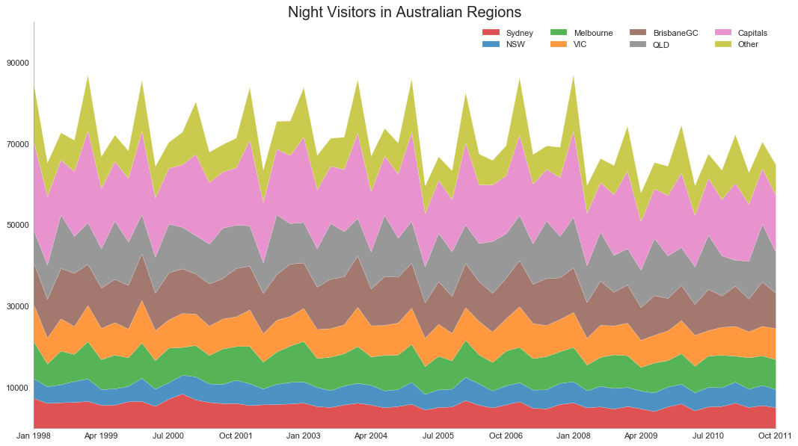


图43

### 64. 未堆积的面积图 （Area Chart UnStacked）

未堆积面积图用于可视化两个或更多个系列相对于彼此的进度（起伏）。 在下面的图表中，您可以清楚地看到随着失业中位数持续时间的增加，个人储蓄率会下降。 未堆积面积图表很好地展示了这种现象。

```plaintext
# Import Data
df = pd.read_csv("https://github.com/selva86/datasets/raw/master/economics.csv")

# Prepare Data
x = df['date'].values.tolist()
y1 = df['psavert'].values.tolist()
y2 = df['uempmed'].values.tolist()
mycolors = ['tab:red', 'tab:blue', 'tab:green', 'tab:orange', 'tab:brown', 'tab:grey', 'tab:pink', 'tab:olive']      
columns = ['psavert', 'uempmed']

# Draw Plot
fig, ax = plt.subplots(1, 1, figsize=(16,9), dpi= 80)
ax.fill_between(x, y1=y1, y2=0, label=columns[1], alpha=0.5, color=mycolors[1], linewidth=2)
ax.fill_between(x, y1=y2, y2=0, label=columns[0], alpha=0.5, color=mycolors[0], linewidth=2)

# Decorations
ax.set_title('Personal Savings Rate vs Median Duration of Unemployment', fontsize=18)
ax.set(ylim=[0, 30])
ax.legend(loc='best', fontsize=12)
plt.xticks(x[::50], fontsize=10, horizontalalignment='center')
plt.yticks(np.arange(2.5, 30.0, 2.5), fontsize=10)
plt.xlim(-10, x[-1])

# Draw Tick lines  
for y in np.arange(2.5, 30.0, 2.5):    
    plt.hlines(y, xmin=0, xmax=len(x), colors='black', alpha=0.3, linestyles="--", lw=0.5)

# Lighten borders
plt.gca().spines["top"].set_alpha(0)
plt.gca().spines["bottom"].set_alpha(.3)
plt.gca().spines["right"].set_alpha(0)
plt.gca().spines["left"].set_alpha(.3)
plt.show()
```


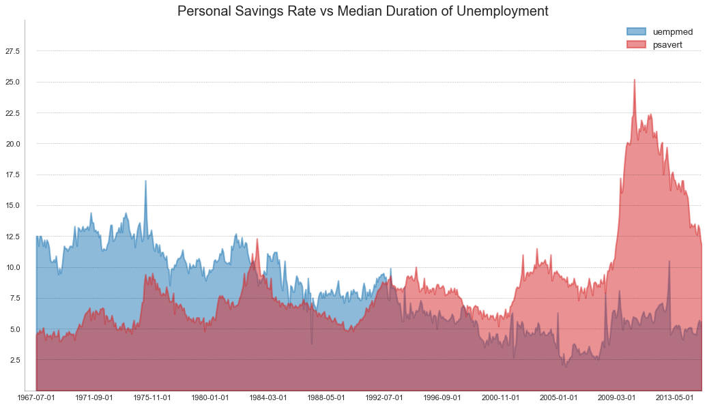


### 65. 日历热力图 （Calendar Heat Map）

与时间序列相比，日历地图是可视化基于时间的数据的备选和不太优选的选项。 虽然可以在视觉上吸引人，但数值并不十分明显。 然而，它可以很好地描绘极端值和假日效果。

（『智影双全』注：需要安装 calmap 库）

```plaintext
import matplotlib as mpl

# pip install calmap  
# 智影双全 备注
import calmap

# Import Data
df = pd.read_csv("https://raw.githubusercontent.com/selva86/datasets/master/yahoo.csv", parse_dates=['date'])
df.set_index('date', inplace=True)

# Plot
plt.figure(figsize=(16,10), dpi= 80)
calmap.calendarplot(df['2014']['VIX.Close'], fig_kws={'figsize': (16,10)}, yearlabel_kws={'color':'black', 'fontsize':14}, subplot_kws={'title':'Yahoo Stock Prices'})
plt.show()
```


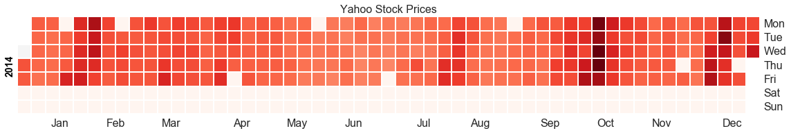


类似 GitHub 的贡献图，用于展示时间序列在天/周维度上的密集程度。

```plain&#x20;text
# 提示：通常建议使用 calplot 库，但用 Matplotlib 原生绘制逻辑如下：import matplotlib.patches as patches

# 模拟数据 (12个月x31天)
data = np.random.rand(7, 52) # 7天/周，52周

fig, ax = plt.subplots(figsize=(15, 5))
im = ax.imshow(data, cmap='YlGn')

# Decoration
ax.set_title('Calendar Heatmap (Activity Tracker)', fontsize=20)
ax.set_xlabel('Weeks of the Year')
ax.set_yticks(range(7))
ax.set_yticklabels(['Mon', 'Tue', 'Wed', 'Thu', 'Fri', 'Sat', 'Sun'])
plt.colorbar(im, orientation='horizontal', pad=0.2)
plt.show()
```

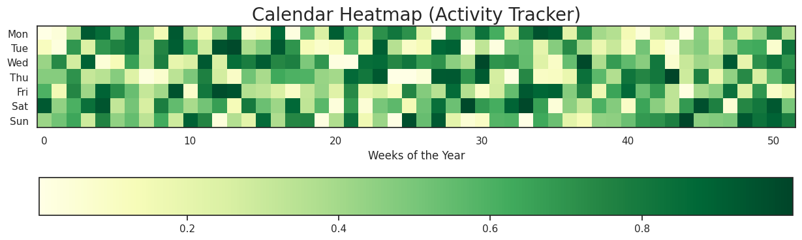


### 66. 季节图 （Seasonal Plot）

季节图可用于比较上一季中同一天（年/月/周等）的时间序列。

```plaintext
from dateutil.parser import parse

# Import Data
df = pd.read_csv('https://github.com/selva86/datasets/raw/master/AirPassengers.csv')

# Prepare data
df['year'] = [parse(d).year for d in df.date]
df['month'] = [parse(d).strftime('%b') for d in df.date]
years = df['year'].unique()

# Draw Plot
mycolors = ['tab:red', 'tab:blue', 'tab:green', 'tab:orange', 'tab:brown', 'tab:grey', 'tab:pink', 'tab:olive', 'deeppink', 'steelblue', 'firebrick', 'mediumseagreen']      
plt.figure(figsize=(16,10), dpi= 80)

for i, y in enumerate(years):
    plt.plot('month', 'traffic', data=df.loc[df.year==y, :], color=mycolors[i], label=y)
    plt.text(df.loc[df.year==y, :].shape[0]-.9, df.loc[df.year==y, 'traffic'][-1:].values[0], y, fontsize=12, color=mycolors[i])

# Decoration
plt.ylim(50,750)
plt.xlim(-0.3, 11)
plt.ylabel('$Air Traffic$')
plt.yticks(fontsize=12, alpha=.7)
plt.title("Monthly Seasonal Plot: Air Passengers Traffic (1949 - 1969)", fontsize=22)
plt.grid(axis='y', alpha=.3)

# Remove borders
plt.gca().spines["top"].set_alpha(0.0)    
plt.gca().spines["bottom"].set_alpha(0.5)
plt.gca().spines["right"].set_alpha(0.0)    
plt.gca().spines["left"].set_alpha(0.5)   
# plt.legend(loc='upper right', ncol=2, fontsize=12)
plt.show()
```


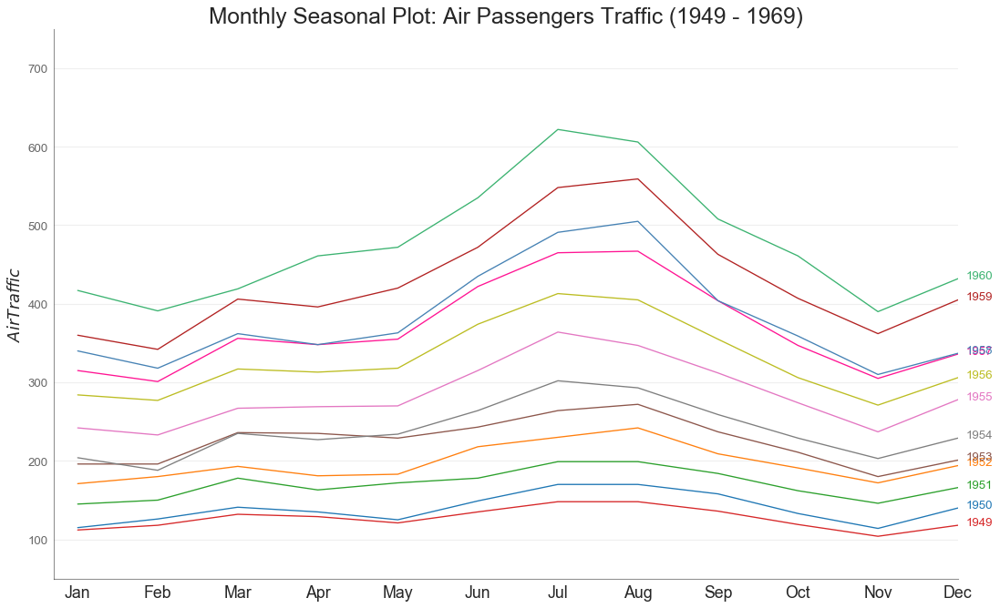


### 67. 地平线图 (Horizon Graph)

当你需要在一个极窄的纵向空间内展示剧烈波动的时序数据（如股票或传感器数据）时，这是最高级的方法。


```python
# 核心原理：将数据切片并重叠，用深浅颜色表示倍数
def horizon_plot(data, labels):
    fig, axes = plt.subplots(len(labels), 1, sharex=True, figsize=(12, 6))
    for i, ax in enumerate(axes):
        ax.fill_between(range(len(data[i])), 0, data[i], color='teal', alpha=0.5)
        ax.set_yticks([])
        ax.set_ylabel(labels[i], rotation=0, labelpad=40)
    plt.tight_layout()
    plt.show()

data = [np.random.randn(100).cumsum() for _ in range(3)]
horizon_plot(data, ['Metric A', 'Metric B', 'Metric C'])
```

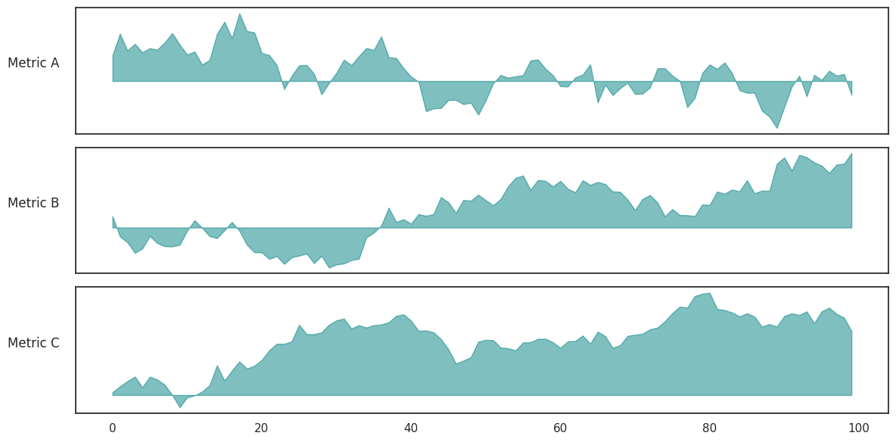


### 68. 流图 (Streamgraph)

堆积面积图的审美进阶版，中心对称，能够更优美地展示多个类别随时间的起伏，常用于新闻媒体。

```plain&#x20;text
# 核心是 stackplot 的 baseline 参数设置为 'wiggle'
x = np.arange(0, 10, 0.1)
y1 = np.abs(np.sin(x) + 1)
y2 = np.abs(np.cos(x) + 1.5)
y3 = np.abs(np.sin(x/2) + 0.5)

fig, ax = plt.subplots(figsize=(12, 6))
ax.stackplot(x, y1, y2, y3, baseline='wiggle', labels=['Topic A', 'Topic B', 'Topic C'], alpha=0.8)
plt.title("Streamgraph: Organic Evolution of Categories", fontsize=18)
plt.axis('off')
plt.show()
```

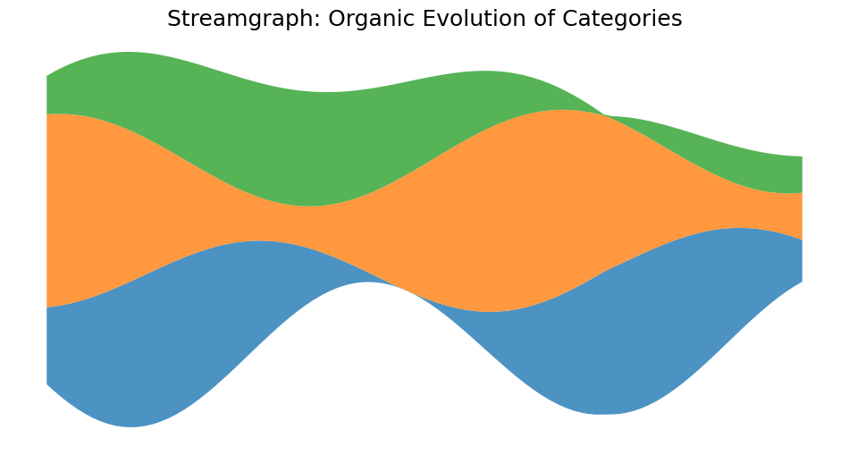


## 七、分组 （Groups）

### 69. 树状图 （Dendrogram）

树形图基于给定的距离度量将相似的点组合在一起，并基于点的相似性将它们组织在树状链接中。

```plaintext
import scipy.cluster.hierarchy as shc

# Import Data
df = pd.read_csv('https://raw.githubusercontent.com/selva86/datasets/master/USArrests.csv')

# Plot
plt.figure(figsize=(16, 10), dpi= 80)  
plt.title("USArrests Dendograms", fontsize=22)  
dend = shc.dendrogram(shc.linkage(df[['Murder', 'Assault', 'UrbanPop', 'Rape']], method='ward'), labels=df.State.values, color_threshold=100)  
plt.xticks(fontsize=12)
plt.show()
```


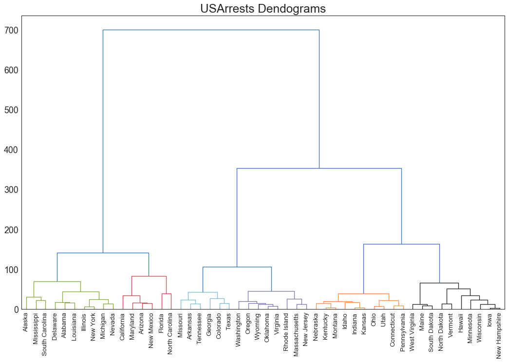


图47

### 70. 簇状图 （Cluster Plot）

簇状图 （Cluster Plot）可用于划分属于同一群集的点。 下面是根据USArrests数据集将美国各州分为5组的代表性示例。 此图使用“谋杀”和“攻击”列作为X和Y轴。 或者，您可以将第一个到主要组件用作X轴和Y轴。

```plaintext
from sklearn.cluster import AgglomerativeClustering
from scipy.spatial import ConvexHull

# Import Data
df = pd.read_csv('https://raw.githubusercontent.com/selva86/datasets/master/USArrests.csv')

# Agglomerative Clustering
cluster = AgglomerativeClustering(n_clusters=5, affinity='euclidean', linkage='ward')  
cluster.fit_predict(df[['Murder', 'Assault', 'UrbanPop', 'Rape']])  

# Plot
plt.figure(figsize=(14, 10), dpi= 80)  
plt.scatter(df.iloc[:,0], df.iloc[:,1], c=cluster.labels_, cmap='tab10')  

# Encircle
def encircle(x,y, ax=None, **kw):
    if not ax: ax=plt.gca()
    p = np.c_[x,y]
    hull = ConvexHull(p)
    poly = plt.Polygon(p[hull.vertices,:], **kw)
    ax.add_patch(poly)

# Draw polygon surrounding vertices    
encircle(df.loc[cluster.labels_ == 0, 'Murder'], df.loc[cluster.labels_ == 0, 'Assault'], ec="k", fc="gold", alpha=0.2, linewidth=0)
encircle(df.loc[cluster.labels_ == 1, 'Murder'], df.loc[cluster.labels_ == 1, 'Assault'], ec="k", fc="tab:blue", alpha=0.2, linewidth=0)
encircle(df.loc[cluster.labels_ == 2, 'Murder'], df.loc[cluster.labels_ == 2, 'Assault'], ec="k", fc="tab:red", alpha=0.2, linewidth=0)
encircle(df.loc[cluster.labels_ == 3, 'Murder'], df.loc[cluster.labels_ == 3, 'Assault'], ec="k", fc="tab:green", alpha=0.2, linewidth=0)
encircle(df.loc[cluster.labels_ == 4, 'Murder'], df.loc[cluster.labels_ == 4, 'Assault'], ec="k", fc="tab:orange", alpha=0.2, linewidth=0)

# Decorations
plt.xlabel('Murder'); plt.xticks(fontsize=12)
plt.ylabel('Assault'); plt.yticks(fontsize=12)
plt.title('Agglomerative Clustering of USArrests (5 Groups)', fontsize=22)
plt.show()
```


图48

### 71. 安德鲁斯曲线 （Andrews Curve）

安德鲁斯曲线有助于可视化是否存在基于给定分组的数字特征的固有分组。 如果要素（数据集中的列）无法区分组（cyl），那么这些线将不会很好地隔离，如下所示。

```plaintext
from pandas.plotting import andrews_curves

# Import
df = pd.read_csv("https://github.com/selva86/datasets/raw/master/mtcars.csv")
df.drop(['cars', 'carname'], axis=1, inplace=True)

# Plot
plt.figure(figsize=(12,9), dpi= 80)
andrews_curves(df, 'cyl', colormap='Set1')

# Lighten borders
plt.gca().spines["top"].set_alpha(0)
plt.gca().spines["bottom"].set_alpha(.3)
plt.gca().spines["right"].set_alpha(0)
plt.gca().spines["left"].set_alpha(.3)

plt.title('Andrews Curves of mtcars', fontsize=22)
plt.xlim(-3,3)
plt.grid(alpha=0.3)
plt.xticks(fontsize=12)
plt.yticks(fontsize=12)
plt.show()
```


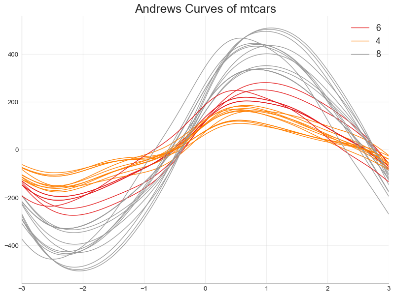


图49

### 72. 平行坐标 （Parallel Coordinates）

平行坐标有助于可视化特征是否有助于有效地隔离组。 如果实现隔离，则该特征可能在预测该组时非常有用。

```plaintext
from pandas.plotting import parallel_coordinates

# Import Data
df_final = pd.read_csv("https://raw.githubusercontent.com/selva86/datasets/master/diamonds_filter.csv")

# Plot
plt.figure(figsize=(12,9), dpi= 80)
parallel_coordinates(df_final, 'cut', colormap='Dark2')

# Lighten borders
plt.gca().spines["top"].set_alpha(0)
plt.gca().spines["bottom"].set_alpha(.3)
plt.gca().spines["right"].set_alpha(0)
plt.gca().spines["left"].set_alpha(.3)

plt.title('Parallel Coordinated of Diamonds', fontsize=22)
plt.grid(alpha=0.3)
plt.xticks(fontsize=12)
plt.yticks(fontsize=12)
plt.show()
```


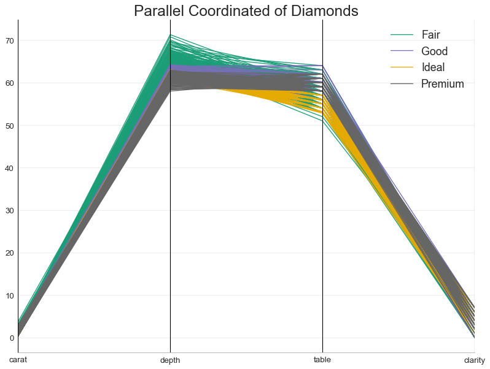


### 73. 雷达图 (Radar Chart / Spider Plot)

对比多个对象在多个维度上的表现（如球员能力值、产品属性）。


```sql
import numpy as np
# Data
df = pd.DataFrame({
    'Group': ['A', 'B'],
    'Speed': [38, 29],
    'Reliability': [29, 38],
    'Comfort': [8, 30],
    'Safety': [7, 20],
    'Efficiency': [28, 15]
})

categories = list(df)[1:]
N = len(categories)
angles = [n / float(N) * 2 * np.pi for n in range(N)]
angles += angles[:1]

fig, ax = plt.subplots(figsize=(8, 8), subplot_kw=dict(polar=True))

for i, row in df.iterrows():
    values = row.drop('Group').values.flatten().tolist()
    values += values[:1]
    ax.plot(angles, values, linewidth=2, label=row['Group'])
    ax.fill(angles, values, alpha=0.25)

ax.set_xticks(angles[:-1])
ax.set_xticklabels(categories)
plt.legend(loc='upper right', bbox_to_anchor=(0.1, 0.1))
plt.title('Radar Chart: Comparison of Group A vs B', fontsize=20)
plt.show()
```


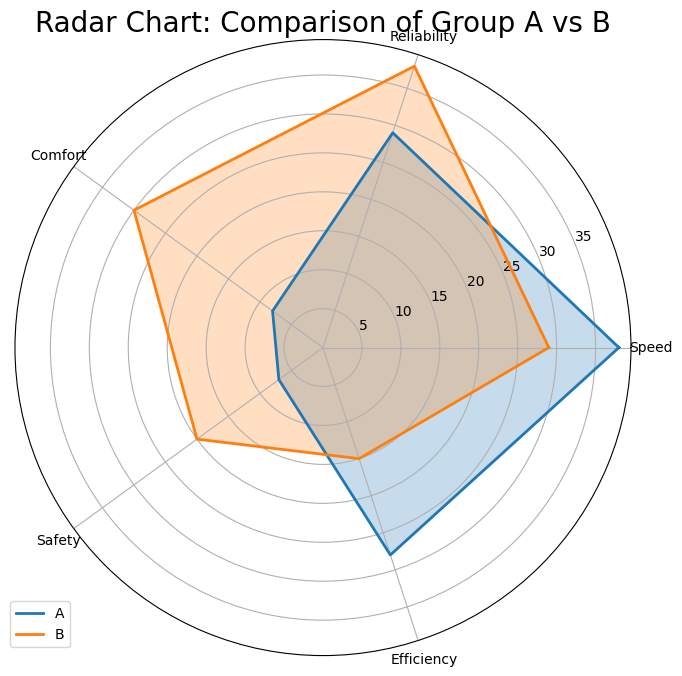


### 74. 极坐标柱状图 (Polar Bar Chart / Nightingale Rose)

常用于展示周期性数据（如 1-12 月的降水量）或多维度评估。

```python
# Data
categories = ['Jan', 'Feb', 'Mar', 'Apr', 'May', 'Jun', 'Jul', 'Aug']
values = [10, 25, 45, 30, 60, 55, 70, 40]
angles = np.linspace(0, 2 * np.pi, len(categories), endpoint=False)

# Plot
fig, ax = plt.subplots(figsize=(8, 8), subplot_kw={'projection': 'polar'})
bars = ax.bar(angles, values, width=0.6, color=plt.cm.viridis(np.linspace(0, 1, len(values))))

# Decoration
ax.set_xticks(angles)
ax.set_xticklabels(categories)
plt.title('Polar Bar Chart: Seasonal Distribution', fontsize=18)
plt.show()
```

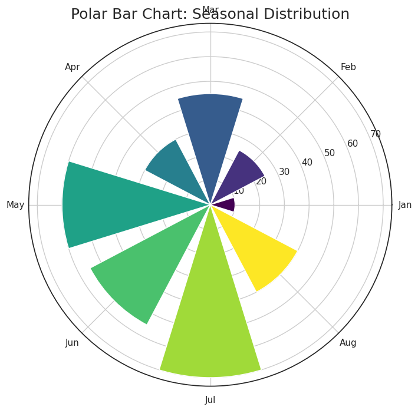


### 75. 3D 曲面图 (3D Surface Plot)

用于展示三个连续变量之间的复杂函数关系。

```plain&#x20;text
from mpl_toolkits.mplot3d import Axes3D

# Data
X = np.arange(-5, 5, 0.25)
Y = np.arange(-5, 5, 0.25)
X, Y = np.meshgrid(X, Y)
R = np.sqrt(X**2 + Y**2)
Z = np.sin(R)

# Plot
fig = plt.figure(figsize=(12, 8))
ax = fig.add_subplot(111, projection='3d')
surf = ax.plot_surface(X, Y, Z, cmap='coolwarm', edgecolor='none')

# Decoration
fig.colorbar(surf, shrink=0.5, aspect=5)
plt.title('3D Surface Plot', fontsize=18)
plt.show()
```

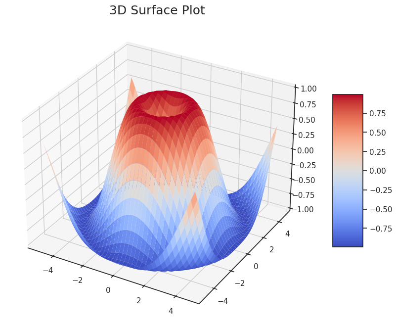


### 76. 三元图 (Ternary Plot)

展示三个分量之和为100%的数据分布。常用于化学（成分比例）、土壤科学或选举结果分析（三党制）。

```plain&#x20;text
!pip install python-ternary
import ternary
import matplotlib.pyplot as plt
import numpy as np

scale = 100
fig, tax = ternary.figure(scale=scale)
tax.boundary(linewidth=2.0)
tax.gridlines(color="blue", multiple=10)

# 模拟数据点 (A, B, C) 且 A+B+C = 100
points = [(30, 40, 30), (10, 70, 20), (50, 10, 40)]
tax.scatter(points, marker='o', color='red', label="Samples")

tax.left_axis_label("Component A", offset=0.14)
tax.right_axis_label("Component B", offset=0.14)
tax.bottom_axis_label("Component C", offset=0.14)
tax.legend()
plt.show()
```


## 八、 机器学习与模型评估 (Machine Learning & Evaluation)

这部分图表是数据科学家在模型调优和汇报结果时的必备工具。

### 77. 混淆矩阵热力图 (Confusion Matrix Heatmap)

```plain&#x20;text
from sklearn.metrics import confusion_matrix
import seaborn as sns

y_true = [0, 1, 0, 1, 1, 0, 1, 0]
y_pred = [0, 1, 0, 0, 1, 0, 1, 1]
cm = confusion_matrix(y_true, y_pred)

plt.figure(figsize=(6, 5))
sns.heatmap(cm, annot=True, fmt='d', cmap='Blues', xticklabels=['Negative', 'Positive'], yticklabels=['Negative', 'Positive'])
plt.ylabel('Actual')
plt.xlabel('Predicted')
plt.title('Confusion Matrix', fontsize=16)
plt.show()
```

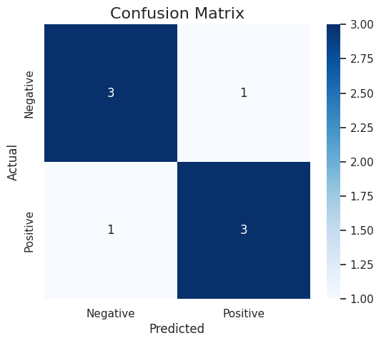

衡量分类模型好坏的基础。

```plain&#x20;text
# --- Confusion Matrix ---from sklearn.metrics import confusion_matrix

# 模拟真实值与预测值
y_true = [0, 1, 0, 1, 1, 0, 1, 0, 1, 1]
y_pred = [0, 1, 0, 0, 1, 0, 1, 0, 0, 1]
cm = confusion_matrix(y_true, y_pred)

plt.figure(figsize=(8, 6))
sns.heatmap(cm, annot=True, fmt='d', cmap='Pastel1', 
            xticklabels=['Negative', 'Positive'], 
            yticklabels=['Negative', 'Positive'])
plt.xlabel('Predicted', fontsize=15)
plt.ylabel('Actual', fontsize=15)
plt.title('Model Confusion Matrix', fontsize=20)
plt.show()
```

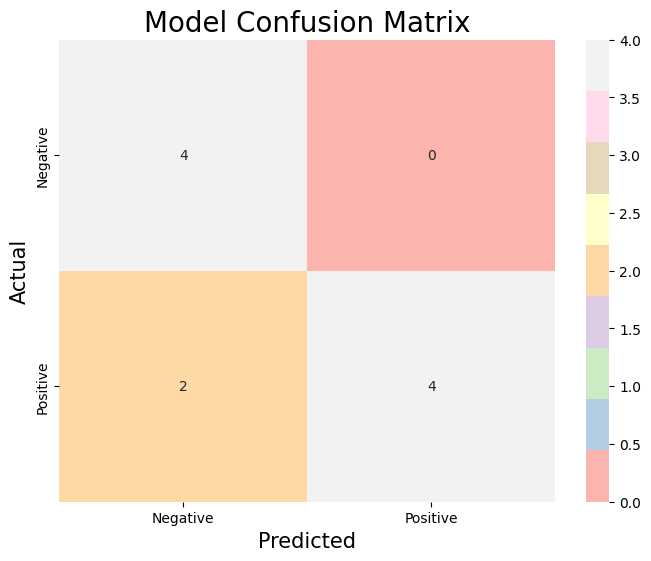


### 78. ROC 曲线图 (ROC Curve)


```plain&#x20;text
from sklearn.metrics import roc_curve, auc

# Fake data
fpr, tpr, _ = roc_curve([0, 0, 1, 1], [0.1, 0.4, 0.35, 0.8])
roc_auc = auc(fpr, tpr)

plt.figure()
plt.plot(fpr, tpr, color='darkorange', lw=2, label=f'ROC curve (area = {roc_auc:.2f})')
plt.plot([0, 1], [0, 1], color='navy', lw=2, linestyle='--')
plt.xlabel('False Positive Rate')
plt.ylabel('True Positive Rate')
plt.title('Receiver Operating Characteristic (ROC)', fontsize=16)
plt.legend(loc="lower right")
plt.show()
```

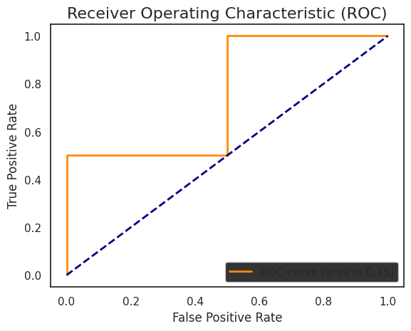


评估二分类器性能的关键。

```plain&#x20;text
# --- ROC Curve ---from sklearn.metrics import roc_curve, auc

# 模拟预测得分
y_score = np.random.rand(100)
y_test = np.random.randint(0, 2, 100)
fpr, tpr, _ = roc_curve(y_test, y_score)
roc_auc = auc(fpr, tpr)

plt.figure(figsize=(8, 8))
plt.plot(fpr, tpr, color='darkorange', lw=2, label=f'ROC curve (area = {roc_auc:.2f})')
plt.plot([0, 1], [0, 1], color='navy', lw=2, linestyle='--')
plt.xlim([0.0, 1.0])
plt.ylim([0.0, 1.05])
plt.xlabel('False Positive Rate')
plt.ylabel('True Positive Rate')
plt.title('Receiver Operating Characteristic (ROC)', fontsize=20)
plt.legend(loc="lower right")
plt.show()
```

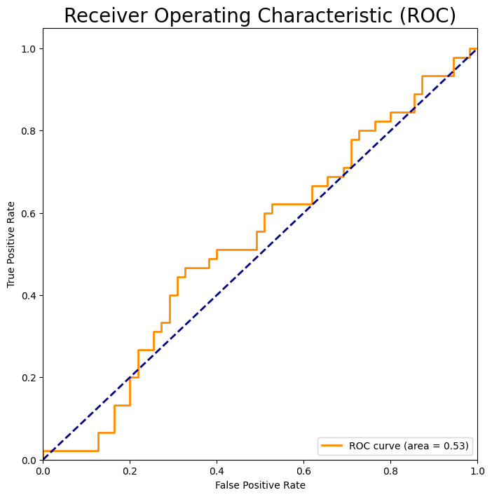


### 79. 精确度-召回率曲线 (Precision-Recall Curve)

在类别不平衡（如医疗诊断、欺诈检测）时，P-R 曲线比 ROC 曲线更能反映模型真实性能。


```plain&#x20;text
from sklearn.metrics import precision_recall_curve, average_precision_score
from sklearn.datasets import make_classification
from sklearn.linear_model import LogisticRegression
from sklearn.model_selection import train_test_split
import matplotlib.pyplot as plt

# 准备数据
X, y = make_classification(n_samples=1000, n_classes=2, weights=[0.9, 0.1], random_state=42)
X_train, X_test, y_train, y_test = train_test_split(X, y, test_size=0.3)

# 训练模型
model = LogisticRegression()
model.fit(X_train, y_train)
y_score = model.predict_proba(X_test)[:, 1]

# 绘图
precision, recall, _ = precision_recall_curve(y_test, y_score)
ap = average_precision_score(y_test, y_score)

plt.figure(figsize=(8, 6))
plt.step(recall, precision, color='b', alpha=0.2, where='post')
plt.fill_between(recall, precision, step='post', alpha=0.2, color='b')
plt.xlabel('Recall')
plt.ylabel('Precision')
plt.title(f'Binary Precision-Recall curve: AP={ap:.2f}')
plt.show()
```

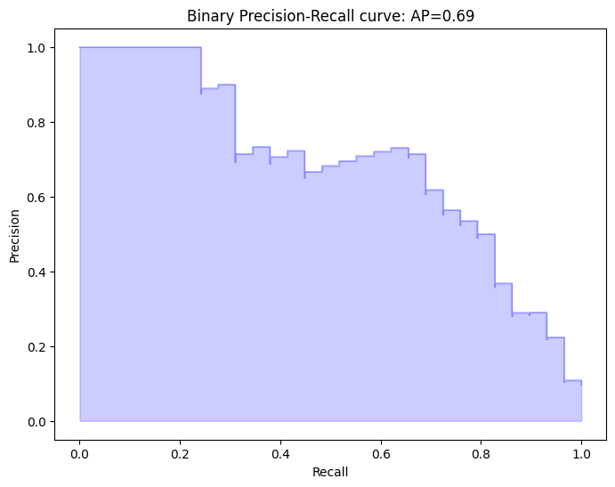


### 80. 特征重要性条形图 (Feature Importance)

用于解释黑盒模型（如随机森林、XGBoost）哪些变量起到了关键作用。

```plain&#x20;text
from sklearn.ensemble import RandomForestClassifier
import numpy as np

# 模拟特征名
features = [f'Feature {i}' for i in range(10)]
X, y = make_classification(n_samples=1000, n_features=10, random_state=42)
model = RandomForestClassifier().fit(X, y)

# 排序并绘图
importances = model.feature_importances_
indices = np.argsort(importances)

plt.figure(figsize=(10, 6))
plt.title('Feature Importances')
plt.barh(range(len(indices)), importances[indices], color='skyblue', align='center')
plt.yticks(range(len(indices)), [features[i] for i in indices])
plt.xlabel('Relative Importance')
plt.show()
```

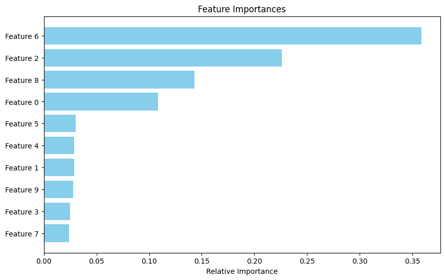


### 81. 深度学习损失与准确率曲线 (Training History)

展示神经网络训练过程中 Loss 和 Accuracy 的收敛情况，用于判断是否过拟合。

```plain&#x20;text
# 模拟训练数据
epochs = range(1, 21)
train_loss = np.exp(-np.linspace(0, 2, 20)) + np.random.normal(0, 0.02, 20)
val_loss = train_loss + 0.1 * np.linspace(0, 1, 20)

fig, ax1 = plt.subplots(figsize=(10, 6))

ax1.plot(epochs, train_loss, 'bo-', label='Training loss')
ax1.plot(epochs, val_loss, 'ro-', label='Validation loss')
ax1.set_title('Training and Validation Loss')
ax1.set_xlabel('Epochs')
ax1.set_ylabel('Loss')
ax1.legend()
plt.show()
```

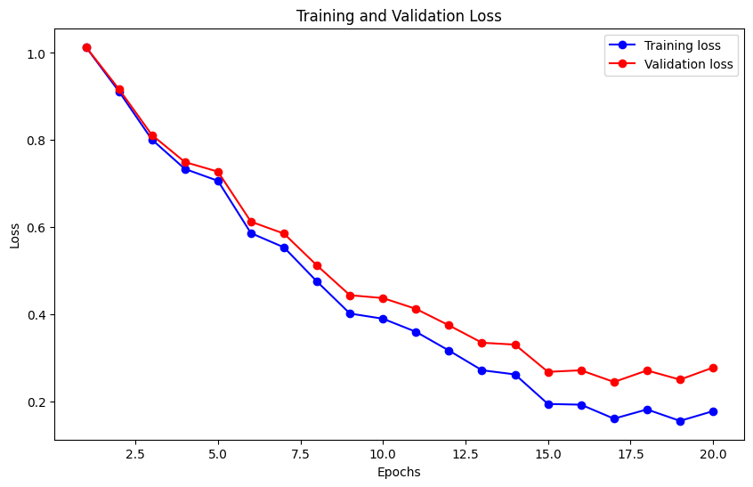


### 82. 泰勒图 (Taylor Diagram)

泰勒图是气象、气候和水文领域评估模型最常用的工具。它将**相关系数 (Correlation)**、**标准差 (Standard Deviation)** 和 **均方根误差 (RMSE)** 整合在一张图中，用于对比多个模型与观测值（Reference）的接近程度。

```plain&#x20;text
import numpy as np
import matplotlib.pyplot as plt
from matplotlib.projections import PolarAxes
from mpl_toolkits.axisartist import floating_axes
from mpl_toolkits.axisartist import grid_finder

class TaylorDiagram(object):"""
    泰勒图坐标系构建器
    """def __init__(self, refstd, fig=None, rect=111, label='_'):
        self.refstd = refstd
        # 转换角度：相关系数 r -> 弧度 theta
        tr = PolarAxes.PolarTransform()

        # 构建相关系数刻度 (0 到 1)
        rlocs = np.array([0, 0.2, 0.4, 0.6, 0.7, 0.8, 0.9, 0.95, 0.99, 1])
        tlocs = np.arccos(rlocs)
        gl1 = grid_finder.FixedLocator(tlocs)
        tf1 = grid_finder.DictFormatter(dict(zip(tlocs, map(str, rlocs))))

        # 构建标准差范围 (0 到 1.5倍的参考标准差)
        smin, smax = 0, 1.5 * self.refstd
        gh = floating_axes.GridHelperCurveLinear(tr, extremes=(0, np.pi/2, smin, smax),
                                               grid_locator1=gl1, tick_formatter1=tf1)

        if fig is None: fig = plt.gcf()
        ax = floating_axes.FloatingSubplot(fig, rect, grid_helper=gh)
        fig.add_subplot(ax)

        # 调整坐标轴
        ax.axis["top"].set_axis_direction("bottom")  # 相关系数刻度
        ax.axis["top"].toggle(ticklabels=True, label=True)
        ax.axis["top"].major_ticklabels.set_axis_direction("top")
        ax.axis["top"].label.set_axis_direction("top")
        ax.axis["top"].label.set_text("Correlation Coefficient")

        ax.axis["left"].set_axis_direction("bottom") # 标准差刻度
        ax.axis["left"].label.set_text("Standard Deviation")

        ax.axis["right"].set_axis_direction("top")   # 右侧不显示
        ax.axis["right"].toggle(ticklabels=True)
        ax.axis["bottom"].set_visible(False)         # 底部隐藏

        self._ax = ax                   # 浮动坐标轴
        self.ax = ax.get_aux_axes(tr)   # 极坐标绘图层# 绘制参考点（标准差=refstd, 相关系数=1.0）
        l, = self.ax.plot([0], self.refstd, 'k*', ls='', ms=12, label=label)
        
        # 绘制均方根误差 (RMS) 轮廓线
        rs, ts = np.meshgrid(np.linspace(smin, smax), np.linspace(0, np.pi/2))
        rms = np.sqrt(self.refstd**2 + rs**2 - 2*self.refstd*rs*np.cos(ts))
        CS = self.ax.contour(ts, rs, rms, colors='gray', linestyles='--', alpha=0.5)
        plt.clabel(CS, inline=1, fontsize=10, fmt='%.2f')

    def add_sample(self, stddev, corrcoef, *args, **kwargs):"""添加模型样本点"""
        l, = self.ax.plot(np.arccos(corrcoef), stddev, *args, **kwargs)
        return l

# --- 绘图 Demo ---# 模拟数据
ref_std = 0.5  # 观测值的标准差
models = {
    "Model A": [0.42, 0.95, 'ro'], # [标准差, 相关系数, 样式]"Model B": [0.38, 0.85, 'bo'],
    "Model C": [0.55, 0.70, 'go']
}

fig = plt.figure(figsize=(10, 8))
td = TaylorDiagram(ref_std, fig=fig, label='Observation')

for name, params in models.items():
    td.add_sample(params[0], params[1], marker=params[2][1], color=params[2][0], 
                  ms=10, ls='', label=name)

fig.legend(loc='upper right', bbox_to_anchor=(0.9, 0.9))
plt.title("Taylor Diagram: Model Evaluation", y=1.08, fontsize=18)
plt.show()
```

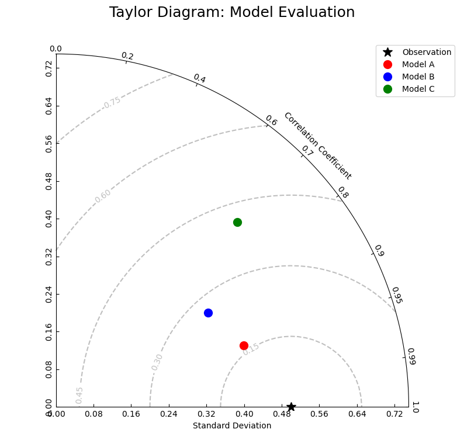


### 94. 学习曲线 (Learning Curve)

用于诊断机器学习模型的训练状态。通过观察“训练集得分”与“验证集得分”随样本量增加的变化，可以判断：

* **欠拟合：** 两条曲线都很低，且非常接近。

* **过拟合：** 训练集得分很高，验证集得分很低，且两者之间有巨大鸿沟（Gap）。

```plain&#x20;text
import numpy as np
import matplotlib.pyplot as plt
from sklearn.model_selection import learning_curve
from sklearn.datasets import load_digits
from sklearn.ensemble import RandomForestClassifier

# 1. 准备数据
digits = load_digits()
X, y = digits.data, digits.target
model = RandomForestClassifier(n_estimators=50, max_depth=5)

# 2. 计算学习曲线# train_sizes: 训练样本量的比例或绝对值# train_scores: 训练集上的交叉验证得分# test_scores: 验证集上的交叉验证得分
train_sizes, train_scores, test_scores = learning_curve(
    model, X, y, cv=5, n_jobs=-1, 
    train_sizes=np.linspace(0.1, 1.0, 10), 
    scoring='accuracy'
)

# 计算均值和方差
train_scores_mean = np.mean(train_scores, axis=1)
train_scores_std = np.std(train_scores, axis=1)
test_scores_mean = np.mean(test_scores, axis=1)
test_scores_std = np.std(test_scores, axis=1)

# 3. 绘制图形
plt.figure(figsize=(12, 8))
plt.grid()

# 填充方差区域 (Standard Deviation bands)
plt.fill_between(train_sizes, train_scores_mean - train_scores_std,
                 train_scores_mean + train_scores_std, alpha=0.1, color="r")
plt.fill_between(train_sizes, test_scores_mean - test_scores_std,
                 test_scores_mean + test_scores_std, alpha=0.1, color="g")

# 绘制均值曲线
plt.plot(train_sizes, train_scores_mean, 'o-', color="r", label="Training score")
plt.plot(train_sizes, test_scores_mean, 'o-', color="g", label="Cross-validation score")

# 装饰
plt.title("Learning Curves (Random Forest on Digits)", fontsize=20)
plt.xlabel("Training Examples", fontsize=14)
plt.ylabel("Accuracy Score", fontsize=14)
plt.legend(loc="best", fontsize=12)
plt.ylim(0.5, 1.01) # 设置纵坐标范围便于观察

plt.show()
```

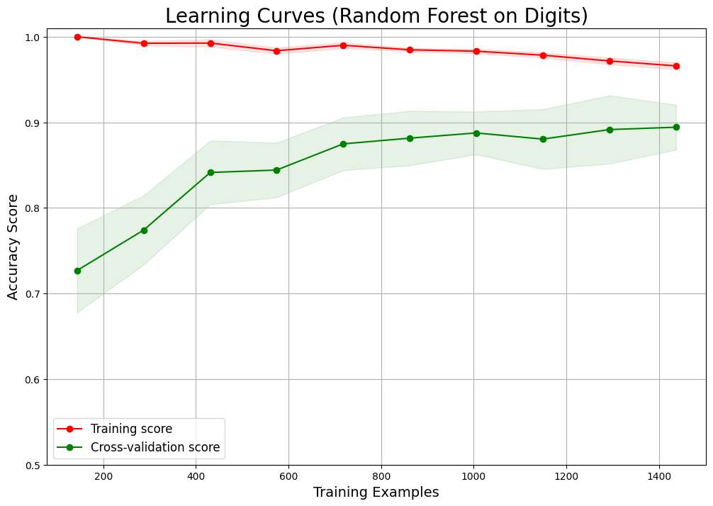


### 95. SHAP 特征贡献摘要图 (SHAP Summary Plot)

比传统的特征重要性图更先进。它不仅显示哪些特征重要，还能显示特征值的高低如何影响预测结果（正向还是负向）。

```plain&#x20;text
!pip install shap
import shap
import pandas as pd
import numpy as np
from sklearn.ensemble import RandomForestRegressor

# 创建一个模拟的 midwest DataFrame
midwest = pd.DataFrame({
    'area': np.random.rand(100) * 100,
    'poptotal': np.random.randint(1000, 100000, 100),
    'popdensity': np.random.rand(100) * 500
})

# 训练一个简单模型
model = RandomForestRegressor().fit(midwest[['area', 'poptotal']], midwest['popdensity'])
explainer = shap.TreeExplainer(model)
shap_values = explainer.shap_values(midwest[['area', 'poptotal']])

# 绘制 SHAP 摘要图
shap.summary_plot(shap_values, midwest[['area', 'poptotal']])
```

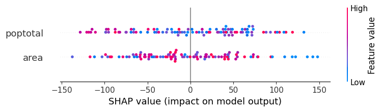


### 96. 分类决策边界图 (Decision Boundary Plot)

直观展示分类模型（如 SVM, KNN, 随机森林）是如何在特征空间中划定界限的，用于观察过拟合或欠拟合。

```plain&#x20;text
from sklearn.inspection import DecisionBoundaryDisplay
from sklearn.svm import SVC

# 模拟数据
X = iris.data[:, :2]  # 只取前两个特征方便绘图
y = iris.target
clf = SVC(kernel="rbf", gamma=0.7).fit(X, y)

# 绘制边界
disp = DecisionBoundaryDisplay.from_estimator(
    clf, X, response_method="predict",
    cmap=plt.cm.coolwarm, alpha=0.8,
)
plt.scatter(X[:, 0], X[:, 1], c=y, edgecolor="k")
plt.title("SVM Decision Boundary (RBF Kernel)")
plt.show()
```

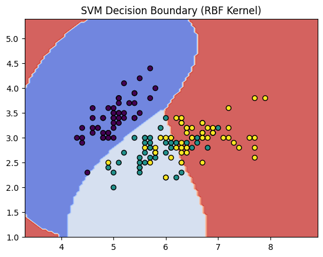


### 97. 部分依赖图 (Partial Dependence Plot, PDP)

展示一个或两个特征对模型预测结果的边际效应。例如：房价如何随“房屋面积”单调变化，而忽略其他变量的影响。

```plain&#x20;text
from sklearn.inspection import PartialDependenceDisplay
from sklearn.ensemble import GradientBoostingRegressor

# 假设已训练模型 clf
fig, ax = plt.subplots(figsize=(12, 6))
PartialDependenceDisplay.from_estimator(clf, X, [0, (0, 1)], ax=ax) # 展示特征0及特征0与1的交互
plt.show()
```

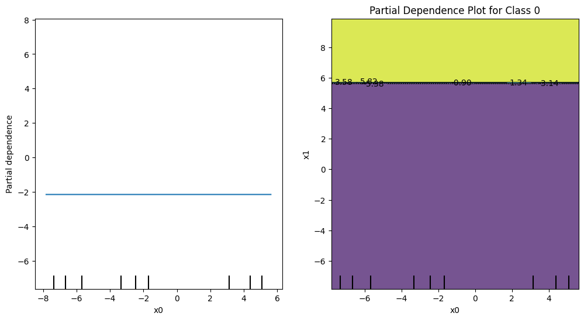


### 98. 预测概率分布图 (Probability Calibration Hist)

展示模型预测概率的分布。对于二分类，好的模型应该将概率推向 0 和 1 两端；如果概率大量集中在 0.5 附近，说明模型区分度不高。

```plain&#x20;text
import matplotlib.pyplot as plt
import seaborn as sns
import numpy as np

# Generate sample predicted probabilities (y_score) as it was not defined
y_score = np.random.rand(1000) # Example: 1000 random probabilities between 0 and 1

plt.figure(figsize=(10, 6))
sns.histplot(y_score, bins=50, kde=True, color='purple')
plt.axvline(0.5, color='red', linestyle='--')
plt.title("Distribution of Predicted Probabilities")
plt.xlabel("Probability")
plt.show()
```


## 九、 生物信息学分析 (Bioinformatics)

生信分析经常涉及数万个基因的对比，需要特殊的统计展示方式。

### 99. 火山图 (Volcano Plot)

用于展示基因差异表达分析（DEA）。X轴为 Fold Change，Y轴为 P-value。

```python
import pandas as pd
import matplotlib.pyplot as plt
import seaborn as sns
import numpy as np

# 模拟生信数据
np.random.seed(42)
data = pd.DataFrame({
    'log2FC': np.random.normal(0, 2, 1000),
    'pvalue': np.random.uniform(0, 1, 1000)
})
data['neg_log10_p'] = -np.log10(data['pvalue'])

# 定义显著性
data['sig'] = 'Normal'
data.loc[(data['log2FC'] > 1) & (data['pvalue'] < 0.05), 'sig'] = 'Up'
data.loc[(data['log2FC'] < -1) & (data['pvalue'] < 0.05), 'sig'] = 'Down'

# 绘图
plt.figure(figsize=(8, 8))
sns.scatterplot(x='log2FC', y='neg_log10_p', hue='sig', data=data,
                palette={'Up':'red', 'Down':'blue', 'Normal':'grey'}, alpha=0.6)
plt.axhline(-np.log10(0.05), color='black', linestyle='--')
plt.axvline(1, color='black', linestyle='--')
plt.axvline(-1, color='black', linestyle='--')
plt.title('Volcano Plot of Differentially Expressed Genes')
plt.show()
```

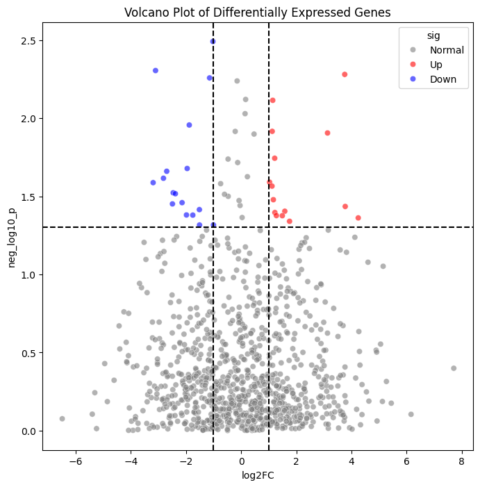


### 100. 层次聚类热图 (Clustermap)

生信中最常用的图表，用于展示不同样本间基因表达模式的相似性。

```plain&#x20;text
# 生成随机表达矩阵 (50个基因, 10个样本)
exp_data = np.random.rand(50, 10)
df_exp = pd.DataFrame(exp_data, columns=[f'Sample_{i}' for i in range(10)])

sns.clustermap(df_exp, cmap='vlag', center=0, linewidths=.75, figsize=(10, 12))
plt.show()
```

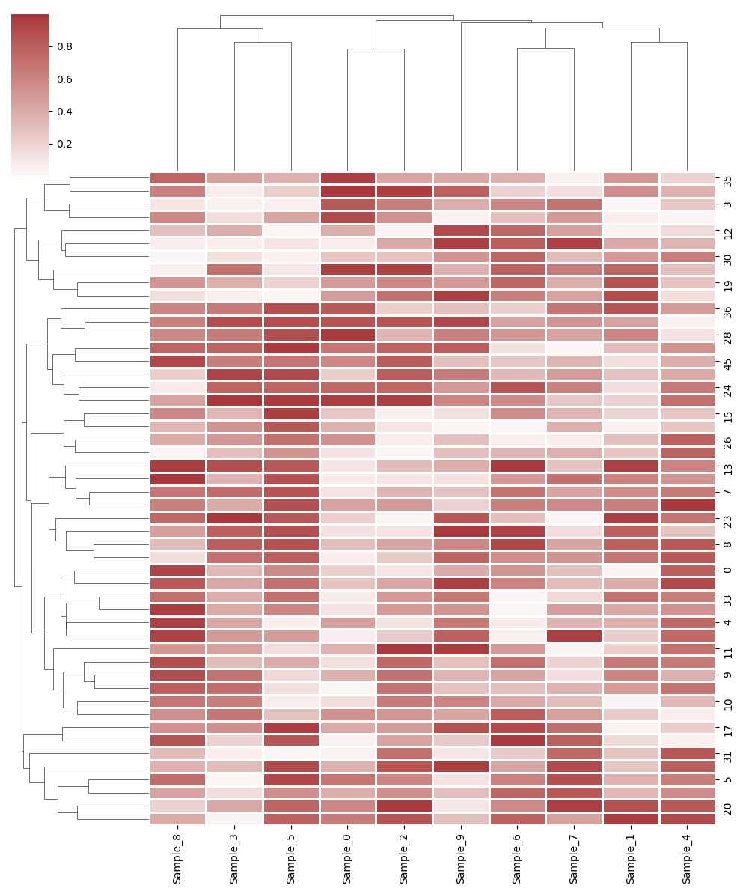


### 101. 基因共线性图 (Synteny Plot / Circos Link)

展示不同物种或不同染色体之间基因位置的对应关系。

```plain&#x20;text
import matplotlib.pyplot as plt
from matplotlib.patches import ConnectionPatch

fig, (ax1, ax2) = plt.subplots(2, 1, figsize=(12, 6))
ax1.set_xlim(0, 100); ax2.set_xlim(0, 100)
ax1.hlines(1, 10, 90, colors='blue', lw=10, label='Species A')
ax2.hlines(1, 15, 85, colors='green', lw=10, label='Species B')

# 绘制基因间的对应连线
for start, end in [(20, 25), (40, 55), (70, 80)]:
    con = ConnectionPatch(xyA=(start, 0.9), xyB=(end, 1.1), coordsA="data", coordsB="data",
                          axesA=ax1, axesB=ax2, color=(1.0, 0.0, 0.0, 0.3))
    fig.add_artist(con)

ax1.axis('off'); ax2.axis('off')
plt.title("Genomic Synteny: Conserved Regions between Species")
plt.show()
```

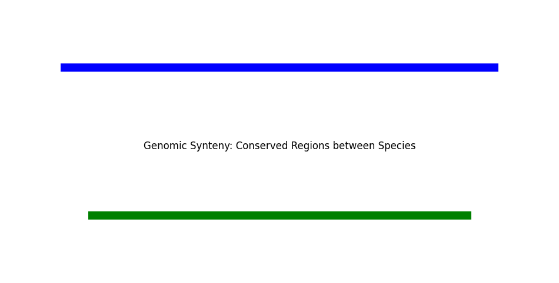


### 102. 点阵图 (Dot Plot for Sequence Alignment)

通过矩阵形式比较两条核苷酸或氨基酸序列。对角线代表匹配，偏移线代表重复，断裂代表插入/缺失。

```plain&#x20;text
seq1 = "ACTGTAGCTAGCTAGC"
seq2 = "ACTGTAGCTAAATAGC"# 构建匹配矩阵
matrix = np.zeros((len(seq1), len(seq2)))
for i in range(len(seq1)):
    for j in range(len(seq2)):
        if seq1[i] == seq2[j]:
            matrix[i, j] = 1

plt.figure(figsize=(6, 6))
plt.imshow(matrix, cmap='Greys', interpolation='none')
plt.xticks(range(len(seq2)), list(seq2))
plt.yticks(range(len(seq1)), list(seq1))
plt.title("Sequence Alignment Dot Plot")
plt.show()
```

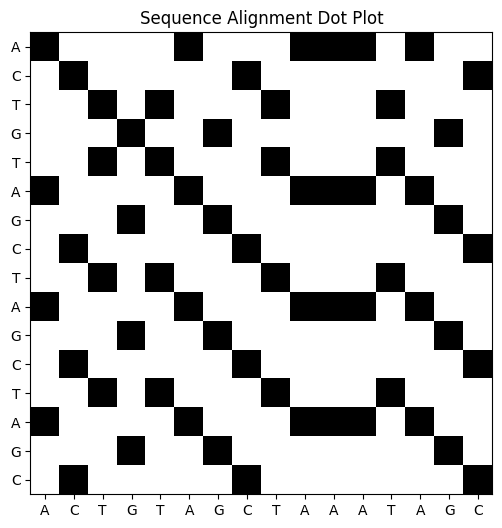


### 103. GO/KEGG 富集条形图 (Enrichment Bar Chart)

展示差异基因显著富集在哪些生物学通路。Y轴为通路名称，X轴为基因占比或 -log10(P-value)。

```plain&#x20;text
# 模拟富集数据
pathways = ['Cell Cycle', 'DNA Replication', 'P53 Signaling', 'Apoptosis', 'Metabolism']
p_values = [0.0001, 0.002, 0.01, 0.03, 0.05]
log_p = -np.log10(p_values)

plt.figure(figsize=(10, 6))
colors = sns.color_palette("Reds_r", len(pathways))
sns.barplot(x=log_p, y=pathways, palette=colors)
plt.axvline(-np.log10(0.05), color='blue', linestyle='--') # 显著性阈值线
plt.title("Pathway Enrichment Analysis")
plt.xlabel("-log10(P-value)")
plt.show()
```

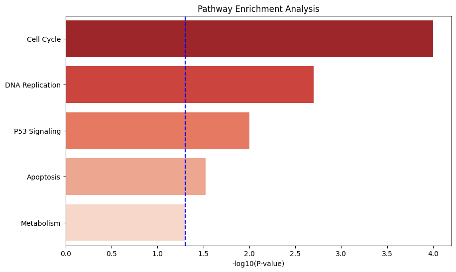


### 104. 基因结构图 (Gene Structure / Locus Plot)

展示基因的各种外显子（Exon）、内含子（Intron）和非翻译区（UTR）的排列结构，通常用于突变位点标注。

```plain&#x20;text
import matplotlib.patches as patches

fig, ax = plt.subplots(figsize=(12, 2))
# 绘制内含子（细线）
ax.hlines(0.5, 100, 1000, color='black', lw=2)
# 绘制外显子（矩形块）
exons = [(150, 250), (400, 550), (750, 950)]
for start, end in exons:
    rect = patches.Rectangle((start, 0.3), end-start, 0.4, color='skyblue', ec='black')
    ax.add_patch(rect)

ax.set_xlim(0, 1100); ax.set_ylim(0, 1)
ax.axis('off')
plt.title("Gene Exon-Intron Structure")
plt.show()
```

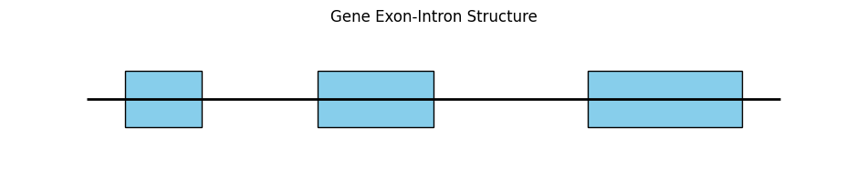


## 十、 统计学诊断 (Statistical Diagnostics)

在进行线性回归等统计建模前，必须进行的分布和假设检验。

### 105. Q-Q 图 (Quantile-Quantile Plot)

用于检查数据是否符合正态分布。

```plain&#x20;text
import scipy.stats as stats

# 生成一份正态分布数据和一份偏态数据
data_norm = np.random.normal(0, 1, 100)
data_skew = np.random.exponential(1, 100)

fig, (ax1, ax2) = plt.subplots(1, 2, figsize=(12, 5))

stats.probplot(data_norm, dist="norm", plot=ax1)
ax1.set_title("Q-Q Plot (Normal Data)")

stats.probplot(data_skew, dist="norm", plot=ax2)
ax2.set_title("Q-Q Plot (Skewed Data)")

plt.show()
```

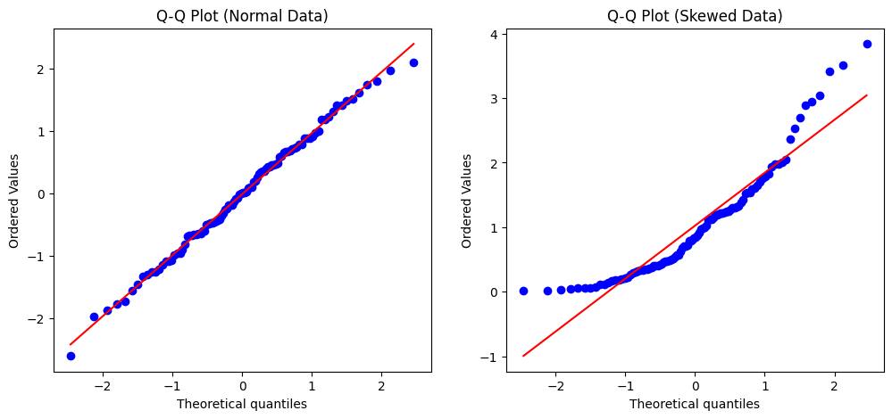


### 106. 回归残差图 (Residual Plot)

检验线性回归的齐性假设（Homoscedasticity）。

```plain&#x20;text
# 模拟回归数据
x = np.linspace(0, 10, 100)
y = 2 * x + 1 + np.random.normal(0, 2, 100)

plt.figure(figsize=(10, 6))
sns.residplot(x=x, y=y, lowess=True, color="g")
plt.title('Residuals Plot: Checking for Linearity and Variance')
plt.xlabel('Independent Variable')
plt.ylabel('Residuals')
plt.show()
```

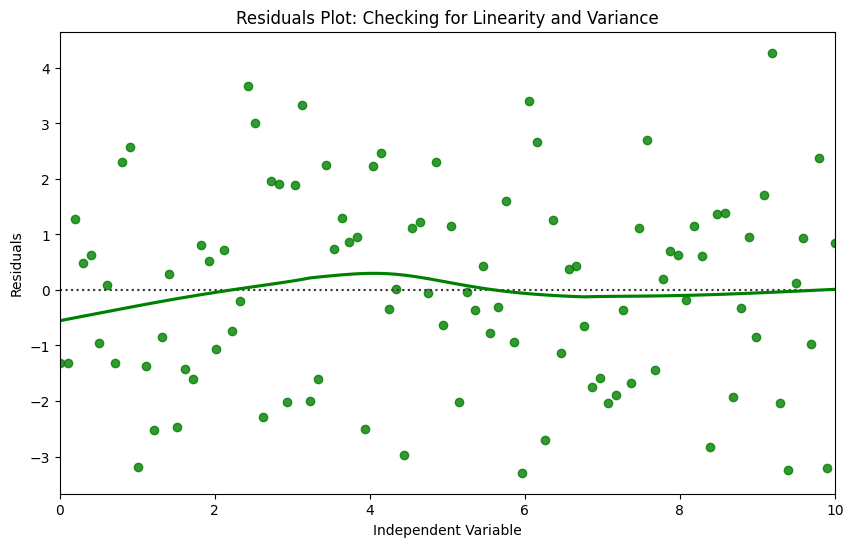


### 107. 交互作用图 (Interaction Plot)

在方差分析（ANOVA）中观察两个分类变量对连续变量的共同影响。

```plain&#x20;text
from statsmodels.graphics.factorplots import interaction_plot

# 模拟实验数据
weight = np.array([15, 18, 19, 22, 12, 14, 25, 28])
diet = np.array(['A', 'A', 'A', 'A', 'B', 'B', 'B', 'B'])
gender = np.array(['M', 'M', 'F', 'F', 'M', 'M', 'F', 'F'])

fig = interaction_plot(diet, gender, weight, colors=['red', 'blue'], markers=['D', '^'], ms=10)
plt.title('Interaction Plot: Effect of Diet and Gender on Weight')
plt.show()
```

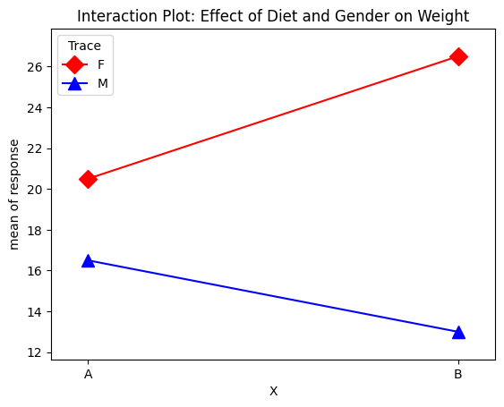


### 108. 轮廓系数图 (Silhouette Plot)

用于评价聚类效果的好坏。它显示了每个簇内点的紧凑程度以及簇间的距离。如果大部分点轮廓系数高，说明聚类合理；若出现负值，说明样本被误分到了错误的簇。

```plain&#x20;text
from sklearn.datasets import make_blobs
from sklearn.cluster import KMeans
from sklearn.metrics import silhouette_samples, silhouette_score
import matplotlib.pyplot as plt
import matplotlib.cm as cm
import numpy as np

# 1. 准备数据：生成 500 个样本，3 个中心点
X, y = make_blobs(n_samples=500, n_features=2, centers=3, cluster_std=1.0, random_state=42)

# 2. 聚类：假设我们要评估 K=3 的效果
n_clusters = 3
clusterer = KMeans(n_clusters=n_clusters, random_state=10)
cluster_labels = clusterer.fit_predict(X)

# 3. 计算得分
silhouette_avg = silhouette_score(X, cluster_labels)
sample_silhouette_values = silhouette_samples(X, cluster_labels)

# 4. 绘图
fig, ax1 = plt.subplots(figsize=(10, 7))

y_lower = 10
for i in range(n_clusters):
    # 提取第 i 个簇的轮廓系数并排序
    ith_cluster_silhouette_values = sample_silhouette_values[cluster_labels == i]
    ith_cluster_silhouette_values.sort()

    size_cluster_i = ith_cluster_silhouette_values.shape[0]
    y_upper = y_lower + size_cluster_i

    color = cm.nipy_spectral(float(i) / n_clusters)
    ax1.fill_betweenx(np.arange(y_lower, y_upper), 0, ith_cluster_silhouette_values,
                      facecolor=color, edgecolor=color, alpha=0.7)

    # 标注簇编号
    ax1.text(-0.05, y_lower + 0.5 * size_cluster_i, str(i))
    y_lower = y_upper + 10 # 为下一个簇留出间隙

ax1.set_title("Silhouette Plot for KMeans Clustering", fontsize=18)
ax1.set_xlabel("Silhouette Coefficient Values")
ax1.set_ylabel("Cluster Label")

# 绘制平均轮廓系数垂直线
ax1.axvline(x=silhouette_avg, color="red", linestyle="--", label=f'Avg: {silhouette_avg:.2f}')
ax1.set_yticks([]) # 隐藏 Y 轴刻度
ax1.set_xlim([-0.1, 1]) # 轮廓系数范围在 [-1, 1]
plt.legend()
plt.show()
```

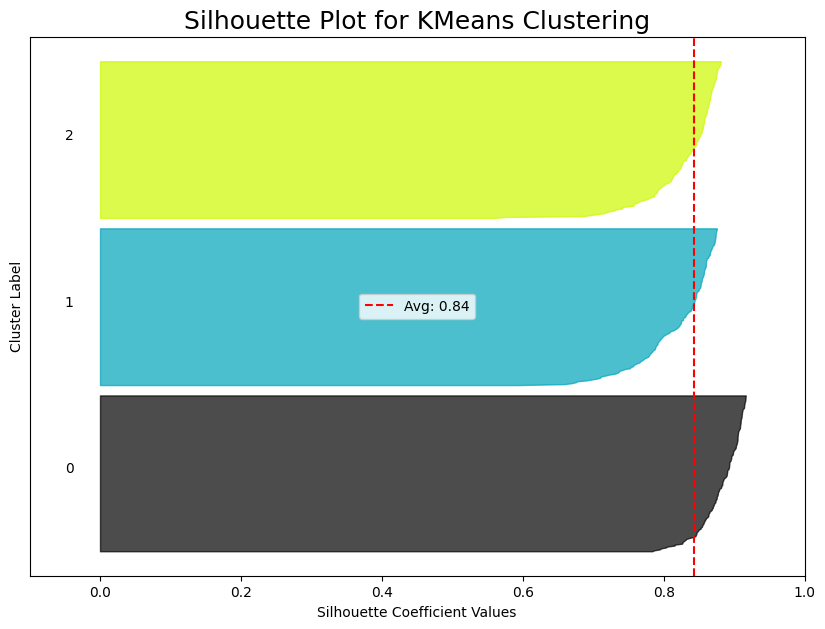


### 109. 碎石图 (Scree Plot)

在 PCA（主成分分析）中，用于决定保留多少个主成分。通常寻找“肘部”（Elbow），即方差解释率显著下降的转折点。

```plain&#x20;text
import pandas as pd
import numpy as np
import matplotlib.pyplot as plt
from sklearn.decomposition import PCA
from sklearn.preprocessing import StandardScaler
from sklearn.datasets import load_iris

# 1. 加载数据
data = load_iris()
df = pd.DataFrame(data.data, columns=data.feature_names)

# 2. 标准化（PCA 前必须进行标准化）
X_std = StandardScaler().fit_transform(df)

# 3. 运行 PCA
pca = PCA().fit(X_std)
exp_var_pca = pca.explained_variance_ratio_
cum_sum_eigenvalues = np.cumsum(exp_var_pca)

# 4. 绘图
plt.figure(figsize=(10, 6))

# 绘制单个方差解释率（条形）
plt.bar(range(1, len(exp_var_pca) + 1), exp_var_pca, alpha=0.5, align='center', 
        label='Individual explained variance', color='teal')

# 绘制累计方差解释率（折线）
plt.step(range(1, len(cum_sum_eigenvalues) + 1), cum_sum_eigenvalues, where='mid',
         label='Cumulative explained variance', color='red', lw=2)

# 装饰
plt.ylabel('Explained variance ratio', fontsize=12)
plt.xlabel('Principal component index', fontsize=12)
plt.title('Scree Plot: PCA Variance Explained', fontsize=18)
plt.xticks(range(1, len(exp_var_pca) + 1))
plt.axhline(y=0.95, color='gray', linestyle='--', label='95% Cut-off') # 常用 95% 阈值线
plt.legend(loc='best')
plt.grid(axis='y', alpha=0.3)
plt.show()
```

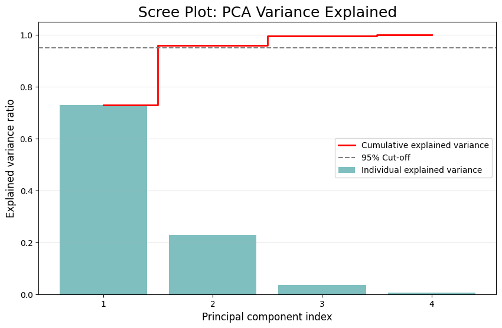


### 110. Bland-Altman 图

在生物医学和临床化学中，用于比较两种测量方法（如新老设备）的一致性，观察误差是否随测量值的增大而改变。

```plain&#x20;text
import numpy as np
import matplotlib.pyplot as plt

# 1. 模拟数据：两种方法测量同一个人的 100 次结果
np.random.seed(42)
method1 = np.random.normal(100, 10, 100)
method2 = method1 + np.random.normal(2, 3, 100) # 假设存在 2 个单位的系统误差

# 2. 计算均值和差值
means = np.mean([method1, method2], axis=0)
diffs = method1 - method2
mean_diff = np.mean(diffs)
std_diff = np.std(diffs, axis=0)

# 3. 计算 95% 一致性边界 (Limits of Agreement)
upper_loa = mean_diff + 1.96 * std_diff
lower_loa = mean_diff - 1.96 * std_diff

# 4. 绘图
plt.figure(figsize=(10, 6))
plt.scatter(means, diffs, alpha=0.6, color='darkblue', edgecolors='white', s=80)

# 绘制均值线和边界线
plt.axhline(mean_diff, color='red', linestyle='-', lw=2, label=f'Mean Diff: {mean_diff:.2f}')
plt.axhline(upper_loa, color='gray', linestyle='--', lw=1.5, label=f'+1.96 SD: {upper_loa:.2f}')
plt.axhline(lower_loa, color='gray', linestyle='--', lw=1.5, label=f'-1.96 SD: {lower_loa:.2f}')

# 标注文字
plt.text(max(means)*0.85, upper_loa + 0.5, "Upper Limit", fontsize=10, color='gray')
plt.text(max(means)*0.85, lower_loa - 1.5, "Lower Limit", fontsize=10, color='gray')

# 装饰
plt.title("Bland-Altman Plot: Comparison of Two Methods", fontsize=18)
plt.xlabel("Average of Method 1 and Method 2", fontsize=12)
plt.ylabel("Difference (Method 1 - Method 2)", fontsize=12)
plt.grid(alpha=0.2)
plt.legend(loc='upper right')
plt.show()
```

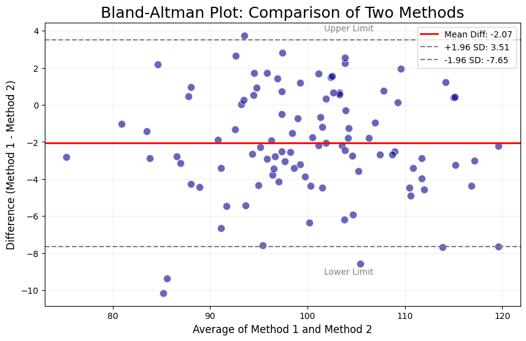


## 十一、 深度学习与高维数据 (Deep Learning & High-Dim Data)

在处理图像特征、词向量或高维嵌入（Embeddings）时，降维可视化是必经之路。

### 111. t-SNE / UMAP 聚类可视化

用于将高维特征空间投射到 2D 平面，观察模型学习到的类别分离度。

```plain&#x20;text
from sklearn.manifold import TSNE
from sklearn.datasets import load_digits

# 加载手写数字数据 (高维)
digits = load_digits()
X, y = digits.data, digits.target

# t-SNE 降维
tsne = TSNE(n_components=2, random_state=42)
X_embedded = tsne.fit_transform(X)

# 绘图
plt.figure(figsize=(10, 8))
scatter = plt.scatter(X_embedded[:, 0], X_embedded[:, 1], c=y, cmap='jet', alpha=0.6)
plt.colorbar(scatter)
plt.title('t-SNE visualization of Image Embeddings', fontsize=18)
plt.show()
```

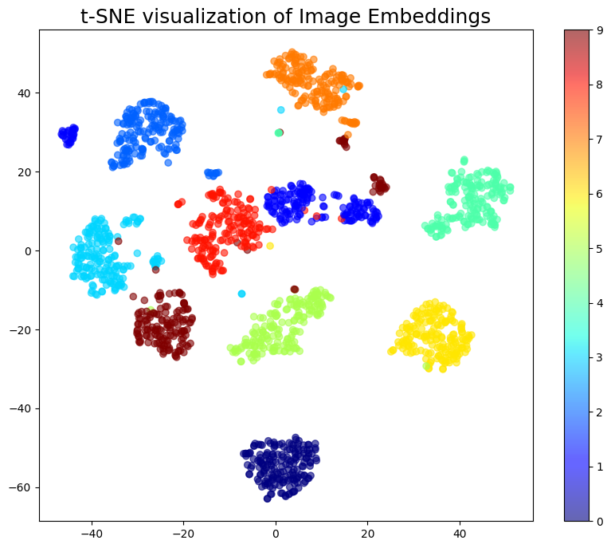


### 112. 模型校准曲线 (Calibration Curve)

评估模型预测的概率是否与真实概率一致（模型是否“自信过度”）。

&#x20;

```plain&#x20;text
from sklearn.calibration import calibration_curve
from sklearn.naive_bayes import GaussianNB

# 模拟分类数据
X, y = make_classification(n_samples=10000, n_features=20, n_clusters_per_class=2, random_state=42)
X_train, X_test, y_train, y_test = train_test_split(X, y, test_size=0.3)

# 训练并预测概率
model = GaussianNB().fit(X_train, y_train)
prob_pos = model.predict_proba(X_test)[:, 1]

# 计算校准曲线
fraction_of_positives, mean_predicted_value = calibration_curve(y_test, prob_pos, n_bins=10)

plt.figure(figsize=(8, 8))
plt.plot(mean_predicted_value, fraction_of_positives, "s-", label="GaussianNB")
plt.plot([0, 1], [0, 1], "k--", label="Perfectly calibrated")
plt.ylabel("Fraction of positives")
plt.xlabel("Mean predicted value")
plt.title("Calibration Curve (Reliability Diagram)")
plt.legend()
plt.show()
```

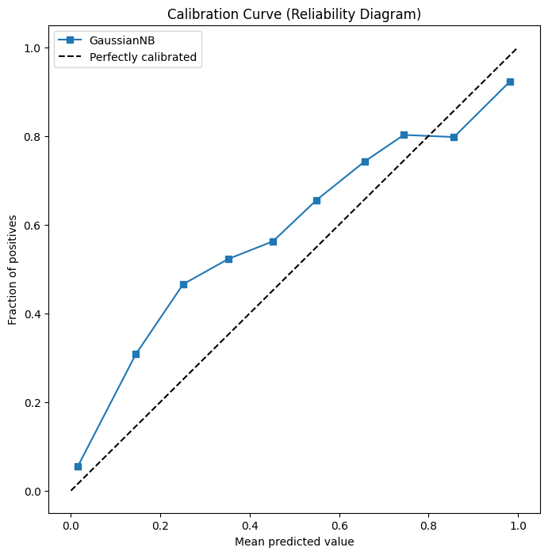


### 113. 权重分布直方图 (Weight Distribution Plot)

观察神经网络层中权重（Weights）的分布情况。如果权重集中在 0 附近或变得极大，可能预示着梯度消失或梯度爆炸。

```plain&#x20;text
# 模拟神经网络某层的权重数据
weights = np.random.normal(loc=0, scale=0.01, size=10000)

plt.figure(figsize=(10, 6))
sns.violinplot(weights, color="skyblue")
plt.title("Neural Network Layer Weight Distribution", fontsize=18)
plt.xlabel("Weight Value")
plt.show()
```

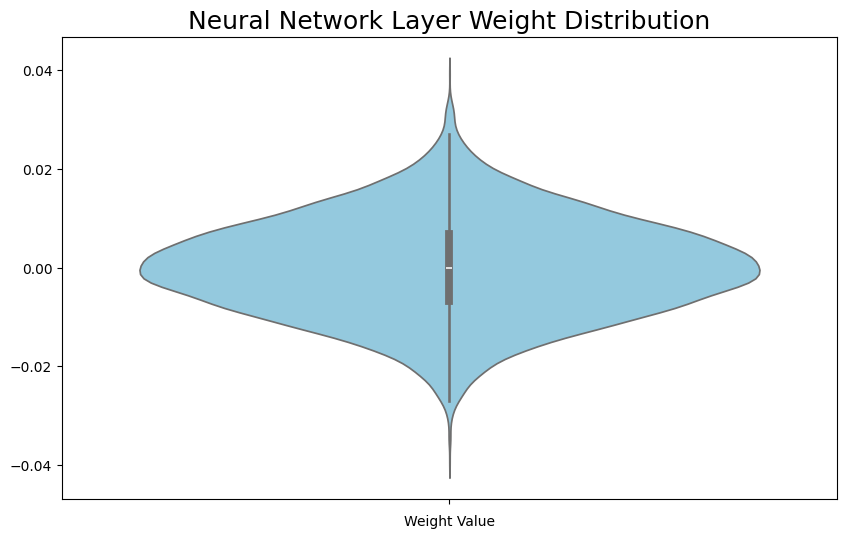


### 114. 激活值热力图 (Activation Map / Saliency Map)

在卷积神经网络中，展示图像的哪些像素点对最终分类结果贡献最大（类似于 Grad-CAM 的简化版）。

```plain&#x20;text
# 模拟一个 224x224 的热力图覆盖在原始图像上
img_size = 224
heatmap = np.random.rand(img_size, img_size)
background = np.zeros((img_size, img_size)) # 模拟原始图像

plt.figure(figsize=(8, 8))
plt.imshow(background, cmap='gray')
plt.imshow(heatmap, cmap='jet', alpha=0.5) # 叠加透明热力图
plt.colorbar(label='Attention Level')
plt.title("Saliency Map: What the Model Sees", fontsize=18)
plt.axis('off')
plt.show()
```

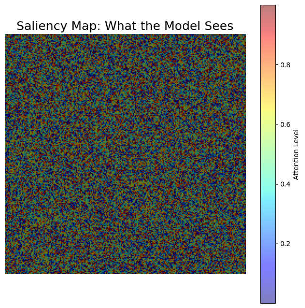


## 十二、 生物信息学进阶 (Advanced Bioinformatics)

### 115. 曼哈顿图 (Manhattan Plot)

GWAS（全基因组关联分析）的标配，用于展示成千上万个 SNP 位点与疾病的相关性。

```plain&#x20;text
# 模拟 GWAS 数据
df_gwas = pd.DataFrame({
    'pos': range(1000),
    'pvalue': np.random.uniform(0, 1, 1000),
    'chrono': np.repeat(range(1, 11), 100)
})
df_gwas['minus_log10_p'] = -np.log10(df_gwas['pvalue'])

# 绘图
plt.figure(figsize=(15, 5))
colors = ['#E27D60', '#85DCB0', '#E8A87C', '#C38D9E', '#41B3A3']
for i, chr_num in enumerate(df_gwas.chrono.unique()):
    sub = df_gwas[df_gwas.chrono == chr_num]
    plt.scatter(sub.pos, sub.minus_log10_p, c=colors[i % len(colors)], s=15)

plt.axhline(-np.log10(5e-5), color='grey', linestyle='--') # 显著性线
plt.title('Manhattan Plot of GWAS results')
plt.xlabel('Chromosome Position')
plt.ylabel('-log10(P-value)')
plt.show()
```

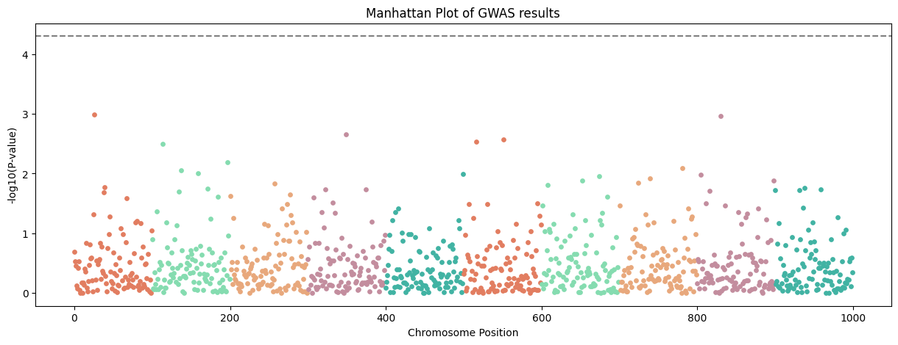


### 116. 环形热图 (Circular Heatmap / Chord Diagram)

常用于展示基因组内部的相互作用或器官间的联系。

```plain&#x20;text
# 利用极坐标系模拟环形布局
data = np.random.rand(24, 5) # 24小时或24个染色体
theta = np.linspace(0, 2*np.pi, 24, endpoint=False)
width = (2*np.pi) / 24

fig, ax = plt.subplots(figsize=(8, 8), subplot_kw={'projection': 'polar'})
for i in range(5): # 5层环
    ax.bar(theta, bottom=i+1, height=1, width=width, color=plt.cm.viridis(data[:, i]), edgecolor='w')

ax.set_yticklabels([])
plt.title('Circular Heatmap of Multilayer Genomic Data', va='bottom')
plt.show()
```

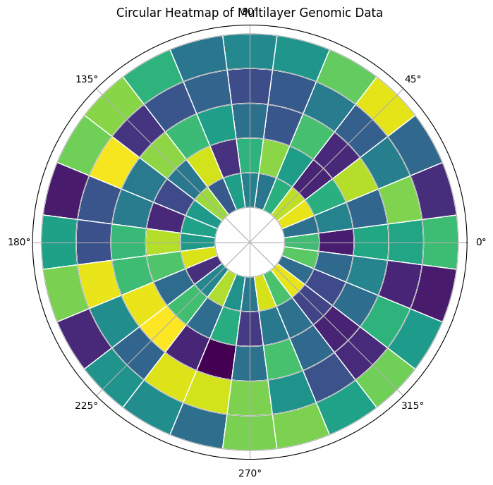


## 十三、 统计分析与临床研究 (Statistics & Clinical Research)

### 117. 生存分析曲线 (Kaplan-Meier Curve)

医学研究中展示病人随访生存率的标准图表。

```plain&#x20;text
# 模拟生存数据
time = np.sort(np.random.weibull(2, 100) * 10)
survival_prob = np.exp(-0.1 * time)

plt.figure(figsize=(10, 6))
plt.step(time, survival_prob, where='post', color='darkred', lw=2)
plt.fill_between(time, survival_prob, step="post", alpha=0.2, color='darkred')

plt.title('Kaplan-Meier Survival Estimator')
plt.xlabel('Time (Days)')
plt.ylabel('Survival Probability')
plt.grid(axis='y', alpha=0.3)
plt.show()
```

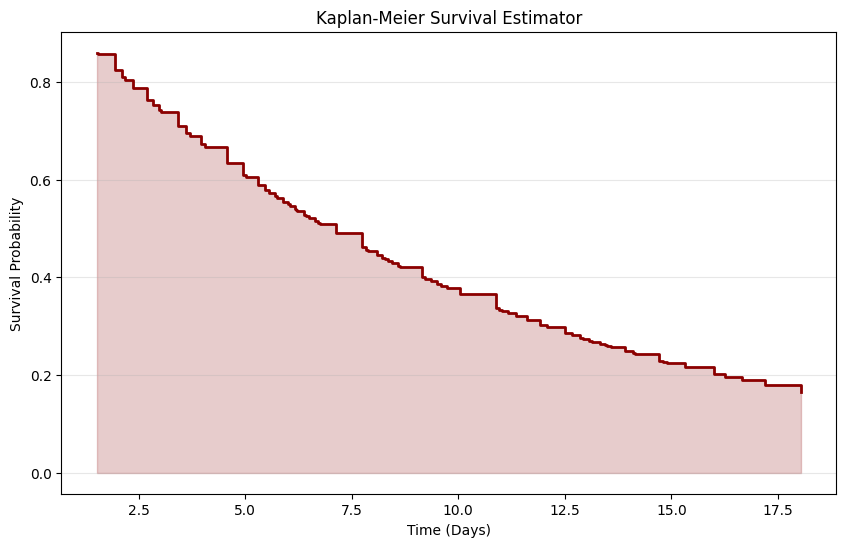


### 118. 森林图 (Forest Plot)

荟萃分析（Meta-analysis）或回归分析中展示各因素 Odds Ratio (OR值) 及其置信区间。

```plain&#x20;text
variables = ['Age', 'Gender (Male)', 'BMI', 'Smoker', 'Blood Pressure']
odds_ratio = [1.2, 0.85, 1.5, 2.1, 1.1]
conf_lower = [1.1, 0.7, 1.3, 1.8, 0.95]
conf_upper = [1.3, 1.0, 1.7, 2.4, 1.25]

plt.figure(figsize=(8, 5))
plt.errorbar(odds_ratio, range(len(variables)), 
             xerr=[np.array(odds_ratio)-np.array(conf_lower), np.array(conf_upper)-np.array(odds_ratio)],
             fmt='o', color='black', ecolor='firebrick', elinewidth=3, capsize=5)

plt.axvline(1, color='grey', linestyle='--') # 基准线
plt.yticks(range(len(variables)), variables)
plt.xlabel('Odds Ratio (95% CI)')
plt.title('Forest Plot of Risk Factors')
plt.show()
```

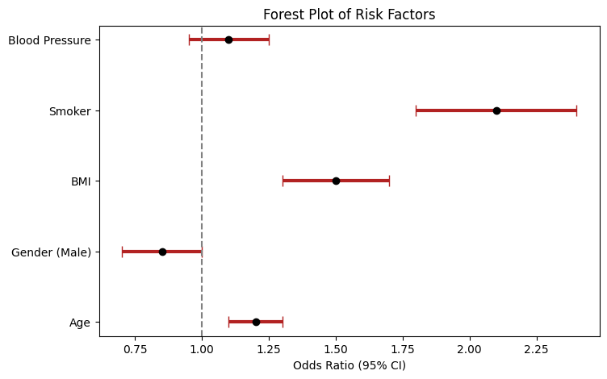


### 119. 缺失值热力图 (Missingness Matrix)

在建模前快速识别数据集中各变量的缺失模式（是随机缺失还是结构性缺失）。

```plain&#x20;text
import missingno as msno
import pandas as pd
import numpy as np
import matplotlib.pyplot as plt

# 模拟原始数据 df_raw
df_raw = pd.DataFrame({
    'col1': np.random.rand(100),
    'col2': np.random.randint(0, 10, 100),
    'col3': np.random.choice(['A', 'B', 'C'], 100)
})

# 模拟缺失数据
df_missing = df_raw.copy()
for col in df_missing.columns:
    df_missing.loc[df_missing.sample(frac=0.1).index, col] = np.nan

# 绘制缺失值矩阵
plt.figure(figsize=(10, 6))
msno.matrix(df_missing)
plt.title("Missing Data Pattern Matrix", fontsize=20)
plt.show()
```

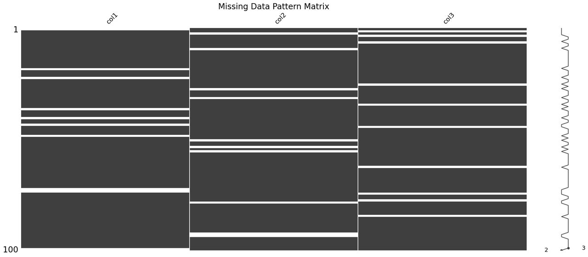


### 120. 偏度和峰度图 (Skewness & Kurtosis Plot)

用于检验变量是否需要进行 Log 转换或 Box-Cox 转换，常见于线性回归的前置分析。

```plain&#x20;text
from scipy.stats import norm

# 模拟偏态数据
data = np.random.exponential(scale=2, size=1000)

plt.figure(figsize=(10, 6))
sns.distplot(data, fit=norm, color='orange')
plt.title(f"Distribution Analysis (Skew: {pd.Series(data).skew():.2f})", fontsize=18)
plt.show()
```

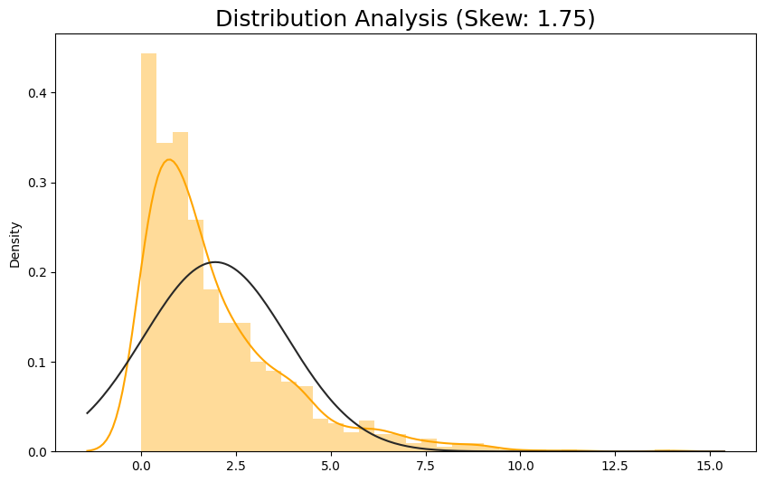


## 十四、 文本分析与关系网络 (Text & Network Analysis)

### 121. 词云图 (Word Cloud)

展示文本数据中的高频词汇。

```plain&#x20;text
from wordcloud import WordCloud

text = "Machine Learning Deep Learning Data Science Python Matplotlib Seaborn Visualization Statistics Bioinformatics AI"
wordcloud = WordCloud(width=800, height=400, background_color='white', colormap='tab10').generate(text)

plt.figure(figsize=(12, 6))
plt.imshow(wordcloud, interpolation='bilinear')
plt.axis('off')
plt.title('NLP Keyphrase Cloud')
plt.show()
```

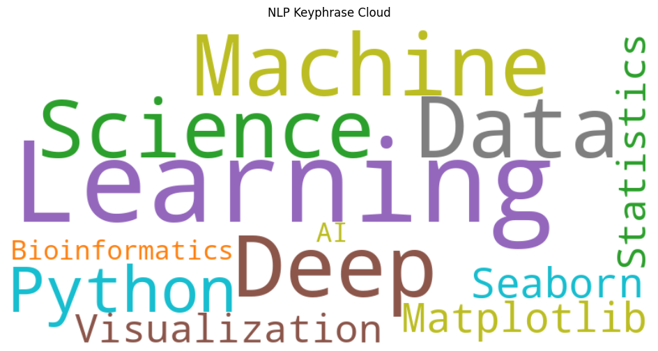


### 122. 网络拓扑图 (Network Graph)

展示蛋白质相互作用（PPI）网络或社交关系。

```plain&#x20;text
import networkx as nx

# 创建随机图
G = nx.erdos_renyi_graph(30, 0.1)
pos = nx.spring_layout(G)

plt.figure(figsize=(10, 8))
nx.draw_networkx_nodes(G, pos, node_size=500, node_color='skyblue', alpha=0.8)
nx.draw_networkx_edges(G, pos, width=1, edge_color='grey', alpha=0.5)
nx.draw_networkx_labels(G, pos, font_size=10)

plt.title('Network Topology of Entity Interactions')
plt.axis('off')
plt.show()
```

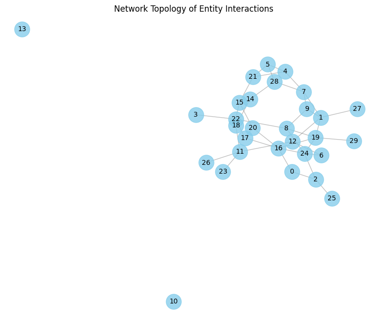


## 十五、 时间序列与不确定性 (Time Series Uncertainty)

### 123. 扇形图 (Fan Chart / Projection Chart)

在经济预测中极为常用。它不只给出一条预测线，而是展示不同概率区间（如 50%, 80%, 95%）的预测范围，颜色越深代表概率越高。

```plain&#x20;text
x = np.linspace(0, 10, 100)
y = np.sin(x)
plt.figure(figsize=(12, 6))
plt.plot(x[:70], y[:70], color='black', label='Observed') # 已观察
plt.plot(x[70:], y[70:], '--', color='blue', label='Forecast') # 预测# 模拟不同置信区间的阴影for i, alpha in enumerate([0.1, 0.2, 0.3]):
    plt.fill_between(x[70:], y[70:]-(0.5-i*0.1), y[70:]+(0.5-i*0.1), color='blue', alpha=alpha)

plt.title("Fan Chart: Forecasting with Uncertainty Bands")
plt.legend()
plt.show()
```

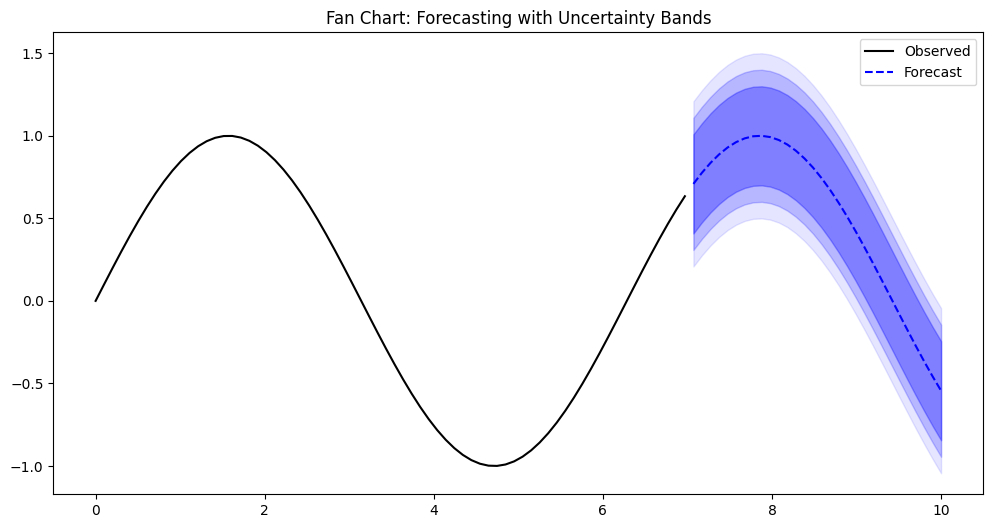

